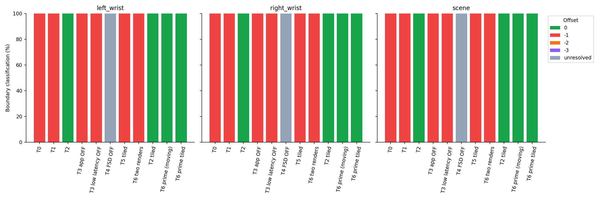
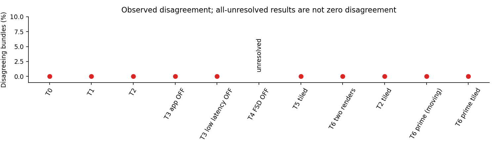
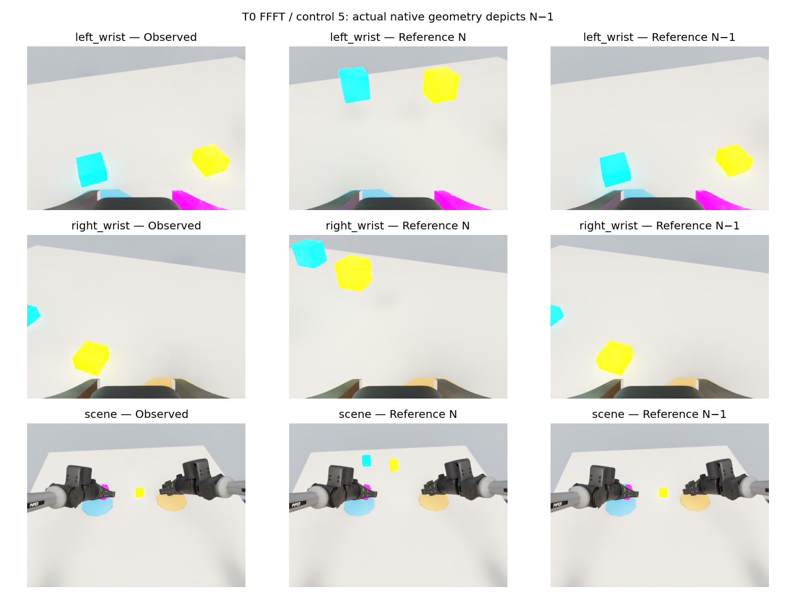
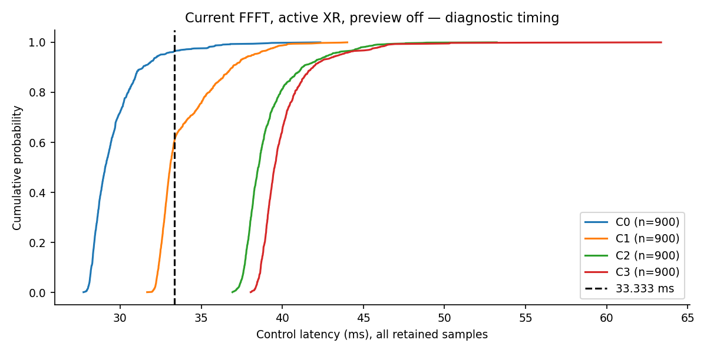
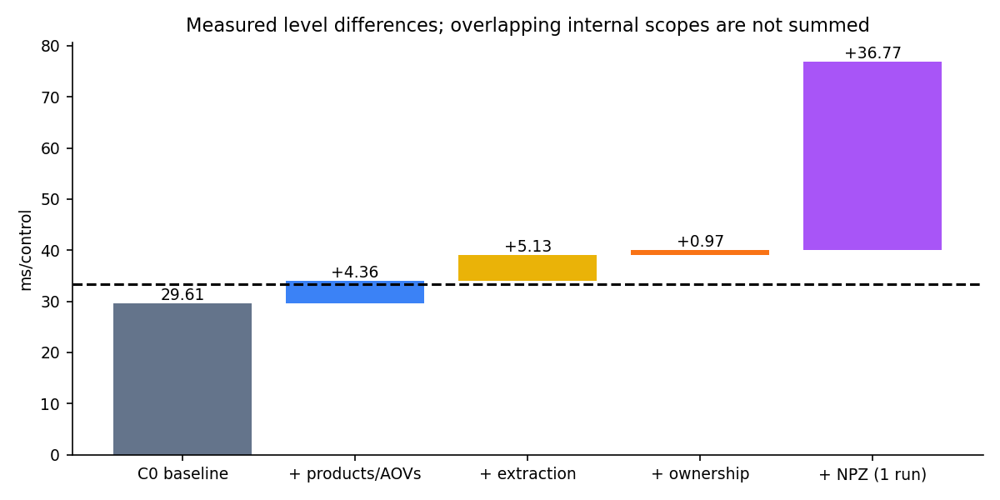
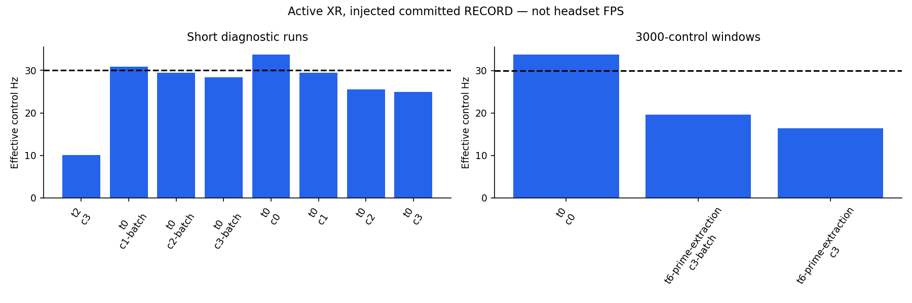
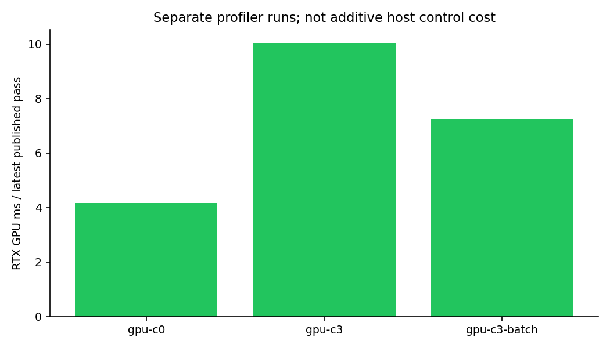
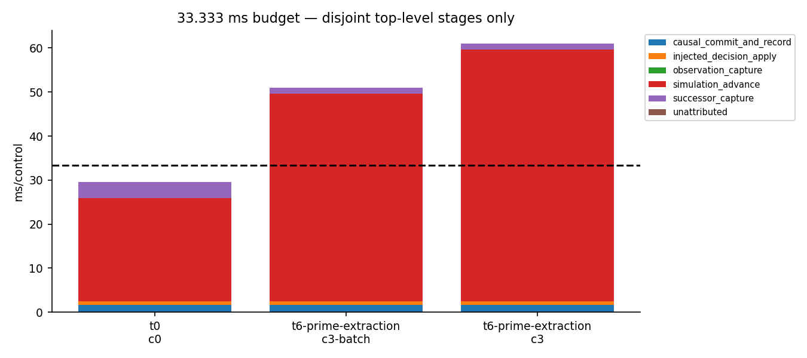
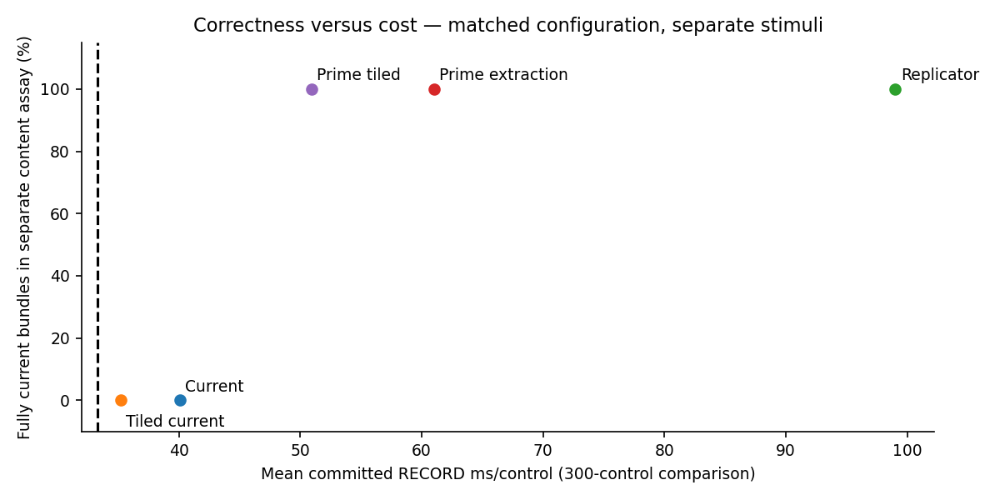

# Live camera temporal and full cost audit

Research branch only. No production selection, environment version, dataset
admission, gate acceptance or gate binding changes. No physical Quest was connected.

## 1. Executive conclusion

The temporal mismatch is reproducible, but it is **not an unavoidable inability
to capture live RGB**. Current FFFT produces shared N−1 content in all 900 primary
tested boundaries. Both the pinned Replicator synchronous capture and a narrower
render → Camera extraction → render → final capture sequence produce N/N/N in the
tested native-state assays, including controlled wrist/gripper motion. A simple
post-physics reorder does not fix it. The precise internal handoff owner remains
unresolved; this is not a universal upstream-bug finding.

For the current FFFT RECORD path, three 640x480 cameras with previews entirely OFF
increase mean control time from **29.606 to 40.069 ms: +10.463 ms/control**.
This is the complete measured marginal camera path in the injected native RECORD
workload, not only RTX time. Those pixels are temporally stale. The fastest tested
correct path is batched prime extraction: **50.972 ms/control (19.619 Hz)**,
**+21.377 ms** above its matched long camera-OFF baseline. It misses every measured
30 Hz deadline. Independent correct capture is 60.974 ms; Replicator is 99.005 ms.
No tested correct path has 30 Hz headroom.

Measured on RTX 4090 / i7-13700K, driver 580.159.03, pinned Isaac Sim 6.1.0.0 / Kit
110.3 / Replicator 1.13.36. Effective renderer is RealTimePathTracing and XR scale
0.4 throughout primary comparisons. The host has about 31 GiB RAM and the CPU
governor reports powersave; the repository's single-thread preflight passes.
These are observed host conditions, not tuned/new environments. Human input/IK,
physical Quest presentation and production live-RGB dataset admission are not
qualified. Source branch is `origin/experiment/vr-recording-fix-nocam` at
`0f67ad49c8d129e5f2420f1f685088baf0d4d792`.

Offline RGB remains justified by the measured budget and recording isolation,
while the stronger claim that live RGB cannot be temporally correct is refuted
within the tested scope.

## 2. Exact current RECORD pipeline


Verified in `tools/run_isaac_s1.py:_advance`, `tools/isaac_s2_runtime.py:run_s2`,
`tools/isaac_vr_recording.py:LiveRecording`, `tools/isaac_vr_runtime.py:VRCameraRig`,
and the pinned sources hashed in [source audit](source_audit.json).

```mermaid
sequenceDiagram
  participant L as S2 control loop (30 Hz logical)
  participant R as Native HDF recorder
  participant P as PhysX (120 Hz)
  participant F as Fabric / robot buffers
  participant K as Kit / Hydra / RTX
  participant C as Camera / annotator
  L->>R: O_t = promoted preceding successor (or sample initial O0)
  L->>L: XR input -> processor -> IK -> preclip A_t -> native apply
  loop Four integrations
    L->>P: write target; step(render = F,F,F,T)
    P->>P: simulate(1/120); fetch_results
    opt Fourth integration only
      P->>F: render -> forward kinematics and Fabric
      F->>K: KitVisualizer app.update (playSimulations disabled)
      K-->>K: Hydra/RTX scheduling and product/AOV work
    end
    L->>F: robot.update; record physics generation
    L->>C: rig.update (RECORD: returns; live: invalidate)
    L->>F: object/contact runtime updates
  end
  L->>C: capture_boundary (RECORD: returns; C2+: extract)
  opt C3 owned live payload
    C->>C: GPU host transfer -> numpy owned RGB copy
  end
  L->>R: capture O_(t+1), native/Fabric snapshot and digest
  L->>L: causal complete -> commit -> construct row
  L->>R: append buffered O_t plus A_t and successor identities
  R->>R: flush each 64 committed rows; promote successor to next O_t
```

Current RECORD intentionally calls neither upstream Camera.update nor annotator
extraction: `disable_live_rgb()` makes rig update/capture no-ops, and setup disables
the three Hydra textures and detaches annotators. C1-C3 restore only the selected
camera work at the existing end-of-four-integrations seam. HDF rows still use
snapshot-backed observations; diagnostic RGB is never silently admitted as D0 proof.

`step(render=True)` completes native simulate/fetch **before** invoking render.
`render()` calls physics pre-render, visualizers (including forward), post-render
hooks, then increments Lab's render generation. Thus T1 is not expected to fix a
render-before-fourth-physics defect: that defect is absent in the inspected source.
It moves the render after the final project buffer refresh, which is still a
falsifiable integration-order difference. KitVisualizer suppresses automatic
physics around app.update. Native callback counts, not only Lab counters, must
establish the no-extra-physics invariant.

| Identity / operation | What it establishes | What it does not establish |
|---|---|---|
| Physics generation | completed requested Lab physics integrations | pixels current |
| Native physics callback | actual PhysX integration callback | camera completion |
| Fabric forward count | calls forwarding native kinematics/transforms | independently observable Fabric state version (UNMEASURED) |
| USD state | authored stage values; pose writes to USD disabled with Fabric | live native pose equality |
| Kit update count | application pumps | RTX completion or headset FPS |
| Hydra render request / drawable | scheduling / observed per-product drawable publication | depicted state identity |
| Lab render generation | completed Python render method | native RTX fence or content state |
| RenderProduct path | resource identity and camera mapping | common source time |
| Camera.frame | buffer extraction/frame bookkeeping | freshness of scene content |
| Camera data generation | SensorBase update and completed extraction bookkeeping | native state represented by pixels |
| Annotator extraction | reader output available to Camera | output belongs to state N |
| Owned RGB | independent CPU bytes (2,764,800/tick) | correct temporal binding |
| Control tick | logical decision attempt | dense HDF row index |
| Dataset observation | immutable source snapshot identity and exact causal linkage | live RGB when only state was recorded |

The injected benchmark reuses native target apply, `_advance(4)`, snapshot capture,
causal commit, append and flush. It bypasses teleop and DifferentialIK. Its absolute
Hz is therefore a bounded no-client RECORD result, not human RECORD or headset Hz.


## 3. Temporal-correctness hypotheses

The audited `SimulationContext.step(render=True)` performs native simulate/fetch
before render. T1 therefore tests placement relative to the project's final
buffer refresh, not an imagined render-before-fourth-integration implementation.
Lab Camera counters track extraction. The Kit visualizer path makes Camera's
`ensure_isaac_rtx_render_update` trust the existing application pump; it does not
provide a content-currentness fence. Both independent and batched producers use
upstream `IsaacRtxRenderer` tiled products, with one versus three view slots.

Pinned Replicator 1.13.36 exposes `step(delta_time=0.0, pause_timeline=False,
rt_subframes=1, wait_for_render=True)`. The adapter first forwards native state,
guards `/app/player/playSimulations=false`, enables the orchestrator, and disables
capture-on-play. Exact native physics count and measured state must be unchanged
across the held-state capture. The inherited Lab base experience otherwise sets
`Orchestrator.enabled=false`; the initial unsupported setup timed out after 1000
application updates and is retained as failed setup, not negative API evidence.

T2 is a supported composite capture operation. Its internal settings also enable
synchronous material loading and disable eco mode; it is not a pure GPU fence.
The public source's attach/play callbacks apply capture settings, including
app async=false when Replicator async=false. This explains a supported route to
the observed baseline readback, but the precise startup setter was not traced.
The effective T0 readback was app async=false, low-latency=true, Replicator
async=false, FSD=true, Fabric transform consumption=true. T3 app OFF therefore
has no treatment contrast; the separate low-latency OFF test does.

## 4. Temporal experiment matrix

All primary probes retain 120 Hz physics, four integrations per logical 30 Hz
boundary, three canonical 640x480 views, RTX RealTimePathTracing, XR scale 0.4,
and zero preview panels. The non-XR control is explicitly separate.

| Candidate | Intervention | Physics / control | Rendering/capture |
|---|---|---|---|
| T0 | Current ordering | F,F,F,T | One Lab render, then Camera extraction |
| T1 | Post-physics explicit render | F,F,F,F | One explicit render after all four updates |
| T2 | Replicator held-state capture | F,F,F,F | Forward + synchronous orchestrator step; no physics |
| T3 | App async OFF | F,F,F,T | Effective value already false |
| T3 low-latency OFF | Only low-latency switch | F,F,F,T | Separate ablation |
| T4 | FSD OFF | F,F,F,T | Legacy delegate; Fabric physics retained |
| T5 | One three-view producer | F,F,F,T | Same poses/resolution/role mapping |
| T6 double | Two held-state explicit renders | F,F,F,F | No extra physics; discriminates pump count |
| T2 batch | Barrier + one three-view producer | F,F,F,F | Selected after individual effects |
| T6 prime extraction | Render, discarded Camera update, render, final capture | F,F,F,F | Two Kit pumps; same native state throughout |
| T6 double extraction | Two Camera updates after the current render | F,F,F,T | Discriminates extraction count |
| T6 CUDA diagnostic | Current extraction followed by explicit CUDA synchronize | F,F,F,T | Discriminates this post-extraction fence placement |

The oracle reuses the frozen deferred probe, with an experiment-only adapter.
Two actual existing PhysX cubes move through separated native kinematic poses in
view of the canonical wrist cameras and static scene camera. Fixed diagnostic
materials aid visibility, but native geometry motion is the witness. Articulation
targets are held canonical: the old large finger/joint teleports made the actual
post-physics reference geometry inconsistent. A second assay moves actual articulation joint 0 and finger aperture through
separated native states, restoring the actual post-physics articulation for
references. It tests moving wrist cameras and gripper appearance with the same
content classifier. This controlled sequence does not qualify human teleoperation
or establish independent visibility of every finger surface.

Four held native reference states are restored from actual post-integration
snapshots, then rendered without physics; T2 references use the same supported
capture barrier. Features are RGB mean absolute errors over reference-varying
pixels, sampled at stride two for analysis only. Full-resolution raw RGB remains
retained. Require minimum pair separation >=10 intensity units, best error <=40%
of that separation, and runner-up margin >=max(5,25% separation). Missing or
ambiguous results fail closed. Every boundary's errors, margins, RGB hashes,
Camera identities, native state, physics/render/Kit counters and drawable receipts
are retained. Four declared initial stimulus controls remain in raw logs and are
excluded only as predeclared warmup, never as outliers.

A four-state cycle identifies offsets in the tested N..N-3 window; it alone can
alias a delay of four additional controls. Separate deterministic sentinel runs
hold the native state every eleventh control, breaking that cycle. Repeated-state
ambiguity remains unresolved rather than being relabelled current. These checks
corroborate the observed phase but are not an arbitrary-latency proof.

## 5. Temporal results

| Candidate | Boundaries | All N | Shared N−1 | Any N−2/N−3 | Cross-view disagreement | Unresolved |
|---|---:|---:|---:|---:|---:|---:|
| T0 current (3 processes) | 900 | 0% | 100% | 0% | 0% | 0% |
| T1 explicit post-physics | 100 | 0% | 100% | 0% | 0% | 0% |
| T2 Replicator (3 processes) | 900 | 100% | 0% | 0% | 0% | 0% |
| T3 app async OFF (no effective contrast) | 100 | 0% | 100% | 0% | 0% | 0% |
| T3 low-latency OFF | 100 | 0% | 100% | 0% | 0% | 0% |
| T4 FSD OFF | 100 | 0% | 0% | 0% | UNRESOLVED | 100% |
| T5 tiled current | 100 | 0% | 100% | 0% | 0% | 0% |
| T6 two renders | 100 | 0% | 100% | 0% | 0% | 0% |
| T2 tiled | 100 | 100% | 0% | 0% | 0% | 0% |
| T6 prime extraction, moving (3 processes) | 900 | 100% | 0% | 0% | 0% | 0% |
| T6 prime extraction tiled, moving (3 processes) | 300 | 100% | 0% | 0% | 0% | 0% |

Each resolved primary bundle has the same offset in left wrist, right wrist and
scene. [Temporal data](temporal-results.json) retain every per-role histogram;
[all run summaries](results.json) also include setup failures and supplementary
assays. T0/T2 primary probes were measured at `3325c86`; the moving prime probes
and primary cost matrix were measured at `cc05a4c`. Exact full SHAs and source
hashes are retained per run. They are distinct content/performance workloads.

Supplementary moving-wrist T0 and T2 runs each retain 100 boundaries: T0 is 100%
N−1 and T2 is 100% N. Forty-boundary two-extraction and post-extraction CUDA-fence
ablations remain 100% N−1. A separate no-XR T0 control is 100/100 current; this
narrows the scope to the XR composition and is not proposed as an XR solution.

Sentinel holds deliberately create ambiguous repeated states. T0 and two-render
sentinel runs each retain 82% shared N−1 and 18% unresolved; Replicator and prime
extraction each retain 91% current and 9% unresolved. No ambiguous frame is
upgraded to current. These results support the observed phase and preserve the
finite-window limitation.

T4's legacy delegate emits `_MarkInstancerDirty` warnings and produces
indistinguishable native reference states. It is an invalid diagnostic ablation,
not a negative proof about live capture or proof of an FSD defect. The moving
assay also retains the old centroid check's `reference_witness_not_visible`
diagnostic when that narrower color witness is occluded; the whole-image native
geometry classifier has separately measured reference separation and passes.







For example, native projection independently corroborates the T0 left-wrist cube
phase: at retained control 5, the left cube has observed centroid approximately
(190.14,363.49), expected current (191.73,111.73), expected preceding
(191.73,368.27). The 251.77 versus 5.04 pixel errors give a 246.72 pixel margin
against the next nearest native prediction. The exact projections are retained
in `temporal-t0-r1/deferred-phase.json` (row 5, left_wrist/native/left_cube). Raw full-resolution payload locators are in
[representative image identities](representative-images.json).

Representative raw failures and references are in the locators indexed by
[provenance](provenance.json). The retained image comparison shows actual N-1
content, not just equal counters. No cross-view offset disagreement was observed
in the corrected primary assays; this is narrower than historical claims.

## 6. Root-cause assessment

**Measured facts:** Current FFFT reproduces a stable N−1 phase under the active no-client XR
composition. Rendering after all four updates does not fix it. The pinned
Replicator capture transaction and an interleaved render/extract/render sequence
both yield current three-view pixels in the tested native-state assays. Two
ordinary renders, two extractions, and the tested post-extraction CUDA fence do
not. The successful sequences preserve exactly four native physics integrations
and unchanged native state during rendering. T2 issues five Kit updates and five
drawable events per product; prime extraction issues two. App async OFF is already
the baseline value; disabling low latency does not fix the phase.

**Strong inference:** the selected live Camera integration lacks a sufficient
capture-completion/state-handoff operation under the active XR experience. The
supported Replicator path can obtain the tested current native state, so the
claim that live RGB is inherently impossible is refuted within this assay.
Simply moving one render or issuing a second ordinary Kit render is insufficient.

**Unresolved possibilities:** precise ownership of the XR/Fabric/Hydra handoff;
why interleaved Camera extraction and a second render succeed while two
ordinary renders do not; generalized motion and headset-connected behavior;
any separate problem in Camera versus the upstream renderer. FSD OFF yielded
unusable reference discrimination and does not isolate an FSD defect. These data
do not establish a universal Kit/Isaac bug.

## 7. Full camera-cost decomposition

| Measured transition | Marginal wall ms/control | Interpretation |
|---|---:|---|
| C1 − C0 | +4.362 | Products, RGB AOV/annotator production and scheduling |
| C2 − C1 | +5.129 | Requested extraction/synchronization and its state-recording interaction |
| C3 − C2 | +0.972 | Owned host RGB and final validation |

| Direct scope in C3 | mean ms/control | Scope |
|---|---:|---|
| render_app | 11.928 | Inclusive render/app, NON-ADDITIVE with Kit/Fabric |
| kit_visualizer_app_pump | 11.114 | Inclusive Kit pump |
| camera_extraction | 5.146 | Three upstream Camera.update calls; includes implicit waits |
| rgb_device_to_host | 0.483 | Blocking host transfer as actually required |
| rgb_numpy_copy | 0.184 | Independent numpy ownership |
| camera_binding_validation | 0.113 | Current-boundary checks only |
| hdf_append_ms | 0.229 | Native buffered append |
| hdf_flush_ms | 0.125 | Periodic flush, amortized over all controls |

C3 camera-boundary work is 8.764 ms inclusive. After extraction, host transfer, copy and timed current-boundary checks, about 2.838 ms remains in capture state/identity/finalization work; this is a derived remainder, not an isolated timer. Successor capture changes from 4.572 ms in C1 to 1.299 ms in C3. This is consistent with native state reads and synchronization moving earlier into camera capture. Consequently the internal camera-boundary cost must not simply be added to the C1 total. HDF append/flush means remain small; their full tails and every flush control are retained.






C0 suspends dataset Hydra textures and detaches annotators, while native state/HDF
recording remains enabled. C1 keeps all products and attached RGB annotators/AOVs
active but performs no intentional per-control Camera extraction. Drawable events
prove production; counters alone are not used. C2 performs normal Camera update
and annotator extraction once per control. C3 also performs owned CPU RGB: device
transfer and numpy copy are timed separately, with 2,764,800 RGB bytes/control.
C4 writes separate compressed NPZ payloads; it never changes the native HDF schema.
The single optional C4 diagnostic averages **76.839 ms/control (13.014 Hz)**.
Its directly timed NPZ compression/write averages **35.212 ms/control**; total
C4−C3 is +36.771 ms, a one-run diagnostic difference rather than a replicated
storage estimate. Its 600 warmup+measured payloads occupy **192,470,205 bytes**.
No fsync/durable-storage throughput or PNG/video codec claim is made.

C1 includes unavoidable attached annotator/AOV work; it is not pure RTX time.
C2-C1 estimates the whole extraction/request/synchronization/binding increment.
C3-C2 estimates ownership cost in the matched workload. Differences can be small
or negative under run drift; direct scoped timings accompany the differences.
GPU/CPU overlap and nested timers prevent an exact additive decomposition into
RTX, Hydra scheduling and synchronization. No forced CUDA fence was added to the
performance path. A separate, explicitly named temporal-only CUDA fence ablation
failed to fix the phase; it does not rule out all possible fence placements.

## 8. Matched current-FFFT cameras OFF vs ON result

| Current FFFT, active XR | mean | p50 | p95 | p99 | effective Hz | deadline misses |
|---|---:|---:|---:|---:|---:|---:|
| C0 | 29.606 | 29.081 | 32.473 | 36.287 | 33.777 | 33/900 |
| C1 | 33.967 | 33.083 | 38.236 | 40.254 | 29.440 | 359/900 |
| C2 | 39.097 | 38.521 | 42.910 | 45.733 | 25.578 | 900/900 |
| C3 | 40.069 | 39.525 | 43.540 | 46.479 | 24.957 | 900/900 |

Times are ms/control. Three independent repetitions each; 300 warmup + 300 measured controls per process. These are diagnostic timing results: the corresponding current live-RGB content path is temporally invalid.

**C3 minus C0:** mean **+10.463 ms**, p95 **+11.067 ms**, p99 **+10.193 ms**, effective rate **-8.820 Hz**. Quantile differences compare the two distributions; they are not quantiles of paired individual-tick differences.


Fresh processes use the same committed adapter, scene, configuration family,
state/cache root, pinned environment and rendering quality. All measured controls
are retained. Primary XR FFFT RGB is temporally invalid; its matched 300-control
windows are explicitly diagnostic rather than long performance qualification.
The longer active-XR camera-off and correct-capture controls have 300 warmup and 3000 measured controls. The first 300 post-warmup controls of each long run were predeclared as an additional matched short comparison; the full 3000-control distributions remain retained.
Runs are interleaved in forward/reverse order with three independent repetitions.
The supported correct XR path is separately measured; it is not called FFFT.

Native committed RECORD uses the existing bounded injected-target driver. Actual
human input, processor traversal and IK are bypassed; absolute rates must not be
advertised as headset/human RECORD rates. The current scene, native command apply,
four physics steps, successor snapshot, causal commit and HDF lifecycle are real.
A production physical result remains unmeasured. The original bounded injected target sweep repeats every 1000 controls. An opt-in `require_distinct_actions=False` permits that unchanged periodic workload in long experiments; default smoke behavior still requires unique actions, and every causal/HDF row remains independently validated. No target or task dynamics were changed for the cost measurements.

## 9. Performance distributions

| Cohort | n | stddev ms | CV | p90 ms | p99.9 ms | max ms | miss fraction |
|---|---:|---:|---:|---:|---:|---:|---:|
| C0, short | 900 | 1.707 | 0.0577 | 31.413 | 41.147 | 42.349 | 3.67% |
| C1, short | 900 | 1.981 | 0.0583 | 36.933 | 43.622 | 44.007 | 39.89% |
| C2, short | 900 | 1.837 | 0.0470 | 41.221 | 49.340 | 53.224 | 100.00% |
| C3, short | 900 | 1.914 | 0.0478 | 41.887 | 56.352 | 63.357 | 100.00% |
| C0, long | 9000 | 1.733 | 0.0586 | 31.702 | 42.420 | 53.970 | 3.62% |
| Prime independent, long | 9000 | 2.655 | 0.0435 | 63.723 | 77.153 | 137.590 | 100.00% |
| Prime tiled, long | 9000 | 1.958 | 0.0384 | 53.357 | 64.897 | 71.126 | 100.00% |
| Replicator, short | 900 | 2.171 | 0.0219 | 101.533 | 110.298 | 115.672 | 100.00% |



All long cohorts contain three independent 300+3000-control processes. Their run-mean ranges are 60.911–61.026 ms for independent prime extraction and 50.920–51.054 ms for batched prime extraction. The complete per-run distributions, wall rates, process CPU/RSS, cumulative disk counters, measured-window disk deltas, HDF/artifact bytes and GPU samples are in the linked JSON. CPU percent uses one logical CPU as 100%; disk counters include logging and OS writeback and do not isolate HDF durable writes.


[Results](results.json) retain per-run count, mean, standard deviation, CV,
p50/p90/p95/p99/p99.9/max, effective Hz, wall Hz, RTF and 33.333 ms deadline
misses. Effective Hz is 1000/mean elapsed control time, RTF is effectiveHz/30;
wall Hz also includes between-control observers/output. Neither is headset FPS.
No samples are trimmed. Startup/shader preparation is excluded consistently.

Timers expose target writes, native physics, Fabric forward, Kit pump, render,
camera extraction, host transfer, numpy copy, binding checks, observation and
successor capture, causal commit/HDF append and flush. Nested timers are
NON-ADDITIVE. `observer_before_write_ms` measures end-observer construction plus
existing logger output, excluding its final JSON write. Other instrumentation
cost is not independently calibrated: UNMEASURED. Unattributed primary residual
is retained. Input/teleop and IK cost in this injected workload is UNMEASURED.

## 10. RTX/render budget

| Diagnostic profiler run | RTX mean ms/published pass | p95 | Exposed tile count |
|---|---:|---:|---:|
| XR/operator only, C0 | 4.164 | 4.222 | 2 |
| + three independent cameras, C3 | 10.027 | 10.160 | 5 |
| + one three-view product, C3 | 7.219 | 7.283 | 3 |

The combined independent-camera GPU increment is **5.862 ms/reported pass**;
the tiled increment is **3.055 ms/reported pass**. This explains why a historical
approximately six-millisecond GPU observation can coexist with a current
**10.463 ms/control** total increment. Each diagnostic has 300 warmup and 300
measured controls, one process; GPU scopes are not part of the primary timing
matrix. Individual role attribution is UNMEASURED. Pinned Kit profiler source
explicitly treats these `duration` values as milliseconds.

For representative measured-window telemetry, C0 repetition 1 has GPU utilization
mean 49.25% (8 one-second samples), C3 repetition 1 50.33% (12 samples), and
correct tiled long repetition 1 52.03% (154 samples). VRAM means are approximately
7925, 8179 and 8240 MiB respectively. Process CPU means are 323%, 325% and 351%;
RSS means approximately 8.07, 8.08 and 8.02 GB. These are explicitly representative
runs; all repetitions and distributions remain in `results.json`. Low sampled
GPU utilization does not establish spare end-to-end latency headroom.



GPU profiler queries are diagnostic-only separate runs; they introduce no extra
render. Persistent external nvidia-smi sampling records utilization and VRAM.
RTX scope durations are per reported GPU pass, not end-to-end per-control cost.
A product identity does not imply one independent RTX pass; reported tile/scopes
are retained without assigning unexposed GPU work to a camera role.

| Wall budget case | Mean ms/control | Mean budget remaining (33.333 ms) |
|---|---:|---:|
| C0 long | 29.595 | +3.739 |
| Current independent C3, short diagnostic | 40.069 | −6.735 |
| Correct tiled prime, long | 50.972 | −17.639 |
| Correct independent prime, long | 60.974 | −27.640 |
| Correct Replicator, short | 99.005 | −65.672 |



The stacked graph uses only disjoint top-level wall stages. RTX, Kit and Camera
nested scopes are deliberately excluded from this stack because they overlap.

## 11. Camera cost by layer

| Layer | Observable | Limitation |
|---|---|---|
| RenderProduct | enable state, role/path mapping, drawable events | Producer event is not content proof |
| RTX | reported GPU scope/pass and tile count | Delayed/nested GPU telemetry, not wall critical path |
| Hydra/Kit | app update count and timed visualizer/render calls | CPU scheduling and waiting overlap GPU |
| Extraction | timed Camera.update / annotator consumption | Includes upstream copies and implicit synchronization |
| Synchronization | Replicator held-state wall time; host transfer wait | No standalone CUDA-fence measurement |
| Ownership | .cpu().numpy() and explicit numpy copy | Transfer may block for earlier GPU work |
| Binding | current boundary/frame/generation validation | Bookkeeping cannot establish depicted state |
| Storage | HDF append/flush and optional separate NPZ | PNG/video codecs not benchmarked |

## 12. Independent vs tiled/multi-view result

| Current FFFT level | Independent mean ms | Tiled mean ms | Tiled saving ms |
|---|---:|---:|---:|
| C1 active products | 33.967 | 32.384 | 1.583 |
| C2 extraction | 39.097 | 33.973 | 5.124 |
| C3 owned RGB | 40.069 | 35.225 | 4.843 |

Each cell pools three independent matched 300-control windows after 300 warmup.
Tiled C3 reaches 28.389 effective Hz but remains N−1 and misses 897/900 deadlines.
Equal owner/frame IDs do not establish content cotemporality. For the separately
qualified prime-extraction sequence, batching saves **10.002 ms/control** in the
matched long comparison: 60.974 → 50.972 ms, still above the deadline.

The upstream owner is one real Camera with three view slots, not a custom renderer.
Role mapping follows actual sensor prim order and is checked against the renderer
spec. Canonical poses and per-view 640x480 resolution are retained. The held-articulation and separately repeated moving-wrist assays use the same
content classifier. A moving-wrist tiled probe also passes. Whole-view native
geometry evidence does not independently qualify an occluded finger surface.

## 13. Cost of temporal correctness

| Correctness-qualified configuration | n controls | mean ms | p50 | p95 | p99 | effective Hz |
|---|---:|---:|---:|---:|---:|---:|
| Matched C0 baseline | 9000 | 29.595 | 29.045 | 32.715 | 36.271 | 33.790 |
| Prime independent | 9000 | 60.974 | 60.339 | 65.513 | 68.733 | 16.401 |
| Prime tiled | 9000 | 50.972 | 50.469 | 54.652 | 57.979 | 19.619 |
| Replicator (short) | 900 | 99.005 | 98.678 | 103.008 | 106.045 | 10.101 |

Prime extraction is the narrowest **tested** successful sequence, not a proven
minimum-cost upstream solution:

```text
physics(False) × 4
sim.render()
Camera.update(0, force_recompute=True) for each producer (discard this extraction)
sim.render() at unchanged native state
normal end-boundary capture + owned RGB
```

Only the final bundle is accepted; no dataset state or extra physics step is
fabricated. Independent and tiled variants each emit two Kit/drawable updates.
The matched long cost over C0 is **+31.379 ms independent / +21.377 ms tiled**.
The predeclared first-300 comparisons give 61.008 and 50.950 ms respectively;
relative to their matching current C3 producer types, the correctness surcharge
is **+20.939 ms independent / +15.724 ms tiled**. These quantifications retain
state-invariance diagnostic checks averaging 0.338/0.336 ms; they are not silently
subtracted as hypothetical production savings.

Replicator averages 99.005 ms/control, with a nested held-state barrier of
69.655 ms and state-invariance checks of 0.370 ms. Its three 300-control measured
windows suffice to establish a large deadline miss; long qualification targets
the cheaper successful sequence. No supported method tested here yields both
current three-view content and comfortable realtime throughput.




The successful tested mechanism is available in the pinned upstream API. Its cost
is a composite synchronous capture cost, not an inferred six-millisecond GPU delta.
Four native physics callbacks per control and unchanged measured state across
capture reject extra-physics explanations. No action shift, duplicate frame or
interpolation is used. Cost measurement does not admit diagnostic RGB to HDF/D0.

## 14. Comparison to historical evidence

The required 20260921 bakeoff, phase findings, XR scheduling evidence, deferred
min60/min120, camera-latency and batched reports were inspected. Their RTX Minimal
settings, scene/control and implementation revisions differ from this study.
Their lag/cross-view reports motivated the hypotheses but are not observations
of this branch. This assay reproduces a stable shared N-1 phase, not every older
role-specific/time-varying behavior.

The `review/vr-recording-validation@e2e08e3` camera suspension report's approximately
131.128 to 81.967 ms/control is **historical**, not the current FFFT comparison.
The lifecycle reconciliation's roughly 23.94 ms no-XR injected result is also
historical context. The old approximately six-millisecond RTX/pass delta is not
substituted for complete camera cost here. No graph pools those workloads.

## 15. NVIDIA upstream/docs/forum findings

Exact installed files and SHA-256 identities are in [source audit](source_audit.json).
The source audit precedes the adapters and owns API truth. All external sources
were retrieved on 2026-09-24 Europe/Moscow (2026-09-23 UTC).

| Source | Exact supported claim | Version relationship | Retrieved |
|---|---|---|---|
| [Isaac Sim Replicator API tutorial](https://docs.isaacsim.omniverse.nvidia.com/6.1.0/replicator_tutorials/tutorial_replicator_getting_started.html) | wait_for_render blocks for capture; false may return previous frame; held delta_time supported | 6.1 documentation; parameters verified locally | 2026-09-24 Europe/Moscow (2026-09-23 UTC) |
| [Isaac Sim SDG workflows](https://docs.isaacsim.omniverse.nvidia.com/6.1.0/replicator_tutorials/tutorial_replicator_sdg_workflows.html) | Active RenderProducts continue rendering per application tick; disable via updates_enabled | 6.1 documentation; local Hydra property verified | 2026-09-24 Europe/Moscow (2026-09-23 UTC) |
| [Fabric Scene Delegate comparison](https://docs.omniverse.nvidia.com/kit/docs/usdrt.scenegraph/latest/fabricsd/fsd_vs_omnihydra.html) | FSD consumes Fabric rather than the legacy mixed USD/Fabric path | contextual rolling docs; local Kit experience confirms selected FSD setting | 2026-09-24 Europe/Moscow (2026-09-23 UTC) |
| [NVIDIA skeleton/FSD discussion](https://forums.developer.nvidia.com/t/usdskel-not-in-sync-when-the-scene-is-played/344617) | NVIDIA reply attributes skeleton N versus skinned mesh N-1 to FSD ordering; proposes synchronous Replicator capture | context only: skeleton and Isaac 6.0, not our rigid bodies/6.1 measurement | 2026-09-24 Europe/Moscow (2026-09-23 UTC) |
| [Camera lag report](https://forums.developer.nvidia.com/t/camera-images-are-always-delayed-2-rendering-frames/251906) | User reports two rendering-frame camera lag | context only: 2023 releases, not proof here | 2026-09-24 Europe/Moscow (2026-09-23 UTC) |
| [Simulation/postprocessing phase report](https://forums.developer.nvidia.com/t/the-simulation-time-is-desynchronized-with-the-playback-time/346839) | User reports render versus postprocess phase difference | context only: Isaac 5.0, not proof here | 2026-09-24 Europe/Moscow (2026-09-23 UTC) |

Forum reports are contextual leads. Our native rigid-body measurements are stronger evidence for this workload. Python sources and installed API stubs are inspectable; closed native Kit/Hydra implementations are not available as source here. No universal one-RTX-pass-per-RenderProduct claim is supported: drawable identities and measured tile/pass scopes are reported separately.


## 16. Implications for offline RGB architecture

Offline RGB remains justified for the current application budget and for keeping
state/action recording independent of live render latency. This investigation
has not measured offline RGB throughput or validated a new offline product. The
reason is bounded cost/isolation, not proof that current live RGB is impossible.
State snapshots and training labels must retain their existing causal identities.

## 17. Implications for live RGB architecture

A future live path must include a proven state/capture operation and content
qualification, then budget the complete capture and recording cost. Do not promote
counter equality or an extra ordinary render to such a guarantee. The tested
Replicator and prime-extraction compositions are research candidates. Controlled
moving-camera evidence passes; human-input and physical-XR follow-up remain required. No production implementation is switched.

## 18. Remaining unknowns

Generalized moving wrist/gripper temporal guarantees beyond the controlled
sequence; physical Quest presentation/tracking cost; dynamic task trajectories; arbitrary
latencies outside the tested offset window; the exact internal XR/FSD handoff;
a lower-cost supported barrier; role-specific RTX attribution; video encoding;
independent calibration of instrumentation overhead. Unavailable metrics are
UNMEASURED, never zero. Failed setup attempts and FSD failures remain retained.

Failed setup is preserved separately from temporal evidence:

| Failure class | Retained scope / disposition |
|---|---|
| Launcher/instrumentation setup | CLI mismatch, ResolvableString handling, missing no-XR teleop runtime variable, missing recording-dir argument; corrected before primary runs |
| Initial weak references | Occluded color witnesses, inconsistent large joint teleports and incorrect reference mapping; no temporal conclusion from these attempts |
| Disabled Replicator orchestrator | Initial step loop exceeded 1000 pumps and was interrupted; exact installed experience disables the orchestrator until explicitly enabled |
| Replicator reference setup | Capture-on-play OFF required the same supported barrier for held-state references |
| FSD legacy delegate | Unusable references, warnings and unresolved classification retained; no long qualification |
| CloudXR port 48322 occupied | Some first attempts failed before measurements; fresh retries have distinct locators; port owner was not established |
| Missing core tools in root venv | Switched to the already-declared core validation environment; installed no dependencies |

Validation on the final experiment code (analysis/classifier commit `565daaf3b803ece509a80e896889b1fa36834a55`, with subsequent plot-label and CSV line-ending-only adjustments):

- Focused camera/capture/recording/replay/runtime tests: **163 passed**.
- Full feasible declared core suite: **615 passed, 26 skipped, 2 warnings, 4 subtests passed**. The first sandboxed attempt had three RPC socket-bind failures; the authorized socket-capable rerun passed. The warnings concern existing hppfcl deprecation and a non-writable numpy tensor fixture.
- Governance regression suite: **108 passed**.
- Documentation/spec references, contract structure/semantics and selective MANIFEST: PASS. Canonical `FINAL RC NOT READY` and existing gate blockers remain unchanged.
- Ruff and scoped mypy: PASS; mypy covers seven source files with unavailable SDK imports skipped/ignored, not full native SDK typing.
- Native SessionReader and strict project validation: **43 recordings, 47,280 committed frames**, all pass. The first readback wrapper returned 1 after successful validation because its report used a different path from the launcher; a fresh corrected wrapper run exits 0. Neither pass is a stage-replay or offline-RGB qualification.
- Matched-cohort consistency check: PASS for source hashes, effective quality/scale, four native integrations, disabled previews, product counts, Kit counts and nonoverlapping benchmark processes.
- Final nonfinite-reference guard: **15,480 retained classifications unchanged**; four declared warmup boundaries per run remain excluded from measured rates. One early failed setup has an older centroid-only schema and is reported separately.

Exact commands, raw logs and source identities are retained in [provenance](provenance.json). Documentation/spec/contract/manifest checks use trusted base `0f67ad49c8d129e5f2420f1f685088baf0d4d792`. Historical preservation is checked against that base; pre-existing historical-integrity debt remains unresolved, and external authenticity is not independently checked. No physical or gate qualification is inferred.

## 19. Physical Quest follow-up

No physical Quest result is claimed. A human can start the owned CloudXR/Quest
session using the existing [operator guide](../../project/RUN_VR_OPERATIONS.md),
then run fresh unique output directories with the same pinned environment:

```sh
python tools/camera_audit/launch.py --probe --mode physical --temporal t0 --measured 300 --output /data/ebulochkin/vla-runtime/evidence/20260924_live_camera_temporal_cost_audit/physical-t0-r1 --state-root /data/ebulochkin/vla-runtime/isaac-isaac61
python tools/camera_audit/launch.py --probe --moving-wrists --mode physical --temporal t2 --measured 300 --output /data/ebulochkin/vla-runtime/evidence/20260924_live_camera_temporal_cost_audit/physical-t2-r1 --state-root /data/ebulochkin/vla-runtime/isaac-isaac61
python tools/camera_audit/launch.py --probe --moving-wrists --mode physical --temporal t6-prime-extraction --measured 300 --output /data/ebulochkin/vla-runtime/evidence/20260924_live_camera_temporal_cost_audit/physical-prime-r1 --state-root /data/ebulochkin/vla-runtime/isaac-isaac61
```

Repeat interleaved in fresh directories, retain connection/presentation evidence,
and do not infer display FPS from app callbacks. These diagnostic commands move
simulated witness cubes and, with `--moving-wrists`, articulation; they do not command a physical robot. Actual human RECORD
cost additionally needs the canonical physical recording lifecycle with the same
selected camera work; the injected cost launcher deliberately refuses physical
mode rather than labelling injected controls as human operation.

## 20. Final verdict

| Question | Verdict |
|---|---|
| A. Is previous temporal mismatch reproducible? | **Yes, within scope:** shared N−1 in 900/900 current-path boundaries; historical cross-view disagreements were not reproduced here. |
| B. Is it our scheduling/integration? | **The current integration is insufficient.** Plain post-physics reorder fails; supported held-state capture and render/extract/render succeed. Exact SDK/Fabric/XR ownership remains unresolved. |
| C. Is supported correct live RGB possible? | **Yes in the tested content assays**, including controlled moving wrists/gripper. This is not a general physical-task guarantee. |
| D. What does that path cost? | Fastest tested correct path: **50.972 ms/control, +21.377 ms above matched camera-OFF**, with upstream three-view batching. Independent prime capture: 60.974 ms; Replicator: 99.005 ms. |
| E. Can it sustain 30 Hz with headroom? | **No tested correct path does.** Fastest is 19.619 effective Hz and misses 9000/9000 measured deadlines. |
| F. Does offline RGB remain justified? | **Yes for the current measured budget and state-recording isolation.** It is not justified by an assertion that live correctness is impossible. No new offline correctness claim is made. |

Implementation discipline / size re-audit:

| Required item | Result |
|---|---|
| Capability / gate | Bounded experiment; D0/S1/S2/D1 acceptance and bindings unchanged |
| Reused / pinned owners | SimulationContext, PhysxManager, Camera/IsaacRtxRenderer, Replicator 1.13.36, HydraTexture, Kit 110.3 and native Episode Recorder |
| Remaining gap / adapter | Process-local selectors, retained native-state content oracle, timings and offline summaries |
| Environment impact | No pins, dependencies or declared environment selection changed |
| Production code scope | Only a default-preserving injected-driver option allowing its existing bounded action cycle in long research runs; pure regression test preserves the default guard |
| Registration | New bounded report, provenance and results artifacts plus experiment evidence; no gate binding |
| Human evidence / next gate | None; physical follow-up remains separate and no gate promotion is proposed |

The experiment crosses the 1000-line audit threshold across launch, import hook,
oracle, runtime observers and offline analysis. Re-audit confirms that pinned
upstream still owns rendering, physics, sensors,
causal transactions and native HDF. New code only selects experiment variants,
retains pixels/provenance, times existing calls and summarizes results. Reused
historical helper bytes remain unchanged. The size re-audit found no replacement
renderer, recorder, robotics framework or environment. No gate bindings change.
