# Архитектуры записи: от master до текущего live-пайплайна

Kind: experiment; status: current; owner: `vr.performance`; mutable: true.
Срез исследования: 2026-10-10, исходный HEAD `daf6d41e057669fe5c918426062c1be26bb10287`.
Нулевая архитектура: master `beaedfd1116577fd4d8026232cfb96cba0b030fa`.
Ветка: `research/live-camera-recording-30hz`. Gate bindings=[].
Это запрошенная сравнительная карта всего исследования; подробные отчёты и
замороженные результаты остаются первоисточниками. Новых GPU-прогонов при сборке карты нет.

## Где мы сейчас

Найдена практически полезная архитектура: **одна основная Kit-сцена, CPU PhysX
и DLS, три live камеры960×600, GPU NVENC, превью из тех же кадров, онлайн HDF5
state/actions и привязки изображений к наблюдениям**. Длинный прогон во время
записи дал **49,76 Гц**, с завершением кодирования **49,67 Гц**; короткий повтор
с явной проверкой CPU backend — **50,55/49,77 Гц**. С тем же конечным пайплайном
на CUDA PhysX — **25,39/24,65 Гц**. Быстрый профиль существенно меняет способ
исполнения физики и управления относительно GPU-профиля master.

**Требование >30 Гц с подключённым Quest ещё не подтверждено.** Новые тесты
использовали XR-профиль без клиента и детерминированные simulated inputs.
Есть точная привязка идентификатора источника, но остаются temporal image
artifacts, непокрытый конец эпизода, небольшой CPU physics drift с превью,
рост RAM и зависимость адаптера превью от конкретных Kit/CUDA/CUPTI версий.
Selected RUN/DIAG/RECORD не переключены; физическая квалификация и допуск
датасета не получены. Источник: [последний подробный отчёт](native_deep/REPORT.md).

## Как читать скорости и бюджеты

Исследование шло по двум ответвлениям, а не по одной цепочке настроек:
сначала отдельный snapshot-fed renderer, затем возвращение к камерам основной
живой сцены. Ниже девять различимых вариантов0–8; небольшие совместимые
доработки объединены. Переход4→5 сознательно отменяет отдельный renderer.

Основные новые тесты: RTX4090, i7-13700K,32GB RAM, Isaac6.1/Kit110.3,
Replicator1.13.36, CUDA12.8. Три камеры960×600, четыре физических шага1/120с
на control tick. Исключения указаны явно. У разных этапов отличаются view mode,
warmup, длительность и качество рендера: таблица показывает проверенные scopes,
а не чистое причинное A/B всех архитектур.

`Рабочая` частота — межтиковые wall intervals после warmup. `С хвостом` включает
завершение NVENC в указанном тесте, но не обязательно весь shutdown/проверку.
Историческая whole-session частота включает lifecycle и выделена отдельно.
30FPS в видеоконтейнере и30Hz simulation grid сами по себе не доказывают wall
capture throughput. Положительный запас — остаток **20мс для50Гц** или
**33,33мс для30Гц** без нагрузки подключённого Quest; он не прогнозирует её стоимость.

| № / вариант | Рабочая Гц / с хвостом | Период, мс | Остаток20мс /33,33мс | Что ограничивает результат |
|---|---:|---:|---:|---|
| 0. Master, state-only | исторически37,68 без клиента;26,963 whole-session с Quest |26,54 /37,09 соответственно|−6,54/+6,79; −17,09/−3,76|RGB материализуется позднее; это разные исторические scopes|
| 1. Native compressed prototype |52,51 /не установлено|19,04|+0,96/+14,29|418 packets на420 transitions; не законченная корректная запись|
| 2. Kit producer +OVRTX mirror |47,94 /не тот же steady denominator|20,86|−0,86/+12,47|1441 триплет, source IDs PASS; полнота геометрии ещё не доказана|
| 3. Standalone PhysX +OVRTX, исправленные meshes |56,81 /56,20|17,60|+2,40/+15,73|Minimal view; другая физика; отдельный renderer по snapshots|
| 4. Dataset/latency/resource доработки варианта3 |53,04 /52,86 unpaced;30,00 /29,93 paced|18,85 unpaced;33,33 paced|+1,15/+14,48 unpaced|Original view в ресурсном тесте;30Hz pacer отдельно|
| 5. Main Kit live callback +preview |37,90 /37,39|26,39|−6,39/+6,95|синхронизация превью; exact pixel source ещё не доказан|
| 6. Ограниченное event-ACK превью |52,53 /51,98|19,04|+0,96/+14,30|без конечного source proof; нельзя перенести этот FPS на вариант8|
| 7. Полная renderer geometry/source проверка |43,56 /42,55|22,96|−2,96/+10,38|тяжёлые проверки внутри каждого тика|
| 8. Native Attribute ID +cache +live binding, CPU soak |49,76 /49,67|20,095|−0,095/+13,238|source ID доказан; quality/physics/RAM/Quest открыты|

Из сохранённых performance logs заново собран сопоставимый **верхнеуровневый
host partition** для1–8. Каждый body совмещён со следующим межтиковым интервалом,
прогрев исключён; сумма стадий и residual равна wall period. Это распределение
бюджета по участкам runtime, не разложение GPU kernels. Renderer worker второго
процесса перекрывается с producer и повторно в сумму не включается.

| № | Advance | Decision/apply | Successor capture | Commit/record | Service/residual | Всего, мс |
|---|---:|---:|---:|---:|---:|---:|
|1|14,152|0,671|0,952|1,648|1,622|19,045|
|2|14,456|0,743|1,928|1,846|1,886|20,859|
|3|11,847|2,154|1,707|1,840|0,054|17,602|
|4|11,663|1,892|3,623|1,623|0,051|18,852|
|5|13,499|2,406|8,906|1,530|0,045|26,387|
|6|13,401|2,481|1,601|1,510|0,045|19,038|
|7|16,822|2,451|2,119|1,521|0,047|22,959|
|8|13,875|2,458|2,155|1,561|0,046|20,095|

Округление может изменить сумму на0,001мс; точные значения:
[данные/источники/SHA](overview_budget.json), [воспроизводимый анализ](analyze_architecture_budget.py).
`Advance` включает physics, Kit update и вложенные waits/callbacks;
`capture` — зависимые наблюдения/media/preview операции конкретного пути;
`residual` — остальные стадии и работа между bodies, включая внешний poll.
Для0 сохранены historical totals/частичный профиль: совместимого полного
stage log этого master scope нет, его неизвестное распределение не выдумано.

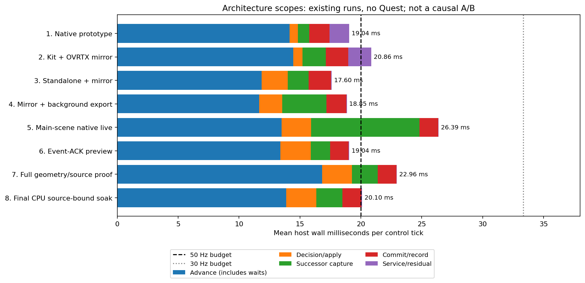

## 0. Master: live state/action, RGB после эпизода

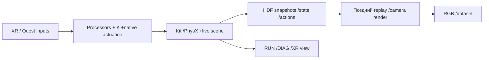

**Скорость и бюджет.** Исторический state-only no-client RECORD37,68/37,63Гц;
реальный RECORD06.10 —26,963Гц whole-session, около37,09мс на действие вместе
с lifecycle. Последний результат относится к сохранённому историческому
запуску, а не к новому benchmark точного master HEAD. Ранний корректный
последовательный live RGB путь XR/no-client дал19,619Гц,50,97мс/тик.
В историческом640×480 A0 профиле: около9,17мс три non-render physics steps,
12,81мс final step+render,9,38мс capture/media,0,38мс state/HDF. Это частичный
профиль другого scope, его нельзя выдавать за аддитивный профиль master.

**Особенности и фичи.** Каноническая цепочка observation→action→transition,
snapshot-backed HDF; offline RGB materialization уже реализована.
RUN/DIAG и RECORD имеют разные observation/rendering пути.

**Плюсы:** простая запись состояния, можно менять offline renderer,
исходный control/physics профиль сохранён.
**Минусы:** нет live dataset camera frames; проигрывание состояния и temporal
renderer history не гарантируют эквивалентность live изображениям; lifecycle
и XR уже съедают бюджет. **Компромисс:** дешёвое хранение state вместо
дорогой камеры в runtime, ценой поздней материализации и другого pixel path.
Это исходная точка; изменений относительно предыдущей нет.

Источники: [история и точные scopes](HISTORY.md), [первая фаза](REPORT.md).

## 1. Native GPU camera packets: умеренное изменение внутри Kit

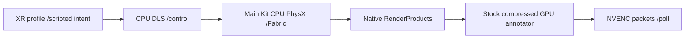

**Изменения от0:** CPU PhysX для небольших артикуляций, асинхронные renderer
settings, GPU compressed output вместо последовательного CPU RGB пути.
**Скорость/бюджет:**52,51Гц,19,04мс средний интервал,p9523,31мс;
осталось0,96мс из20. Исходный RealTimePathTracing, IK, XR AR enabled;
420 transitions,418 packets/роль. Это control+media probe: не подтверждение
полного корректного N+1 image/state HDF эпизода. Основной расход — advance14,15мс;
верхнеуровневое распределение приведено в общей таблице.

**Фичи:** native RTX→NVENC, одна сцена, небольшое вмешательство.
**Плюсы:** первым показал приблизительный no-Quest запас50Гц;
исходный renderer mode не пришлось менять на Minimal.
**Минусы:** пустые/неполные polls, ещё нет exact source binding и безопасной
полной lifecycle модели кадров; оптический sibling тест выявил лаг и quality FAIL.
**Компромисс:** высокий packet throughput без достаточного доказательства
свежести и полноты. Прототип полезен как строительный блок, не как готовый recorder.

Источник: [глубокое исследование, raw matrix](deep_research/REPORT.md).

## 2. Native Kit producer +отдельный OVRTX renderer на той же GPU

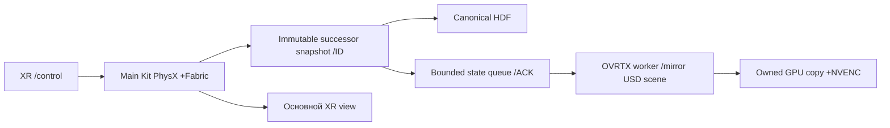

**Изменения от1:** camera renderer вынесен из Kit control graph; передаются
не RGB, а уже захваченные world transforms. Камеры получают уникальные source
IDs и ограниченную очередь с backpressure. **Скорость/бюджет:**47,94Гц,
20,86мс рабочего интервала, на0,86мс выше20мс.1440 transitions/1441 триплет;
1440 persisted source joins PASS. Renderer worker mean11,47мс перекрывается
с producer и не складывается с20,86мс; snapshot→render/submit ACK p9525,58мс.
Cold first render≈1,32с требует прогрева до записи.

**Фичи:** отдельный state transport, encode drain, ID/hash joins;
fixed intrinsics,31 moving paths, ValidationProbe исключён в worker.
**Плюсы:** отделяет управление от camera consumer; GPU-only encode;
изолированный renderer65,09Гц доказал возможность быстрого camera блока.
**Минусы:** полный runtime медленнее50; две scene representations, возможные
ошибки meshes/materials/history; конкуренция за одну GPU.
**Компромисс:** это online snapshot-fed rendering, без чтения HDF, но
**камеры всё равно рендерят копию сохранённого состояния**, а не main live scene.
Fabric+threads1 дал50,65Гц, но strict warmup contrast guard FAIL; этот результат
не повышает статус варианта до полностью корректного.

Источник: [live mirror и Nsight выводы](deep_research/REPORT.md).

## 3. Standalone CPU PhysX +пассивный Kit XR +OVRTX mirror

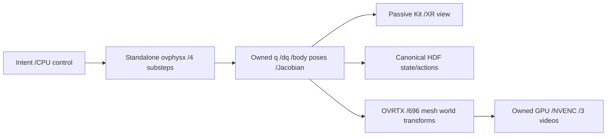

**Изменения от2:** physics owner вынесен в standalone CPU worker;
Kit перестал сам продвигать физику. Добавлены COM→TCP Jacobian mapping,
fixed-base conversion и явная публикация696 leaf meshes.
**Скорость/бюджет:** исправленный reach-demo08 —56,81 steady/56,20 encode-tail/
53,07 full-finishГц;17,60мс steady,2,40мс запаса20мс.960 transitions,
961 captures/роль, Minimal Kit view. В общем partition advance11,85мс,
decision/apply2,15мс; renderer worker работает параллельно и отдельно не прибавляется.
Full finish добавил1,2128с; queue peak4, суммарный backpressure64,91мс.

**Фичи:** осмысленное scripted reaching, раскрытие захватов15–90мм,
source/matrix joins, отдельный witness10:961 optical IDs/роль PASS.
**Плюсы:** быстрый camera/control runtime, видимое движение после исправления,
маленький state transport; потенциальная изоляция расходов Kit physics.
**Минусы:** три процесса, две сцены, ручное mirror coverage и иной physics backend.
Первые шесть reach попыток оставляли robot meshes в home при движущихся wrist
камере/состоянии: их software PASS и~56Гц **отозваны как доказательство
корректного движущегося RGB**. Точный внутренний SDK механизм mesh failure не установлен.
**Компромисс:** скорость ценой существенной архитектурной сложности и physics
qualification. Это по-прежнему рендер live snapshots, не окончательное решение
требования пользователя о камерах основной сцены.

В physics assays smooth replay TCP различался на десяткиµм, step input около3,2мм;
root CPU fixed против GPU world-weld, PABP против GPU broadphase.
Grasp fixture оказался невалиден: контакт/захват этим не доказаны.
Максимальная Cartesian tracking error демо9,93см также не квалифицирует управление.
Источники: [single GPU](single_gpu/REPORT.md), [исправленный эпизод](meaningful_episode/REPORT.md),
[время и физика](temporal_physics/REPORT.md).

## 4. Тот же mirror: bounded latency, live dataset, разумное распределение CPU

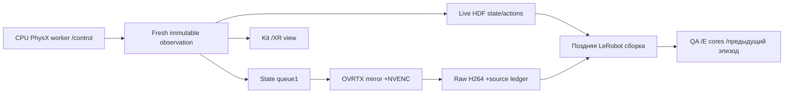

**Изменения от3:** очередь8→1, исправлен per-sample wall timestamp,
30Hz wall pacer, импорт уже encoded видео в LeRobot без resimulation/re-encode,
параллельная QA и CPU affinity. Это доработка lifecycle/storage, не новый renderer.
**Скорость/бюджет:** matched queue8→1 сохранил≈52,4Гц и уменьшил
sample→packet p95≈214→82мс. Paced run:29,999963 action startHz,
29,93259 encode-tailHz; p95 start interval33,373мс, max71,741мс.
При30Hz spare time становится ожиданием pacer, а не дополнительным rendering.
Unpaced Original-view запись с полным export предыдущего эпизода на4E cores:
53,044/52,860Гц,18,85мс/тик; advance11,66мс, capture3,62мс,
control body p95/p99≈22,46/25,25мс.

**Фичи:** online state/action HDF и raw videos; terminal observation отдельно;
30Hz simulation timestamps и реальные wall timestamps различаются явно.
960-row dataset проверен по960 state/actions и2880 RGB fingerprints;
видео remux без повторного кодирования. Ранняя сборка365с и QA219с;
позднее отдельная QA ускорена306→65с при4 workers.
**Плюсы:** запись не ждёт LeRobot; очередь с меньшей задержкой;
фон предыдущего эпизода использует свободные CPU ресурсы.
**Минусы:** mirror-природа камер сохранена;30Hz pacer не демонстрирует
запас для Quest; пакетная задержка paced sample→packet p95≈116мс;
один episode/формат испытан, не универсальный importer.
**Компромисс:** быстрый строгий online capture, дорогая упаковка/QA позднее;
возможны редкие длинные тики вместо постоянного увеличения очереди.

Ресурсы: paced GPU activity≈54%,NVENC2–3%; unpaced≈99,7%,NVENC4–5%,
VRAM<7,5GB, минимум свободной RAM≈16,6GiB. Свободная VRAM не означает свободный
RTX compute.8E ускоряли background QA, но один test ухудшил крайний хвост;
без повторов это не доказанный причинный эффект.
Источники: [dataset30](dataset30/REPORT.md), [ресурсы](resource30/REPORT.md).

## 5. Возвращение к камерам фактической основной Kit-сцены

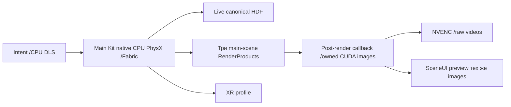

**Изменения от4:** standalone physics и OVRTX renderer удалены из этого пути.
Одна Kit-сцена снова владеет физикой и camera render; Python callback получает
GPU buffer после render dispatch. Никакого HDF replay или повторного применения
snapshot для построения кадров. Превью получает тот же owned image, что NVENC.
**Скорость/бюджет:**37,897/37,385Гц;26,39мс/тик, дефицит6,39мс к50Hz.
1020 transitions/1021 captures, CPU native physics, Original view, XR без Quest.
Поздний host profile локализовал примерно7,20мс в global CUDA wait превью;
это вложенное измерение другого профилируемого запуска, не полная раскладка26,39мс.

**Фичи:** main-scene live capture, онлайн HDF+H264, общий image owner для записи
и превью. Pump capture дал24,90Гц, held orchestrator12,24Гц; callback быстрее.
**Плюсы:** отвечает требованию о фактических live камерах; исключает mirror
geometry gap; меньше процессов и reconciliation кода.
**Минусы:** медленно для no-Quest ориентира; preview copy завершается позже
возврата setter; callback ordinal ещё не доказал pixel source ID.
**Компромисс:** более понятная семантика изображения ценой возвращения Kit
render/control dependencies и необходимости корректно владеть GPU памятью.
Источник: [native live](native_live/REPORT.md).

## 6. Event-ACK превью вместо ожидания всего CUDA device

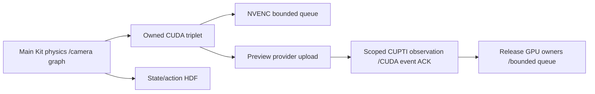

**Изменения от5:** global `cudaDeviceSynchronize` заменён удержанием owner до
конкретного preview copy completion. Early scoped CUPTI subscription наблюдает
действительный provider upload; после setter записывается CUDA event в найденном
context/legacy stream. Он подтверждает копирование, не показ кадра на экране/Quest.
**Скорость/бюджет:**52,53/51,98Гц,19,04мс/тик;≈0,96мс из20 свободны.
Прежний Nsight измерил7,127мс global wait/API call; фактический copy≈5,37µс,
но завершался≈7,37мс после setter. Ожидание всей очереди, а не объём copy,
съедало бюджет. Это подтверждённый механизм, не арифметическая оценка из GPU activity.

**Фичи:** preview ownership limit12, observed peak3, отказ с quarantine при
небезопасной ownership ситуации; NVENC queue8.1861 captured triplets в длинном
тесте; VRAM4000–4128MiB. Retain-all прототип53,05Гц удерживал4,57GB/661 триплет
и непригоден для длинной записи. Просто удалить wait без ACK также непригодно.
**Плюсы:** большая экономия с сохранением live preview и bounded VRAM.
**Минусы:** CUPTI subscriber эксклюзивен; вмешивается в возможность совместного
профилирования/Kit allocation tracking; exact source и geometry ещё не доказаны.
**Компромисс:** узкий версионный адаптер вместо универсального публичного
preview ACK API, которого здесь нет. RAM всё ещё росла в soak.
Источник: [native deep: preview /Nsight /CUPTI](native_deep/REPORT.md).

## 7. Полная проверка реального renderer source и live camera binding

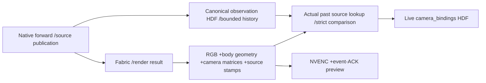

**Изменения от6:** callback ordinal перестал считаться observation ID.
Добавлены actual render-result source stamp, native geometry/camera comparisons,
история canonical observations и отдельный live bindings HDF.
**Скорость/бюджет:**43,56/42,55Гц,22,96мс/тик; дефицит2,96мс к50Hz.
Compact logging44,42/43,92; отключение одного лишнего Fabric sync не вернуло50.
В отдельном heavy profile: advance≈16,89, apply≈2,51, successor≈2,18,
commit≈1,54мс. Это instrumented scope, не аддитивная production строка43,56Гц.

**Фичи:**25 render-visible bodies проверены против native physics inventory27
(два тела без render geometry отдельно исключены); body matrix error≤7,326e−7,
camera≤2,682e−7 в180-frame QA. Optical/source IDs связывают кадр с прошедшим
наблюдением, обычно двумя control ticks ранее. Terminal coverage отмечается явно.
**Плюсы:** впервые отделены «packet есть», «кадр относится к этому source» и
«картинка визуально качественная»; нет фиктивного `frame−2` matching.
**Минусы:** тяжёлый диагностический цикл съедает headroom; строгая image QA
нашла147PASS/33FAIL из180 при правильных IDs. Не все33FAIL — ghosting:
есть lighting/background contribution.
**Компромисс:** максимально сильный per-frame geometry audit ценой FPS;
оставлен как qualification path, не как самый быстрый capture path.
Источник: [native deep: source /optical /geometry](native_deep/REPORT.md).

## 8. Текущий вариант: native Attribute ID, cached helpers, CPU backend

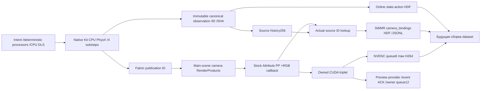

**Изменения от7:** дорогое per-frame чтение всех body/camera matrices заменено
stock Fabric `Attribute` at-render чтением компактного publication ID.
Кэшируются публичные helper objects, **не значения**: `.get()` читает свежий
атрибут. Geometry/optical QA остаётся отдельным режимом, флаг comparison=false
в быстром scope явный. Metadata стримится в JSONL; в media RAM остаются три
строки. Добавлен явный runtime-device receipt, проверены CPU/CUDA и длинный soak.

**Скорость:**600+60 steps50,64/49,71Гц;1800+60 —50,14/49,90;
10000+60 —49,763/49,671; CPU повтор600+60 —50,549/49,767.
Это throughput одновременно действий и триплетов во время записи, а не
background video render после остановки. Final CUDA —25,387/24,650Гц.
Длинное среднее слегка ниже50; устойчивые≥50 не доказаны.

**Фичи:** полностью live основная сцена; CPU PhysX MBP/TGS и CPU DLS;
GPU RTX/copy/NVENC/preview; immutable HDF observations, bounded queues,
exact historical source binding, дополнительный SWMR HDF для camera ledger.
**Плюсы:** около50Гц на одной GPU, безопасный ограниченный lifetime,
кадры/превью одного источника, небольшая стоимость рабочего source check.
**Минусы:** renderer history и physics preview drift остаются; RAM не bounded
в полном benchmark; CUPTI/ABI/version coupling; actual Quest не испытан.
**Компромисс:** per-frame identity плюс отдельная geometry qualification,
CPU execution profile ради скорости; приоритет source correctness над иллюзией
«image всегда соответствует последнему action». Ни старое53Гц без proof,
ни54,10Гц без preview не являются скоростью этого полного конечного scope.

### Как устроен один тик и почему

1. Intent проходит прежние deterministic label processors. Dataset action
   сохраняет пользовательский смысл; actuator outputs не подменяют labels.
   CPU DLS формирует native targets; четыре1/120с шага физики сохранены.
2. После native `forward` ставится publication ID. Наблюдение получает epoch,
   physics step и snapshot SHA; immutable копия идёт в canonical HDF и историю.
   Master control/config intent сохранён, но placement/backend и некоторые
   experimental observation internals изменены: это не универсальная семантическая тождественность.
3. Main-scene RenderProduct формирует изображение. Stock FabricReader PP в
   том же render-results graph читает source attribute. Источник изображения
   определяется этим ID, а не моментом Python callback или номером output packet.
4. Callback делает owned GPU copy с проверенным producer-stream ordering.
   Один owner питает NVENC и preview; CPU RGB readback в быстром пути не нужен.
   NVENC completion и preview upload ACK имеют разные lifetimes и очереди.
5. Binder находит фактическое прошлое observation в истории256 и сохраняет
   `encoded ordinal → source observation/epoch/physics-step/SHA` в bindings HDF.
   В final soak10061 bindings/30210 matches:0 missing/mismatch/evicted unbound.
   Images не читаются из HDF и не рендерятся заново из этой истории.
6. State/actions, source bindings и H264 уже записываются online. HDF не содержит
   RGB arrays: companion video files содержат изображения. Remux/LeRobot/QA
   можно отложить; importer варианта4 **не квалифицирован автоматически** для
   native lag/bindings конечного варианта. Нужен отдельный causal-prefix export.

Задержка появилась внутри native render pipeline, не из replay worker.
В optical assay147/153 samples источник отставал на8physics steps, то есть
2control ticks; startup отличался. Это66,7мс **simulation time**; wall latency
из этого числа не следует. При условно стабильных50wallHz ожидалось бы≈40мс,
но это оценка, не измерение final exposure/packet/Quest latency.
Правильный ID не означает, что каждый пиксель лишён temporal history.
Последние два observations в проверенном scope не получили RGB coverage:
export должен взять явно покрытый causal prefix с нужным `obs_t+1`,
а не сдвигать индексы вслепую или дублировать terminal frame.

### Измеренное распределение бюджета конечного варианта

Аддитивный host partition ниже — final CPU soak,9999 steady start-to-start
интервалов. Body тика совмещён с соответствующим следующим межтиковым интервалом;
warmup и последний непокрытый body исключены. Вложенные таймеры не складываются повторно.

| Этап | Среднее, мс | Доля фактического тика | Из бюджета20мс | Из бюджета33,33мс |
|---|---:|---:|---:|---:|
| Simulation advance, включая вложенные Kit/render/callback waits |13,875|69,05%|69,37%|41,62%|
| Decision/apply |2,458|12,23%|12,29%|7,37%|
| Successor capture |2,155|10,72%|10,77%|6,46%|
| Causal commit/record, включая HDF |1,561|7,77%|7,81%|4,68%|
| Service/residual/interbody work |0,046|0,23%|0,23%|0,14%|
| **Всего** |**20,095**|**100%**|**100,48%**|**60,29%**|
| **Остаток** |—|—|**−0,095мс**|**+13,238мс**|

`Advance` не означает чистый PhysX kernel cost: туда входят зависимые операции
Kit/Fabric/renderer/callback. Final CUDA total39,390мс, из них advance32,320;
CPU repeat total19,783, advance13,691. Около95% разницы локализовано внутри
advance, но это не изолированное доказательство единственного медленного kernel.
Маленький NVENC host submit также не равен нулевой GPU encoder latency.

CPU soak: p5019,580, p9522,922, p9926,369мс; max179,254мс.
35,59% интервалов длиннее20мс,7/9999 длиннее33,33мс.
В самом длинном тике159,535мс пришлись на causal commit/record; причина
disk flush/GC/scheduling пока не установлена. Поэтому средний30Hz запас
есть, но жёсткая гарантия каждого тика отсутствует даже без Quest.

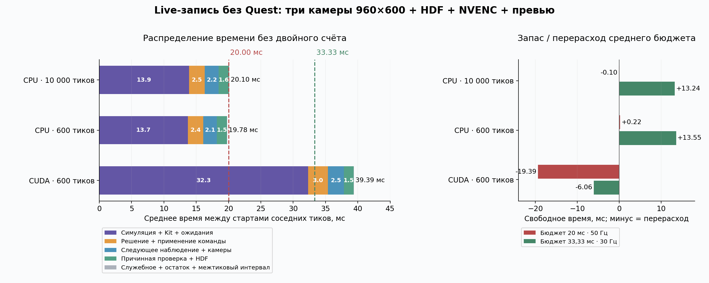

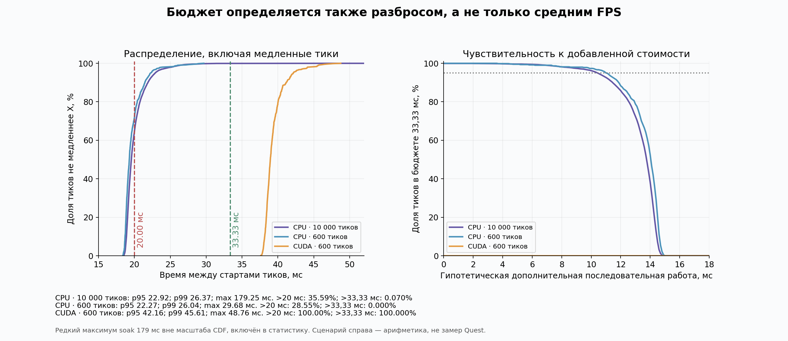

Все четыре графика и методика: [отчёт](native_deep/REPORT.md),
[PDF](native_deep/tick_budget/tick_budget.pdf),
[числа и verified inputs](native_deep/tick_budget/analysis.json),
[receipt](native_deep/tick_budget/analysis_receipt.json).

### Основные проблемы: что доказано, что пока неизвестно

| Проблема | Подтверждено | Причина / открытый вопрос | Практическое последствие |
|---|---|---|---|
| Недостаточный headroom |CPU≈50; CUDA≈25; Quest отсутствует|основное время внутри serial advance; доля будущего XR client неизвестна|нужен actual Quest тест; нельзя обещать>30|
| Источник старше свежего state |actual publication IDs обычно на2ticks раньше|native render scheduling; постоянный лаг не гарантирован|сохранять явную source binding и bounded history|
| Остатки/шум в изображении |IDs верны при33strict QA failures/180|temporal history и lighting/background наблюдаются; конкретный виновный RTX pass не установлен|identity proof не заменяет quality acceptance; AA/lighting абляции пока не решили всё|
| CPU physics drift с preview |fixed-input CPU A/B: q≈5,126e−6rad, body coords≈8,956µм, orientation≈25,24µrad; dq/contact отличаются сильнее|preview-off становится bit-exact; sourceproof-off и extra-sync-off не помогли; partition preseed тоже не помог|локализовано в preview/setup/upload совокупности; механизм и допустимые пределы не установлены|
| Эквивалентность master |CUDA media A/B bit-exact на fixed-command assay; CPU baseline repeat exact|CPU MBP/DLS против GPU PhysX; feedback closed-loop и контакты не квалифицированы|результат CUDA assay нельзя переносить на быстрый CPU профиль|
| Host RAM growth |RSS+131MiB за≈201с,≈43MiB/min; VRAM median4278MiB стабильна|benchmark perf/motion arrays растут; полный SDK heap attribution не выполнен|одно длинное episode испытано; бесконечная сессия не доказана|
| Preview ownership |конкретный provider copy/event ACK; bounded GPU owners|public Python provider не даёт ACK; CUPTI exclusive/version coupling|тонкий C++ адаптер предпочтителен для production; display ACK отсутствует|
| Terminal coverage |последние2observations не имеют RGB в tested scope|render latency и stop/drain policy|нужна явная covered-prefix/terminal policy перед native dataset export|
| Редкие stalls |max179мс, преимущественно commit/record одного тика|точная I/O/allocator/scheduler причина неизвестна|bounded queue и tail metrics; не маскировать пропуск duplicate frame|

GPU activity final≈52,7%, NVENC≈4,1%, VRAM≈4,3GiB: ресурсное истощение GPU
не наблюдалось. Это activity sampling, не occupancy и не доказательство
«оставшиеся47% можно линейно превратить в FPS». Последовательные зависимости
и CPU ожидания ограничивают pipeline. Ресурсные выводы старого OVRTX варианта
с GPU≈99,7% не переносятся на текущий native профиль.

## Другие исследованные пути и отрицательные результаты

Исследованы installed code, upstream repositories/docs, форумы с поиском
первоисточников, трассы и точные ABI. Направления: RTX/Hydra/Fabric, PhysX,
Replicator/SyntheticData, NVENC/Video Codec SDK, CUDA interop, XR/CloudXR,
storage, tiled/atlas cameras, standalone OVRTX/ovphysx, Warp/Newton, OptiX,
neural rendering. Source coverage первой глубокой фазы:34MD/JSON,460 URL
locators; это не460 независимых публикаций. Поздний native-deep сохраняет
69 GPU-config cases,67 technical results:51PASS/16FAIL,2без результата.
Harness PASS и корректная запись — разные утверждения.

| Путь | Что полезного найдено / измерено | Почему не выбран конечным решением |
|---|---|---|
| ZED Isaac Sim |D2D slots, worker encode, producer stream sync; исторически45,05 frames/view при11,26actions с XR/no-client|много render вызовов на action; default30 и queue drops не гарантируют требуемые actions+frames; ABI/версии отличаются|
| Stock compressed annotators |полезный GPU RTX→NVENC building block; простая fixture102,23 bundles/s|fixture без Piper/control/physics/XR; packet source correctness нужно доказать отдельно|
| Fabric batching |matched GPU39,31→46,41Гц без XR|не достиг50; меняет publication timing; не универсальная physics оптимизация|
| Tiled/atlas cameras |atlas timing50,43Гц|пересвет/optical FAIL; scene/optics isolation и quality не доказаны|
| OVRTX GPU camera worker |65,09Гц или64,00 с drain,420×3optical IDs PASS|изолированный replay-derived input; общий native-producer runtime47,94|
| Standalone CPU PhysX |physics-only917ticks/s; позже real drives/poses проверены|ранний fixture не включает VR/control/cameras; fixed-root/backend conversion требует parity|
| Newton/Warp/CUDA Graph |Newton CPU337,30physics ticks/s,27bodies/820shapes|drive/velocity-limit/contact semantics и full XR recording не квалифицированы|
| Vulkan/CUDA external memory |есть upstream interop при собственных exportable allocations/semaphores|не открывает handle любого opaque Kit render resource; ownership/context/sync отдельная задача|
| Managed RpResource event /LD_PRELOAD fence |перспективные низкоуровневые hooks изучены|первый hook не доказал pixel identity; preload поймал0 реальных Kit вызовов|
| CPU preview /sync-throughput /viewport off |29,23 /37,99 /42,97Гц в соответствующих абляциях|не улучшили конечный scope и не заменяют безопасный shared live preview|
| Async stale result |проверенная попытка ускорить ожидание|source freshness FAIL; высокую частоту такой ценой принимать нельзя|
| OptiX /neural scene renderer |возможна специализация renderer|USD/MDL/robot/contact coverage и интеграционный объём; нет измеренного полного решения|
| Второй GPU |можно физически разделить XR и dataset renderer|исключён текущим условием; не испытывался как решение|

Точные ссылки/commits/source hashes: [upstream audits и матрица](deep_research/REPORT.md),
[native-deep results](native_deep/results.json). Неудачи сохранены, а поздние
исправления не переписали исторические FAIL receipts.

## Масштаб изменений, откат и следующий осмысленный шаг

Для mirror ветки изменение крупное: physics worker, passive Kit handoff,
OVRTX scene/meshes, state transport и lifecycle. Для текущей native ветки
сцена и camera renderer снова общие; основные изменения — CPU execution
profile, post-render GPU ownership, source-ID/binding и preview completion.
Это существенное вмешательство в recording/observation путь, но не замена
label contract, robotics framework или всех controllers.

Никаких установленных SDK файлов не патчили. Эксперимент opt-in; selected
profiles сохранены. Checkpoints и verified Git bundles позволяют вернуть
tracked state. Session layers/settings удерживаются до Kit shutdown;
fast shutdown может завершить процесс до Python post-close cleanup,
поэтому проверенная граница освобождения process-local ресурсов — выход
процесса, а не обещание выполнения каждого cleanup блока.
Repeated episode start/stop в одном Kit процессе ещё не квалифицирован.

Следующий приоритет — принять или устранить CPU preview physics effect,
довести native covered-prefix export и memory boundedness, затем измерить
тот же exact-source live recorder с actual Quest. Ускорение submit/renderer
проверять по полной частоте action+camera, image quality, latency и physics,
а не только по количеству пакетов. C++ provider completion adapter может
снять CUPTI ограничение, но его FPS/семантика пока не измерены.

Проверки этой консолидации: [receipt](overview_checks.json), [полный log](overview_checks.log).
Документ объясняет имеющиеся артефакты, не регистрирует новый performance PASS
или gate evidence. Existing frozen inputs и их locators сохранены.
