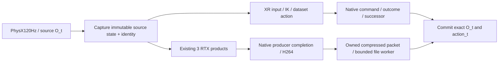
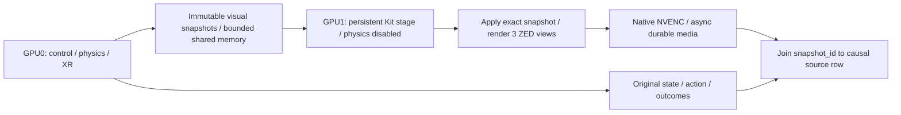

# Архитектура live-записи >30 Гц с Quest 3

Ветка: `research/live-camera-recording-30hz`, создана от чистого
`master` / `beaedfd1116577fd4d8026232cfb96cba0b030fa`.
Дата: 2026-10-09. Owner: `vr.performance`. Исследовательское предложение;
production selection, SDK, contract и состояния gates не меняются.

## Результат исследования

**Полезный быстрый строительный блок найден: штатные RTX RenderProducts →
post-render аппаратный H264 → маленькие compressed packets → file sink.**
В новом простом GPU fixture три 960×600 потока дали 102.225 выдачи
пакетов/с через один `app.update()`, против 52.149 через синхронный
Replicator orchestrator. Все три видео декодируются с ожидаемым числом кадров.
Однако изображения быстрого пути отстают от изменяемого USD witness примерно
на два тика. На полном сохранённом Piper stage polling-путь дополнительно
оборвался из-за пустого encoder buffer. Эти результаты подтверждают доступность
и большой потенциальный запас media path, **не достижение целевого режима**.

Не найдено доказательства **>30 средних wall Hz действий и каждого из трёх
корректно связанных live camera streams при активном XR и подключённом Quest 3**.
Сохранённые исследования более полного runtime с 30–40 Гц без Quest недостаточны:
по уточнению пользователя нужен screening примерно **50 Гц без клиента**.
Новый 102-Гц fixture тоже не проходит этот screening полного runtime: в нём нет
physics, IK, causal recording и XR, а source-state binding требует исправления.

Наиболее перспективное изменение — **producer-driven GPU media pipeline с
явным provenance изображаемого состояния**, без синхронного Python получения
трёх raw RGB и без обязательного corrective render на каждый tick. Если
существующий XR/physics/main-thread budget не позволяет ~20 ms, самый сильный
вариант по независимости ресурсов — **physics/control/XR на GPU0, отдельный
renderer снимков состояния и NVENC на GPU1**. Он требует существенно большей
перестройки и ускорения control base; вторая GPU сама не лечит CPU/PhysX waits.
Гарантировать >30 с Quest по имеющимся данным нельзя.

## Что именно требуется

Конечная проверка проводится при активном native XR/CloudXR, подключённом Quest 3,
обычной teleoperation, обеих руках, трёх камерах и сохранении source actions.
Текущая VR геометрия — massless ZED X One GS, **3×960×600**, а не 640×480.

На одном wall-time интервале измеряются:

- `f_action`: завершённые допустимые causal transitions / wall seconds;
- `f_camera(role)`: подтверждённые новые source captures роли / wall seconds;
- `f_bundle`: полные пары исходное O_t + исходный action_t + outcome/successor
  и три соответствующих RGB / wall seconds.

Требуется строго >30 для всех. Предварительный no-Quest screening — около50
полных bundles/с **при той же активированной XR конфигурации**, а не50 no-XR
пакетов/s. Частота30 simulation-time, codec metadata, enqueue calls, refresh
одного старого буфера и суммарные90 кадров трёх камер не являются таким proof.
Содержание неподвижных кадров может совпадать; новая source identity важнее
различия image hashes. Average requirement не означает, что каждый tick обязан
укладываться в33.333ms; p95/p99/stalls всё равно нужно отдельно показать.

Оценка потери50→30 при подключении Quest — screening ориентир пользователя,
не измеренный универсальный коэффициент. Startup, warmup, рабочий интервал,
semantic tracking gaps/review и final drain публикуются отдельно. Очередь не
должна расти; полная долговременная скорость учитывает окончание записи.
Максимально допустимая задержка live dataset pixels пока не задана. Предложение
для следующего исследования — показывать p99 capture-to-persist/availability
и отдельно проверить bounded задержку порядка двух-трёх кадров; это не
существующий норматив или критерий комфорта Quest.

## История: что уже получилось и что не получилось

Исследованы локальные refs за последние две недели и необходимые 09-24 baselines:
performance/temporal audits, native ZED experiments, live episode writer,
ablations, physical operator runs, codec/streaming и safety branches.
27 источников идентифицированы по точному commit/path/SHA256.
Для33 live/ablation runs прочитаны66 raw files; scalar wall rate совпадает
с Git results во всех33. Полная reauthentication старых видео/инвентарей не
выполнялась. [Исторический разбор](HISTORY.md) и
[каталог точных источников](historical_sources.json) сохраняют scope и locator.

| Источник и режим | Wall Hz | Что это доказывает | Почему не целевой результат |
|---|---:|---|---|
| 09-24 корректный tiled/prime RGB, XR no client | 19.619 | Проверенный moving-content boundary, mean50.972ms | Недостаточно даже30; no Quest |
| 09-25 state-only RECORD, XR no client | 37.68 /37.63 | Быстрый state recorder, камеры выключены | Не50, нет live RGB/человеческого IK |
| 09-26 physical state-only RECORD | 31.198 whole /30.725 profiled | Действующий Quest source в своём scope | Камеры только offline |
| 10-01 native ZED H264 max, no XR | 71.14 кадров/view;17.79 actions | Достаточная скорость некоторых media workloads | Четыре renders на action; действия медленные |
| 10-01 native ZED H264 max, XR no client | 45.05 кадров/view;11.26 actions | XR media output при сниженной eye quality | Действия11Hz, no Quest |
| 10-03 tuned live A0, no XR | 43.649 window /43.438 с RGB flush | Три live640×480 + experimental state/actions | Не50, нет XR и source-content qualification |
| 10-03 tuned live A0, XR no client | 30.177 /29.986 repeats | Native H264 + experimental HDF | 640×480, no Quest; не50; нет initial O_t RGB |
| 10-03 native ZED960×600, tuned XR no client | 28.614 window /28.523 flush | Actual live native pixel dimensions | Ни30, ни50; исторический mount с массой |
| 10-03 same-boundary reuse A0, XR no client | 30.428 /30.461 window;30.325 /30.358 flush | Около1.8% от устранения повторного state read | 640×480, synthetic targets, no Quest; не50 |
| 10-06 physical RUN | 16.494 whole-session control | 1355 ticks/82.149s; advanced wrist boundaries | Не измерение всех3 stream FPS; не30 |
| 10-06 physical RECORD | 26.963 whole-session control | 9636 ticks/357.383s, включая lifecycle | live_rgb=false; не live camera qualification |

Near-30 live writer сохранял successor RGB sidecars, пропуская первый
pre-action RGB O_0. Frame completion counters/files сами не доказывают depicted
physics state. Это особенно важно: 09-24 исправленный assay дал common N−1
в900/900 обычных XR capture boundaries; correct prime/held-state path дороже.
Старый cross-view N−3 failure из09-22 не воспроизведён в later corrected audit;
его нельзя переносить на нынешний pin. И N−1 тоже не универсальная константа.

Документированное physical S2 acceptance master остаётся в своём tested scope;
оно не означает performance acceptance или D1 admission этого предложения.
Поздний operator-stop supplement отличается от original interrupted reports.
Новый текущий RECORD действительно <30 в операторском whole-session результате,
но историческая state-only архитектура не всегда <30: есть37Hz no-client и
31Hz physical результаты на других source/settings. Workloads нельзя смешивать.

## Критический путь и необходимый выигрыш

Корректный serial camera path:50.972ms →20ms означает убрать **30.972ms**,
60.76% времени, ускорение2.549×. Даже устранение всего измеренного camera
increment21.377ms оставляет29.595ms base, то есть только33.79Hz. Для screening
нужно ускорить также control/physics/XR base либо перекрыть независимую работу.

В10-03 A0 host boundaries составляют приблизительно9.17ms на три nonrender
physics steps,12.81ms на final step+render,9.38ms на capture/media и0.38ms
на state/HDF. После reuse state/HDF~0.17ms. Timers не складываются в полный
профиль и не показывают чистое время GPU kernels: native wait может оказаться
в следующем host вызове. NVENC/I/O не были насыщены; queue peak3/64 без losses.
Замена HDF writer одна не уберёт десятки миллисекунд.

Три RGBA960×600 =6.912MB/bundle,207.36MB/s при30 или345.60MB/s при50.
RGB =5.184MB/bundle. Ring6–8 RGBA bundles =41.47–55.30MB без encoder allocations.
Это не чрезмерный bandwidth; важны synchronizations, extra app pumps и lifetime.
Старый scene-state bundle~8974bytes/tick даёт~0.27MB/s при30. Размер полного
нынешнего snapshot ещё нужно измерить; сеть/IPC bandwidth пока не главный подозреваемый.

Целевой engineering budget20ms без Quest — ограничение кандидатов, не обещание.
Для serial пути разумно исследовать native physics/state~8ms, render/XR~7ms,
input/IK/guards~3ms, snapshot/submit~2ms. Для split пути control и camera stages
каждый должны иметь capacity≥50 и сохранять её вместе, включая snapshot apply.
Покупать второй GPU, если control-only остаётся35Hz, без этих проверок бессмысленно.

## Новые GPU-пробы и сохранённые неудачи

Existing declared Isaac environment:6.1.0.0 / Kit110.3, Lab17.0.2,
локальный checkout0c2e2c64, Torch2.11.0+cu128. RTX4090, driver580.159.03;
GPU перед пробами idle. SDK/dependencies не устанавливались и не patchились.
Скрипты используют stock SimulationApp, RenderProduct, compressed LdrColor;
output — standard H264 и диагностический JSON. Никаких физических устройств,
XR server или Quest не запускалось. Source snapshots и команды:
[run ledger](run_ledger.json). Bulk H264 находится в
`/data/ebulochkin/vla-runtime/live30-20261009/`; small logs/results — здесь.
Входные Piper USD/manifest дополнительно сохранены в `piper-inputs/` этой внешней
директории, SHA256 оригинала совпадает. Полный asset/SDK closure не vendored.

| Проба | Scope | Выдача packets/bundle Hz | mean/p95/p99 ms | Итог |
|---|---|---:|---|---|
| native-minimal | Простой moving USD cube, default experience | Не завершена | N/A | Empty packet tick1; сохранено |
| native-zero-delay/orchestrator | 3 products960×600,60warm+300 | 52.149 | 19.173/21.354/25.543 | 360 decoded/view; same-step content FAIL |
| native-one-update/zero-delay | Та же simple scene,60warm+300 | 102.225 | 9.780/12.699/15.684 | 357 decoded/view,3empty warm; source phase≈N−2 |
| piper-render-only | Actual retained Piper stage, authored3ZED,120warm+target3000 | Не завершена; rate не принят | N/A | Empty view0 tick2071; partial видео сохранены |

Указанная скорость включает synchronous buffered writes и `flush()`, но не
`fsync`, encoder tail drain, app teardown или startup. Окно —300 active ticks
после60 warmup; это короткая media-проба, не доказательство durable sustained
recording rate. Долгий Piper прогон был начат именно для проверки этой границы.

Результаты: [orchestrator](native_probe_result.json),
[one-update](one_update_result.json), [Piper failure](piper_probe_result.json).
Actual source versions: [orchestrator](orchestrator_probe_source.py),
[one-update](one_update_probe_source.py), [Piper](piper_probe_source.py),
[первая неудача](failed_probe_source.py).

Декодирование **каждого** кадра всех шести completed streams выполнено FFmpeg,
с `-vsync 0`, без resampling. [Orchestrator witness](native_decode.json):
role0 лучший phase fit−1, role1/2 fit0; [one-update witness](one_update_decode.json):
все три fit−2. Это fitted ordinal **USD cube** phase, не доказанная PhysX/Fabric
source generation и не разрешение вычитать2 у dataset index. Same-step verifier
честно возвращает FAIL. Изменяемый cube позволяет отвергнуть выдачу «свежего
packet» за current observation. Количество decoder frames совпадает с packets;
переданные кадры действительно960×600, H264 yuvj420p, а не raw lossless RGB.

Первая версия decoder check использовала FFmpeg automatic vsync и сама создала
лишний output frame: ffprobe360, raw decoder361. Это ошибка проверки, исправлена
`-vsync 0`; [исходный ошибочный результат](verifier_initial_result.json) и
[промежуточная версия source](verifier_initial_source.py) сохранены и исключены из выводов.
Точные bytes самого первого decoder не зафиксированы; это ограничение provenance
указано в ledger. Current verifier и обе исправленные проверки идентифицированы.
Повторная проверка подтвердила native phase differences. Успешная packet выдача
не переименована в успешную temporal qualification.

У simple fixture три разных products смотрят одинаковым camera pose на один cube.
Это малый throughput/phase assay, а не сцена задач или benchmark всего проекта.
На Piper stage сохранены authored optical prims и проверен snapshot SHA256;
fixture добавляет moving USD cube, но не осуществляет полноценный streamed
snapshot apply всех robot/prop transforms. Original result поле excluded=Piper
унаследовано от simple fixture; scope/snapshot в том же результате явно говорят
о Piper **static stage**, исключаются именно dynamics/control. Source USD
редактируется в памяти/session layer, не сохраняется обратно. Failure не даёт
ни complete3000-run, ни accepted rate, ни proof no-loss frame delivery.

## Что переносить из NVIDIA и ZED

Подробный [GPU source audit](GPU_SOURCE_AUDIT.md) содержит локальные пути,
source SHA256, версии, primary URLs и API pitfalls.

**Replicator1.13.36 + omni.replicator.nv1.1.6 уже имеют аппаратный H264/HEVC.**
`LdrColor` с `init_params={'compression':'h264'}` создаёт POST_RENDER hardware
encode через GPU interop. Host получает flat uint8 compressed bytes.
Новый Python RGB→CPU→codec loop и обязательный ffmpeg runtime pipe не нужны.
[Версионная документация API](https://docs.omniverse.nvidia.com/kit/docs/omni_replicator/1.13.30/source/extensions/omni.replicator.core/docs/API.html).

RTSPStreamWriter — upstream пример producer-driven compressed capture с
simulation-time annotator. Для dataset используется file sink, а не обязательно
RTSP. Native writer events/completion нужны вместо бесконтрольного polling
`.get_data()` после app.update. Это proposal следующий шаг, а не выполненное
исправление Piper failure. RTSP wall timestamp=anchor+sim time не является
physical acquisition clock или exact physics source identity.

`zero_delay` — конкретная штатная experience: SPG включён,
Hydra waitIdle=true, checkForHydraRenderComplete order1000. В тесте она помогла
получить packets, но **не гарантировала same-state output** всех видов и не
проверена с текущим CloudXR experience. Нельзя заменить XR app descriptor и
считать teleoperation preserved. Single app.update быстрее orchestrator в этом
fixture, но frontend payload timing надо связывать с native producer.

Stereolabs current pin/main0164268 уже используется как optics/assets.
В vendor C++ streaming path mono cameras идут через pinned host D2H,
producer cudaStreamSynchronize и newest-wins очередь из трёх slots;
pending frames могут отбрасываться. SDK-free Lab integration — ordinary cameras
и state recorder, не быстрый dataset GPU recorder. Брать полезны authored optical
cameras и native render products; копировать vendor drop policy нельзя.
[Stereolabs repository](https://github.com/stereolabs/zed-isaac-sim),
[SDK-free Isaac Lab integration](https://docs.stereolabs.com/docs/integrations/isaac-sim/using-the-zed-in-isaac-lab).

## Предлагаемые архитектуры и приоритеты

### A. Один Kit, source-bound конвейер и stock NVENC

Первый implementation spike на нынешнем RTX4090:

Сохранить one scene, authored ZED optics, native render products, original IK и
label processors. Camera preview и dataset writer делят producer; preview
не обязан повторно переносить full RGBA через CPU. Сам writer подписывается на
native completion и owns payload до async write; duplicate products запрещены.
До следующего изменения physics renderer обязан захватить O_t либо получить
immutable visual snapshot. Заморозка одного obs_id при продолжающемся изменении
сцены не обеспечивает этого: убрать boundary можно только после доказательства
capture/lifetime semantics.
Персистентность допускает задержку относительно action **при условии**, что
pixels изображают именно неизменяемый source O_t и join происходит по obs_id,
а не по порядку callbacks. Initial O_0 и terminal O_N также нужно сохранить.

Возможны stock core/SRTX compressed annotators; high-level CameraSensor RGB
getter проверяет H×W×channels и не подходит для compressed bytes. Его wrapping
может enforce_square_pixels и изменить ZED aperture: оптику проверять до/после.
TiledCamera — дополнительный кандидат уменьшения per-product overhead,
**не новая доказанная solution**: его correctness/cost уже исследовали.
SPG custom CUDA packing/convert нужен только при измеренном remaining gap;
SPG не предоставляет автоматически recorder ring и causal identity.

Подготовлен конкретный [producer Writer helper](native_packet_writer.py): принимает
existing products, сохраняет owned H264 и structured metadata синхронно внутри
callback; bounded async worker пока не реализован. Проверены syntax
и Ruff; GPU run этого helper не выполнялся. В установленном SRTX Writer доставка
завязана на orchestrator capture events: один `app.update()` может вообще не
вызывать callback. `reference_time` и поздно считанный simulationTime не являются
независимым renderer source ID; helper явно сохраняет alignment как unproven.
Поэтому замена polling на этот класс сама по себе не исправляет lag и не
гарантирует 102 Гц. Сначала нужна проверка native dispatch и original source binding.

**Главный открытый gap:** какой native renderer event подтверждает exact scene
state, изображаемое в packet? Packet ordinal или Camera.frame это не доказывает.
Перенос fixed−2 из simple assay в XR запрещён. Требуется producer sequence/
source snapshot propagation либо квалифицированный rendering source marker/
content oracle, включая динамику и reset. Для future vision policy delayed
availability отличается от human VR: policy не может решить по ещё не доступному
RGB_t. Это потребует explicit delayed-observation policy или ожидания.

Изменения: camera producer/packet sink, causal attachment, lifecycle/backpressure,
preview buffer reuse и performance diagnostics. Несколько тонких adapters;
нет причины менять PIPER model, IK, dataset semantics или писать robotics framework.
Сам sync corrective render должен уйти из critical path или быть заменён
доказанно более быстрым native boundary. Скорость этого полного варианта неизвестна.

### B. Один Kit, GPU0 для physics/XR, GPU1 для camera products/NVENC

Штатный renderer поддерживает product GPU placement: local ViewportManager
использует `uint[] deviceIds` в USD session layer. Для изоляции назначить
camera products `[1]`, separately проверить renderer device↔physical GPU mapping,
XR eyes/device placement и encoder context. `optimize_render_products()`
балансирует products, но не гарантирует, что все камеры ушли наGPU1.
[Isaac performance handbook6.1](https://docs.isaacsim.omniverse.nvidia.com/6.1.0/reference_material/sim_performance_optimization_handbook.html).

Raw surfaces остаются на camera GPU; CPU получает compressed bytes. Если preview
нужен GPU0, его cross-GPU стоимость отдельно измерить. Изменения меньше,
чем новый process mirror; current scene/snapshot source едины. Но main Kit thread,
PhysX fetch, CUDA synchronization и camera source barrier остаются общими.
ВтораяGPU ускоряет renderer workloads, а не автоматически native physics.
Это кандидат на устранение GPU contention; эффект в Piper не измерен.

### C. Независимый renderer mirror снимков состояния, предпочтительно GPU1

Этот вариант даёт наиболее сильное структурное отделение камеры от XR cadence:

Control process — единственный владелец dynamics. Renderer один раз загружает
static stage/assets и применяет полное visual state каждого O_t: measured rigid
link/prop transforms, cameras, visibility/material/light changes. Не делать
вторую независимую physics, action replay или интерполяцию dataset кадров.
Existing Recordables/static snapshot/asset closure и standard media formats
переиспользуются. IPC нужен из-за measured isolation/overlap, не dependency conflict.

Renderer держит состояние до доказанного capture; pipelined frames несут source
snapshot identity. Он обязан выдерживать≥50 **с snapshot apply и encode**, а не
только статический scene FPS. Старый offline replay8–11states/s не становится
live просто от запуска в другом процессе. На однойGPU дваKit делят ресурсы,
возможны ухудшение обоих и VRAM pressure. ВтораяGPU позволяет независимую
capacity, но контрольный процесс всё равно должен пройти ~50 no-Quest screening.

Changes substantial: snapshot transport/ownership, persistent renderer entrypoint,
asset initialization, exact source join, queue/reset/stop/flush/error protocol.
Больше нескольких модулей, возможно upstream patch; runtime framework не нужен.
Drawbacks: ещё однаGPU/Kit memory footprint, synchronization complexity,
bounded live latency, quality/history воспроизводимость, duplicate scene/BVH,
preview transport. Это самый сильный резерв, **не готовая verified architecture**.

### D. Ускорить base ниже Isaac Lab уровня, сохраняя120Hz physics

[Точный low-level audit](LOW_LEVEL_AUDIT.md) обнаружил два конкретных кандидата:

1. Pure implicit actuators: target buffers неизменны внутри control group;
   native PD решает PhysX. Compute processed targets once/control, сохраняя
   submit_commands **каждый physics step**. Можно убрать6 из8 implicit compute
   и связанные getters/tensor kernels. Нужны guards no explicit actuators,
   wrenches/tendons/intra-group target mutation; effort telemetry между steps
   иначе устаревает. Выигрыш неизвестен;8→2 kernels не даёт4× whole loop.
2. ArticulationData.update eagerly вычисляет joint acceleration через velocity
   fetch/finite-difference на каждом substep. Исследовать upstream lazy/optional
   acceleration telemetry при сохранении buffer timestamp invalidation.
   Просто update(4dt) once/control меняет semantics и не является готовым fix.

Явный Python Fabric force_update уже выполняется **раз/control** при FFFT.
PhysxManager.step уже тонко вызывает native simulate/fetch_results. Поэтому
«убрать три Fabric forward» или заменить wrapper direct API — не доказанный выигрыш.
4simulate/1fetch и замена4×1/120 на1×1/30 не обоснованы. Native publication внутри
бинарного fetch надо сначала атрибутировать Tracy/Nsight, не угадывать.

Fabric GPU interop/output channels и CPU physics — реальные upstream knobs.
Отключать transformations при cameras/XR нельзя без нового boundary proof;
static velocities/jointStates/points ablation зависит от всех consumers.
CPU physics двух articulations может избежать GPU dispatch, но historical
большого выигрыша не дал; broadphase MBP/startup/dynamics отличаются. Уменьшение
solver4/1 в истории дало~1%, grasp quality не проверена. Physics60/90 меняет
эксперимент и требует отдельной qualification, не первый путь к50Hz.

## Fallback encoder/low-level implementation

Если stock compressed producer не обеспечивает нужный lifecycle или controlled
PTS/GOP/colors, **PyNvVideoCodec** — supported NVIDIA successor VPF,
с GPU inputs, explicit Encode/EndEncode и controlled params. Wheel/SDK/CUDA ABI
с frozen Isaac env не проверены; установка в production здесь не выполнена.
Owned CUDA surfaces + per-slot events → dedicated encoder worker; Warp borrowed
output напрямую удерживать нельзя. GPU D2D copy лучше глобального device sync.
[NVIDIA encoder API](https://docs.nvidia.com/video-technologies/pynvvideocodec/pynvc-api-reference/encoder.html).

Собственный C++ NVENC/OmniGraph узел — last resort для measured gap. На Linux
NVENC output API synchronous; blocking wait вынести на worker. Windows-style
NVENC async events обещать нельзя. Resource register/map/unmap/ownership,
EOS/last frame и encoder-session leak нужны в протоколе. У stock Replicator
не все bitrate/GOP/PTS knobs public; native IDR+SPS/PPS облегчает per-frame files,
но actual decode/tail verification всё равно обязательны.

ROS2/RTSP/GStreamer/DeepStream полезны для downstream consumers/recording transport,
но не устраняют physics→RTX boundary. Добавлять сеть, JPEG/PNG или raw RGB
serialization только ради записи здесь нецелесообразно. NVIDIA Newton с Kit
поменяет dynamics/stack и потребует новой scene/control qualification;
без comparable evidence не лучше конкретных PhysX/RTX кандидатов. Замена камеры
на ZED SDK не является заменой renderer. Ускорение offline LeRobot conversion
тоже не ускоряет live control.

## Drawbacks, неопределённости и failure policy

- **Correctness против overlap:** fastest polling выдаёт delayed pixels; источник
  должен быть явно связан, нет разрешения менять action label на executed output
  или изображение будущего O_(t+1) присоединять к O_t.
- **Media fidelity:** MinimalRendering меняет appearance, native H264 lossy4:2:0;
  цветовые патчи/range/RGB decoder и training quality требуют отдельной проверки.
  Разрешение960×600 сохранять;640×480 — иной declared schema.
- **XR cost:** native full eyes, real network/encode/client/IK и preview могут
  убрать запас. XRscale.4/.3 в старых тестах не переносится без comfort proof.
- **Queue:** λ50,μ45 создаёт5bundles/s backlog; ring8 заполнится~1.6s.
  Bigger queue не исправляет service deficit. No latest-only в training mode:
  overflow/error → incomplete artifact/gap или honest backpressure и rate loss.
- **Lifetimes:** source reset/reference/session epoch invalidates pending buffers;
  borrowed device buffer нельзя освобождать/перезаписывать до encode completion.
  Detach/start/stop/reset и Ctrl-C должны освобождать encoder sessions.
- **Renderer histories:** TAA/DLSS/motion blur/history зависят от предыдущих кадров.
  Mirror требует declared history/reproducibility, не только14 joint positions.
- **Unknowns:** producer scene generation API, причины empty buffer в long Piper
  polling, capacity полного snapshot apply, actual two-GPU allocation и joint
  control-only budget, sustained10–30min behavior, first/last complete RGB.
- **Source integrity:** inspected installed file hashes не доказывают stock wheel
  integrity всех binaries; никакой отсутствующий native source не был выдуман.

## План проверки выбранного пути и критерии отсечения

1. На точном current960×600 native scene снять matching ceilings: control-only
   с full IK, producer-driven media-only с snapshot apply, затем combined active
   XR/noQuest. Именно combined≥~50 будет основанием двигаться к physical test.
2. Заменить polling на native Writer/completion delivery; отдельно проверить
   packet count, unique producer IDs, depicted source state и simulator-step span.
   Fast fixture102Hz — положительный micro ceiling; Piper empty buffer — обязательный
   unresolved defect. Writer/file-sink helper подготовлен; native dispatch,
   producer/source correspondence и интеграция полного runtime не проверены.
3. Source-content assay: moving wrists/grippers/objects, wrong role/wrong row,
   reset/recenter/session changes, first O_0/last successor, delayed availability.
   Для mirror дополнительно asset/optics and full visual state parity.
4. Short matched matrix native synchronous vs pipelined, one/tiled3products,
   GPU placement, CPU physics/static output channels, pure-implicit compute selector.
   Physics120Hz и original labels baseline; fidelity-changing variants отдельны.
5. Три repeats≥3000 ticks, затем10–30min. Full decode каждого stream, source joins,
   no frame loss/duplication/incomplete rows, bounded queue/latency/memory,
   drain-inclusive rate. Publish failures/partial files и exact source/config hashes.
6. Physical Quest3 test: active session, ordinary motions/grasp, full recording
   lifecycle, **>30 actions/role/bundle Hz**. Выполняется отдельно при участии
   человека и авторизации exact physical action; здесь не выполнялся.

Candidate30–40Hz без Quest дальше не продвигается. Даже≥50 no-client не квалифицирует
physical режим автоматически. Если control-only<50, искать его measured critical
path; fast encoder/camera GPU не маскирует этот bottleneck.

## Детерминированный откат, включая external SDK tweaks

Текущие новые probes самостоятельны; для rollback достаточно выключить experiment,
production configuration не менялась. SDK bytes не правились, output и failures
сохраняются. Assets/history/original worktrees нетронуты.

Для будущего implementation: каждый selector opt-in, отдельный pin/patch manifest
с base commit, preimage/postimage SHA256, exact settings/deviceIds и uninstall/
revert command. Предпочесть configured wrapper/overlay; не редактировать live
site-packages inplace. Если fork native plugin действительно нужен — immutable
source patch + rebuild recipe/toolchain + separate extension search root;
активация одним selector, rollback возвращает original root/hash.

Stop admission → завершить/инвалидировать in-flight transaction → bounded drain owned
buffers → flush/finalize encoders → detach native writers → destroy только
experiment-owned products → restore session attrs/Carb settings → закрыть mirror.
Drain/flush имеют явный timeout. При stalled renderer/encoder transaction и
artifact остаются incomplete; завершать только experiment-owned worker/process,
не ждать бесконечно и не останавливать unrelated sessions.
Error не маркирует partial artifact finalized; failures остаются для анализа.
Source settings и hashes сверять до и после. Original SDK/assets backups и outputs
не удалять при обычном rollback. Это concrete design protocol, не выполненный fork.

## Регистрация и проверки

Этот bundle имеет experiment classification и INDEX owner `vr.performance`.
Source audits/reference appendices и runnable probes current; сохранённые logs,
source snapshots и result JSON historical/immutable. New gate evidence/artifacts
в resolved contract **не добавлялись**: результаты не выбирают machine fact или
gate status. External media outputs идентифицируются исследовательским
[инвентарём](artifact_inventory.json), отдельно от gate registry.
Selective MANIFEST membership не расширяется; после INDEX edits обновляется
только hash уже существующего protected INDEX.

Проверки, stdout и exit codes: [checks](checks.json), [log](checks.log).
Trusted historical preservation base — исходный master `beaedfd1116577fd4d8026232cfb96cba0b030fa`, не INDEX.
Declared core interpreter используется из существующей materialization
`/data/vla-infrastructure/core-reconcile-validation/20260919T082843.713211Z/env`;
локальная `.venv` не содержит pytest и не восстанавливалась установкой deps.
Первый расширенный pytest дал208 PASS и1 failure: Hugging Face dataset cache
пытался писать в read-only home. Повтор использует отдельный cache в `/tmp`,
без изменения runtime/dependencies. В core присутствует заранее существующий
TorchCodec/Torch ABI mismatch; LeRobot автоматически использует PyAV.
Этот fallback не выдаётся за native NVENC benchmark.
Итоговый выбранный core suite:209 PASS, Ruff/syntax и docs/contract/manifest PASS.
Raw logs сохраняют upstream trailing whitespace: полный `git diff --check`
возвращал2 только на logs; исходники/документы проверяются с явным исключением
этих byte-preserved capture files. Все попытки сохранены в checks log.

Final-report scope: GATE — no promotion; REUSED — NVIDIA RTX/Replicator/NVENC,
ZED optics/assets; PINNED/VERIFIED — source bytes и limited fixture;
ENVIRONMENT — existing Isaac и core; CONTRACT CHANGES — none;
EVIDENCE — diagnostic experiment receipts, no acceptance; ARTIFACTS — standard
videos/logs/source snapshots/inventory; PROCESSORS — unchanged;
HUMAN EVIDENCE — no new Quest run; BLOCKERS — full-runtime~50 and physical>30,
producer/source correspondence, long-run empty-buffer defect;
NEXT — producer-driven live pipeline experiment, then qualified split GPU if needed.
