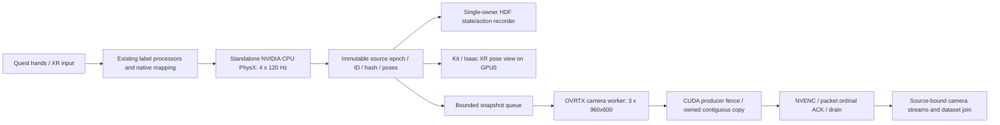

# Живая запись трёх камер выше 30 Гц: глубокое исследование архитектур NVIDIA

Kind: experiment; status: current; owner: `vr.performance`; mutable: true. Итог глубокого исследования от 2026-10-09. Основание: ветка `research/live-camera-recording-30hz`, HEAD `d5566834d29ef8bb56e4fb62bb324e23e0869100`. Это продолжение первой фазы; байты замороженных результатов первой фазы сохраняются. Настоящее исследование не меняет runtime, контракт, правила gates, S2-квалификацию или D1-допуск.

## Результат и выбор дальнейшего пути

Требование пользователя пока не доказано: нет измерения с физически подключённым Quest 3, живыми входами оператора и тремя подтверждённо свежими камерами 960×600 при частоте принятых действий строго выше 30 wall Hz. Все текущие прогоны остаются `dataset_admissible=false`. Загрузка XR-профиля и CloudXR без клиента не создаёт нагрузку глаз, отправки изображений и обработки движения пользователя.

При этом появились два конкретных перспективных пути. Умеренное изменение сохраняет текущие Isaac Sim, PhysX, RTX, сцену, обработчики и запись состояния: CPU PhysX для двух небольших артикуляций, настройки асинхронного рендера выбранного XR experience и существующие GPU render products с native compressed packets. С исходным `RealTimePathTracing`, IK и включённым AR-профилем, но без клиента, измерено **52,51 wall Hz**. Это выше приблизительного ориентира 50 Гц для предварительного испытания без Quest и не требует перехода на MinimalRendering. Однако наличие пакетов ещё не доказывает их привязку к состоянию; проверка оптического счётчика в отдельном диагностическом варианте выявила задержку два тика, а один канал не прошёл установленный порог контраста.

Более крупный вариант использует отдельный standalone OVRTX worker. На той же RTX 4090 динамическое воспроизведение записанных состояний, три камеры 960×600, GPU-потребитель с собственной копией и NVENC дали **65,09 комплекта/с**, либо **64,00 комплекта/с с учётом завершающего drain**. Декодирование подтвердило 420 уникальных последовательных оптических идентификаторов 0…419 во всех трёх потоках. Это сильное доказательство возможностей render→encode части. Впоследствии собран и проверен live producer с XR: все 1441 снимка успешно отрендерены/декодированы, но частота полного цикла составила только 47,94 Гц. Поэтому 65,09 Гц остаётся скоростью изолированного camera worker, а не полным результатом с XR.

Standalone PhysX получил отдельное подтверждение большого запаса CPU backend: третий ovphysx вариант завершил **3000 control ticks / 12000 физических шагов за3,272 с, 917,00 control ticks/s**, сохранив полный27-body inventory, fixed-base, force drives и root-drift guards. Это physics-only screening без камер, XR, IK и recorder, с ещё не доказанной contact/trajectory parity. Ранние topology/binding неуспехи сохранены. Newton имеет пригодный upstream CUDA Graph путь, но требует повторной проверки приводов, ограничений, контактов и семантики наблюдений.

## Что именно необходимо измерить

Целевое измерение должно одновременно учитывать принятые действия, завершённые переходы состояния и комплекты из трёх новых изображений. Для каждого изображения должны сохраняться роль камеры, исходный `obs/source_tick`, время экспозиционного состояния, render receipt, encoder ordinal и соответствующий accepted action/transition. Разрешённая небольшая задержка означает ограниченную очередь с известной границей и сохранённой идентичностью источника. Повтор предыдущего изображения, замена пропуска последним кадром и рост очереди без границы не выполняют это требование.

Сохраняется цепочка `source intent → deterministic processors → dataset_action_t → dataset.action → native mapping → accepted/executed command`. Обучающие 14 меток для двух рук, каждая с шестью суставами и aperture, не заменяются 18 native DOF целями с дополнительными пальцами. Сохраняется временная связь `obs_t → decision → action_t → native actuation → outcome_t → obs_t+1`. Основной control tick включает четыре физических шага по 1/120 с. Уменьшать число этих шагов, удалять контакты, приводы или рабочие камеры ради частоты нельзя считать эквивалентной оптимизацией.

Ориентир около 50 complete bundles/s без Quest — только фильтр кандидатов. Самостоятельный renderer, синтетический encoder, один camera poll и loop rate процесса не являются полной целевой частотой. В raw performance receipts поле `wall_rtf` фактически использует screening deadline 20 мс, то есть `effective_wall_hz / 50`; его нельзя читать как отношение к физическому времени четырёх шагов по 1/120 с. Исходные receipts при этом не переписываются.

## Область исследования и происхождение выводов

Десять исследовательских направлений охватили rendering/Hydra, physics/Fabric, scheduler/profiling, native media и NVENC, exact media SDK source, storage/causality, tiled cameras, XR/CloudXR, Warp/Newton и standalone ovphysx; независимый широкий обзор дополнительно проверил пропущенные NVIDIA samples, публичные benchmarks, ZED, CUDA/Vulkan interop, OptiX и neural rendering. Несколько материалов являются дополнениями одного направления. Число участников не означает десять независимых экспериментальных подтверждений одной гипотезы.

Сводка основана на `RENDER_AUDIT.md`, `PHYSICS_AUDIT.md`, `SCHEDULER_AUDIT.md`, `MEDIA_AUDIT.md`, `MEDIA_EXACT_SOURCE.md`, `STORAGE_AUDIT.md`, `TILED_AUDIT.md`, `XR_AUDIT.md`, `WARP_NEWTON_AUDIT.md`, `OVPHYSX_AUDIT.md`, `INDEPENDENT_SURVEY.md`, `OVRTX_MIRROR_NOTES.md`, `OVRTX_GPU_NOTES.md` и `PLAN.md` в текущем каталоге `deep_research`. Source-ledger JSON фиксируют поисковые запросы, primary URL, установленные файлы и/или pinned commits. Форумы использовались для обнаружения проблемы и поиска первоисточника; ответы форума и старые примеры не подменяли проверку точного установленного кода.

Консолидационный snapshot `/tmp/live30-deep-source-coverage.json` содержит SHA256 34 исследовательских MD/JSON, 25 top-level runtime result/receipt JSON и трёх decode receipts. Точное исключение повторяющихся строк даёт 460 URL locators; сюда входят GitHub/API/raw адреса и ссылки на одну документацию. Это показатель ширины поиска, **не 460 независимо проверенных публикаций**. Snapshot является точкой отсечения, а не перечнем всех артефактов и всех позднейших запусков root.

Основные upstream области: [Isaac Sim documentation](https://docs.isaacsim.omniverse.nvidia.com/), [Isaac Lab source](https://github.com/isaac-sim/IsaacLab), [NVIDIA PhysX/ovphysx](https://github.com/NVIDIA-Omniverse/PhysX), [Warp](https://github.com/NVIDIA/warp), [Newton](https://github.com/newton-physics/newton), [Video Codec SDK](https://developer.nvidia.com/video-codec-sdk), [CUDA samples](https://github.com/NVIDIA/cuda-samples), [OptiX Apps](https://github.com/NVIDIA/OptiX_Apps), [ZED Isaac Sim extension](https://github.com/stereolabs/zed-isaac-sim). Точные страницы, commits, snippets и hashes находятся в отдельных аудитах; обзорные ссылки здесь обозначают область, а не источник каждого численного результата.

## Точное окружение и несовместимости версий

Производственный стек: Isaac Sim **6.1.0.0**, Kit **110.3.0+feature.371399.00c488ae.gl**, Isaac Lab **17.0.2**, Python **3.12.13**, PyTorch **2.11.0+cu128**, CUDA **12.8**, проверенный NVIDIA driver **580.159.03**. Проверенный checkout исходников Lab: `0c2e2c64e51922d088b695d72ffe03faa5c6b95d`. Warp **1.16.0**, Newton **1.5.2**, MuJoCo и MuJoCo Warp **3.11.0**, isaaclab_newton **5.4.1**. XR: IsaacTeleop **1.4.98rc1**, CloudXR **6.2.1**. Replicator core **1.13.36+110.3**, nv **1.1.6**, srtx **1.1.11**, HydraTexture **1.6.2**, videoencoding **0.2.1**, livestream.core **10.4.0**, livestream.rtsp **10.4.1**.

Для отдельного теста OVRTX использованы **0.5.1.385782** и ovstage **0.2.1.385922**. ovphysx **0.6.3** требует ovstage **0.2.0.377349**, Warp ≥1.16,<2 и packaging ≥20,<24; production packaging 26 и OVRTX ovstage имеют другой контракт. Это основание для изоляции optional dependency target/environment, но само по себе не требует RPC или замены идентичности среды. PhysX release source `da950a3537927784951853c66618036f332ca0ce` соответствует исследованному ovphysx/PhysX 5.11; текущий upstream main отличается.

PyNvVideoCodec **2.2.3** исследован по архиву NVIDIA с checksum и точному wheel/source, затем используется в изолированном тестовом target; его наличие не подразумевает изменение production environment. Системный FFmpeg **4.4.2** поддерживает `h264_nvenc`/`hevc_nvenc`, но не AV1 в этой сборке. Системный GStreamer **1.20.3** не содержит нужного NVIDIA plugin; Kit RTSP несёт GStreamer **1.24.12** и модифицированный nvenc plugin с другой историей ABI. Смешение библиотек этих сборок не является готовой оптимизацией.

Версия hosted IsaacCapture/Quest клиентского frontend изменилась относительно установленного IsaacTeleop: исследован upstream v1.4.145, commit `5bbe49d4c92746076196216c3f74e08ae509809a`, а установлен v1.4.98rc1. Hosted client CloudXR 6.3.0 нельзя автоматически считать парным server 6.2.1. Release URLs могут менять содержимое; фиксация версии, контроль hash и проверка installed symbols необходимы до применения инструкции из `latest`.

## Матрица измеренных результатов

Числа ниже взяты из raw `/data/ebulochkin/vla-runtime/live30-deep-20261009/<run>/result.json` или `receipt.json`, а не пересчитаны из агентских оценок. Whole-process tests использовали синтетический `deterministic_injected_xr_v1`, а не движения Quest. Для первых длинных полных тестов — 120 warmup + 300 measured control steps, 420 accepted/committed переходов. Wall frequency вычислена по 299 межтиковым интервалам. p95 в таблице — именно wall interval, а не более короткое внутреннее control timing.

| Прогон | Измерение | wall Hz / mean / p95 | Что действительно покрыто | Граница доказательства |
|---|---|---|---|---|
| `full-gpu-poll-r6` | GPU PhysX, Minimal, без IK/XR | 39,31 / 25,44 / 32,10 мс | основной control, 420 переходов, native compressed poll | 419 пакетов/роль, 1 empty; источник пикселей не доказан |
| `full-cpu-poll-contention` | CPU PhysX, Minimal, без IK/XR | 73,72 / 13,56 / 18,86 мс | основной control, 420 переходов | 419 пакетов/роль; фоновые условия отличаются, не чистый CPU/GPU causal A/B |
| `full-cpu-original` | CPU PhysX, RealTimePathTracing, IK, синхронные настройки | 37,68 / 26,54 / 31,27 мс | control + исходный render mode | без XR, источник пикселей не доказан |
| `full-cpu-xr-minimal-ik` | CPU PhysX, Minimal, XR experience, IK | 52,39 / 19,09 / 22,82 мс | 420 переходов, 418 пакетов/роль | `xr_status.enabled=false`: activation deferred; нет клиента |
| `full-cpu-xr-original-ik-enabled` | CPU PhysX, исходный RTX, IK, XR AR enabled | **52,51 / 19,04 / 23,31 мс** | 420 переходов, 418 пакетов/роль | клиент отсутствует, input pump=0, source alignment не доказан |
| `full-cpu-xr-witness-original` | тот же путь + первая геометрия clock witness | 48,54 / 20,60 / 25,22 мс | 420 переходов, 418 пакетов/роль | optical decode FAIL из-за неработоспособного свидетельства; не доказательство повторов renderer |
| `full-cpu-xr-witness-sibling` | тот же путь + исправленная sibling геометрия | 47,56 / 21,03 / 25,70 мс | 30 warmup +90 measured; 120 переходов | 118 декодированных кадров/роль, IDs 0…117, lag=2 тика; role1 contrast guard FAIL |
| `full-cpu-xr-implicit-lazy` | CPU, исходный RTX, IK, upstream-based physics ablation | 54,50 / 18,35 / 22,74 мс | 420 переходов, per-substep submit сохранён | changed acceleration/effort telemetry, не эквивалентный production выбор |
| `ovrtx-piper-rtx-cpu-r2` | static standalone OVRTX, 3 CPU readbacks | 55,73 / 17,94 / 18,79 мс | 60 warmup+300 requests, 299 timed intervals | без динамики, physics/XR/encoder; unique frames не доказаны |
| `ovrtx-live-witness` | dynamic HDF mirror + CPU readback/decode | 39,03 / 25,62 / 26,63 мс | 31 world-transform path, fixed intrinsics, optical witness | без live producer/XR/encoder; старый overlay не сохранил unit metadata |
| `ovrtx-live-gpu-encoded` | dynamic mirror + GPU owned clone + NVENC | **65,09 / 15,36 / 16,11 мс** | 420 source rows, 60 warmup+360 timed, все 3 камеры | без live producer/physics/XR; с drain **64,00 Hz**, 94,78 мс drain |
| `codec-gpu-gop50-r2` | три синтетических GPU изображения + NVENC | 731,95 bundle Hz / 1,37 / 1,43 мс | 210 inputs/role, 210 decoded/role, ошибок нет | только codec fixture; throughput не end-to-end latency; drain 211,21 мс |
| `ovphysx-cpu-batch` | standalone CPU PhysX | **нет частоты** | importer/topology guard | остановка: expected fixed base, получен floating base |
| `ovphysx-cpu-fixedbase` | fixed-base root-authoring overlay | **нет частоты** | 1475 исходных world transforms сохранены, fixed_base=true | остановка: tensor binding `/World/*` matched0; до timed steps |
| `ovphysx-cpu-fixedbase-v3` | standalone CPU PhysX, полный inventory | **917,00 control Hz**, 3000 controls за3,272 с | 12000 physics steps, 27 bodies, 2×9 DOF, targets+all-body/joint reads | без IK, камер, XR, recorder; contact/trajectory parity не квалифицирована |

Эти строки нельзя сортировать как сравнительный benchmark одинаковой системы. GPU/CPU результаты включали разные IK/render/settings и фоновые условия; timing без Quest не включает глаза и реальную retarget цепочку. Синтетический codec измеряет пропускную способность собственного этапа. OVRTX replay знает состояние заранее. Последующий live опыт ниже измеряет совместную работу и показывает реальный предел текущего Kit producer.

В эффективных настройках удачного CPU+XR original прогона: `/app/asyncRendering=true`, `/app/asyncRenderingLowLatency=true`, `/app/omni.usd/asyncHandshake=false`, `/omni/replicator/asyncRendering=false`, `/app/hydraEngine/waitIdle=false`, `/rtx/rendermode=RealTimePathTracing`, `/rtx-transient/resourcemanager/enableTextureStreaming=false`. При этом CLI argument `async_render=false` не отражает итоговую настройку, полученную из experience. Основание для сравнения — readback `settings`, а не имя теста или command-line intent. Ускорение нельзя приписывать одному CPU PhysX либо одному выключенному waitIdle.

Существовавшие неуспехи сохраняются как часть результата: import extension, output permission, startup crash и invalid rigid-body transforms при конкурирующей GPU нагрузке; первый OVRTX overlay не открывался; первый codec CPU preset/tuning отвергнут. Второй CPU codec fixture получил лишний FFmpeg output frame при auto vsync. Документированный correction `-vsync 0` относится к verifier, а не к исправлению симулятора; до пересчёта результата apparent 900 Hz не считается принятым codec сравнением.

## Умеренный вариант и его ограниченный запас

Две артикуляции по девять DOF слишком малы, чтобы выгода GPU solver автоматически перекрывала launch/transfer/synchronization затраты. В native full GPU minimal probe вложенный `sim_step` занимал в среднем 19,19 мс, а в CPU minimal — 8,52 мс. Но `sim_step` включает render на четвёртом substep: это не время чистого solver, а вложенные stages нельзя складывать с родительским `simulation_advance`. Поздняя Nsight трасса, разобранная ниже, отделяет native PhysX/Fabric callbacks и часть GPU работы; полная XR critical path без клиента не измерена.

CPU PhysX выбран до создания SimulationContext и артикуляций. RTX и NVENC остаются на GPU. Переход требует проверки device assumptions downstream: targets, observation buffers, IK и GPU writer не обязаны теперь иметь одинаковый device. Нельзя повторно вызывать `attach_stage` после создания/warmup или считать CPU setting локальным безопасным флагом без этого аудита.

Native compressed producer уже использует существующие camera render products. Сохранение owned packet bytes устраняет необходимость `.numpy()`/CPU raw RGB/readback и дополнительного preview render product. RTSPWriter подтверждает официальный путь CUDA LdrColor→native encoder→compressed stream; для локальной записи сеть не обязательна. Однако в installed writer empty buffers, suppressed failures, packet ordinal и return checks требуют явного receipt. Имя потока и симуляционное timestamp/SEI недостаточны без проверки pixel identity.

Native async camera output отстаёт от control: sibling fixture получил последовательные IDs с фиксированной разницей −2 к packet index. Это совместимо с допустимым bounded lag, если источник каждой камеры прикреплён к правильному состоянию и на конце эпизода остаток корректно drained. Сдвиг индекса на два по итогам одного запуска не заменяет run-time source receipt: нужны проверка после warmup, при ускорении/замедлении, stop, restart, backpressure и изменении XR нагрузки. Guard role1 с контрастом 10 остаётся FAIL, несмотря на правильные IDs. Порог не снижается ради прохождения результата.

Смысл ближайшего изменения — сохранить shared RUN/DIAG/RECORD base и улучшить владельца native camera packets, а не добавить второй robotics framework. RECORD уже имеет snapshot-backed state/action artifacts; их offline materialization работает по другому observation/render path и не заменяет живую запись, которую просит пользователь.

## Rendering, atlas и зрительное качество

До переноса backend следует убрать только ненужные внешние products/AOVs и CPU preview copies. Три требуемых камеры и XR eye products сохраняются. Current upstream record_demos оставляет external cameras при XR по умолчанию; их выключение — explicit opt-in. Старый форумный совет об автоматическом удалении камер при включении Quest не соответствует исследованному коду. Отсутствие камер может дать высокую частоту, но меняет целевой workload.

Для texture streaming в exact installation используется `/rtx-transient/resourcemanager/enableTextureStreaming`; сходное название из другой инструкции может не менять ничего. Изменение до stage load/reload, readback настройки и наличие profiler участка `resolveSamplerFeedback` предпочтительнее предположения по CLI. Высокая суммарная GPU utilization не исключает синхронизационные пузыри между CUDA/Vulkan очередями.

MinimalRendering имеет несовпадающие enum descriptions в installed SimulationApp docs и Lab/UI; mode2 согласуется как texture, а другие numeric aliases расходятся. Самый безопасный comparison сообщает точный setting и проверенное изображение. DLSS performance (`/rtx/post/dlss/execMode=0`) — кандидат на RTX работу, но temporal artifacts требуют проверки на движущихся руках и тонкой геометрии. DLSS Frame Generation не создаёт новых sensor observations и не засчитывается как свежие камеры.

Upstream native tiled renderer может объединить три камеры в atlas 1920×1200: раскладка 2×2 имеет четвёртую пустую плитку, поэтому RGBA atlas 9,216 MB против 6,912 MB трёх отдельных кадров, на 33,3% больше. Это может сократить per-product orchestration, но не уменьшает обязательный объём полезных пикселей. Порядок ролей необходимо брать из actual camera paths/render-product relationships, а не рассчитывать по regex traversal.

Camera wrapper по умолчанию `reset_xform_properties=true` способен изменить authored mount transforms; повторное обёртывание существующих камер требует `false`. TiledCameraSensor нормализует square pixels и может менять vertical aperture при нестандартной оптике. Точная 960×600 intrinsics проверяется после создания продукта. Lab sensor задаёт размер как `(H,W)=(600,960)`, Replicator — `(W,H)=(960,600)`.

Один atlas encode уменьшает число encoder sessions, но добавляет padding, cross-tile compression и последующее crop. Exact PyNvVideoCodec 2.2.3 требует contiguous CAI; arbitrary pitched tile crop не является бесплатным нулевым копированием. Для трёх отдельных NVENC inputs потребуется собственный D2D gather в contiguous allocations. Возможность ускорения должна проверяться на whole loop, latency и decoded source IDs. В новых `full-cpu-xr-atlas-original/signature` constructor guard действительно остановил опыт до timed loop: первая камера получила fStop1→5, exposure time1→0,02, responsivity1→1,10267 и новые OmniRtxCameraExposureAPI/AutoExposureAPI. Это observed изменение exposure/schema, а не измерение atlas частоты. Guard не снимается ради benchmark. Пока atlas остаётся неподтверждённым кандидатом, с отдельным местом для correction и нового root результата ниже.

## Владение GPU памятью и корректная кодировка

В PyNvVideoCodec 2.2.3 timestamp возвращаемого packet — внутренний instance ordinal 0,1,…, а не произвольный переданный source tag. Поэтому поддерживается отображение `encoder_instance + input ordinal → immutable source metadata`; packet ACK освобождает конкретный input slot. Нельзя молча принимать неизвестный ordinal либо приписывать его текущему control tick.

CUDA Array Interface должен представлять owner object, `.cuda()` которого возвращает этот объект, с `(H,W,4)`, dtype `|u1` и contiguous strides. Удержание Python wrapper не делает Kit-owned pixels неизменяемыми. Точный source audit выявил ограничения обработки CAI stream; поэтому producer-ready event, завершение собственной D2D копии и обратная связь о разрешённом reuse задаются явно.

Практический путь — небольшой ring собственных encoder-compatible GPU slots. Это намеренная GPU→GPU копия, которая делает lifetime обозримым. GIL release не даёт безопасно одновременно вызывать методы одного encoder instance; вызовы сериализуются. `extraOutputDelay` и pending inputs сохраняются даже в ULL-настройке; в GPU fixtures наблюдалось maximum pending=3. `EndEncode` сохраняет все возвращённые packets, completion проверяется до release owner. Destructor — best effort, он не гарантирует сохранение остатка видеопотока.

OVRTX GPU consumer следует этой модели: wait producer event→own Warp clone→NVENC на согласованном stream→ordinal ACK lifetime. Его receipt сам сохраняет `pixel_alignment_proven=false`; отдельный decode receipt добавляет доказательство оптической последовательности, но не превращает весь сценический mirror в допущенный dataset. В 420-row replay все роли имеют 420 unique/consecutive/confident IDs; минимальный contrast 151/142/62, errors пусты, pending максимум3.

FFmpeg decode выполняется с `-vsync 0`, без `-r`/fps filters. Auto CFR может создать лишний первый кадр и сдвинуть verifier; такая ошибка не доказывает, что NVENC создал дополнительный исходный observation. Проверяются decoded pixels и число source IDs, а не только число packets, размер файла или хеш неподвижного изображения.

## Более крупный вариант: OVRTX worker и отдельная GPU

OVRTX использует тот же класс NVIDIA RTX renderer через standalone API и даёт возможность сохранить USD/material/camera модель ближе к текущей, чем собственный OptiX renderer. В replay freeze состояния, world matrices, publish, render и GPU consumer входят в measured15,36 мс. Startup и artifact save исключены, drain включён отдельно. Поправка нового overlay сохраняет `metersPerUnit=1` и `upAxis=Z`; старый CPU-map mirror не сохранял эти metadata, поэтому его визуальная/unit fidelity дополнительно неопределённа. Разницу 39→65 Гц нельзя приписывать только удалению CPU readback, поскольку поменялась и authoring metadata.

Mirror воспроизводит 31 исходный world-transform path: два робота с body/root poses, два динамических куба и три camera poses. Геометрия witness добавляет диагностические paths. Intrinsics были фиксированы, scale выбран unit. `/World/RobosynDemo/ValidationProbe` остаётся явно excluded; его отсутствие требует проверки scope. Оптические часы доказывают, что новые изображения несут правильный source row, но не измеряют ошибку всех body transforms, материалов, освещения, lens model, motion blur, temporal history или скрытых dynamic objects. Именно эти проверки отделяют replay proof от полного scene parity.

Живой worker получает frozen successor snapshot с monotonic source ID после causal commit, а не mutable stage или current joint target. Передача собственных scalar/state arrays гораздо меньше сырого RGB. Каждый writer отвечает за ограниченную очередь, watermark accepted/rendered/encoded/saved и stop-drain. Отдельный процесс сам по себе не добавляет GPU throughput: на одной 4090 он конкурирует с XR глазами, RTX producer и NVENC. На второй GPU можно разделить глаза и dataset renderer, но это пока архитектурная гипотеза без измерения transfer/scheduling/XR compatibility. Разделение producer/worker требует повторного общего benchmark с simultaneous live input.

CUDA/Vulkan external-memory samples показывают interop при собственных exportable allocations и semaphore ownership. Они не открывают CUDA IPC handle у любого непрозрачного Kit RpResource. Device UUID, event completion и жизненный цикл allocation должны совпадать. GDS, GPU RPC и arbitrary shared CUDA pointer нельзя обещать на основании примера с иной моделью владения. Для 31 transform и скромного state потока сначала достаточно безопасного CPU serialization; оптимизация transport нужна после профиля.

## PhysX, CUDA Graph и Newton: где меняется семантика

Native PhysX имеет simulate→fetchResults для каждого из четырёх шагов. Их удаление или четыре simulate без fetch не являются поддержанным способом получить те же результаты. FSD/Fabric уже включены, USD writeback отключён. Первоначального source audit было недостаточно для подсчёта стоимости Fabric publish. Поздняя реальная трасса подтвердила пять callbacks/control, из которых работа первых трёх существенно уменьшается при boundary gating; точные counts и durations приведены ниже. Blanket defer publish без этой границы может сломать observation freshness.

Plain ImplicitActuator уже тонкий upstream путь. Тест `implicit-lazy` сохраняет число substeps и per-substep submit, но делает acceleration read-interval finite difference и вычисляет effort telemetry один раз/control. Измеренные 54,50 Hz относительно52,51 — полезный размер гипотезы, однако меняется смысл наблюдений. Результат не выбирается в production без отдельного telemetry contract decision. Уже имеющийся cached WarpLaunch не нужно изобретать заново.

ovphysx `step_n_sync(4)` уменьшает количество Python/ctypes вызовов, но внутри продолжает четыре simulate/fetch. `step_async` может сначала ждать предыдущую работу. В исследованном exact source не найден готовый whole-scene native PhysX CUDA Graph, который можно включить одним флагом для текущего Kit. Переменная `CUDA_DEVICE_MAX_CONNECTIONS=1` применяется до создания CUDA context и помогает части Vulkan/CUDA bubble сценариев; она может ухудшить другую параллельность. Тестовый OVRTX её использовал; общий выигрыш в whole XR системе не установлен.

Исходный USD содержит два articulation roots, 27 RigidBodyAPI, 7 CollisionAPI и 18 native DOF. PhysxMimicJointAPI не авторизован, но четыре NewtonMimicAPI присутствуют в raw metadata и импортируются Newton. Первоначальный plain-pxr аудит пропустил эти незарегистрированные schemas; это исправлено после двух guard failures, без добавления constraints. Проектный PhysX mapping создаёт finger targets ±aperture/2. Newton equality compliance и solver без mimic support требуют отдельной проверки; root weld, runtime drives, velocity limits и контакты также должны совпасть.

Drive values из USD не равны runtime настройкам: angular stiffness 6,981317 per-degree соответствует400 per-radian; runtime arm использует400/40 с effort100 и velocity5, gripper2000/100 с effort10 и velocity3. В standalone переносе задаются все эффективные overrides, а не только импортируются authored values. Legacy cached tensors используют radians/metres; session angular columns могут использовать degrees при angular velocity/Jacobian в radians. Mapping нужен по каждому полю.

Fixed-base overlay не добавлял новую геометрию или constraint: перенёс root-authoring на существующий world weld, обнулил relationship к nonrigid container, сохранил1475 initial transforms и metadata. Второй runtime подтвердил fixed_base, но binding error остановил тест до timing. Третий вариант исправил readback binding, сохранил полный inventory27 dynamic bodies, включая ValidationProbe, проверил force-drive types и root drift. Успешный raw receipt `ovphysx-cpu-fixedbase-v3` показывает3000 controls/12000 physics steps за3,271546 с: **916,99755 Hz**. Средние затраты: four-physics-step batch1,00549 мс, чтение всех body/joint states0,07108 мс, targets0,01207 мс; p95tick1,44149 мс. Это доказывает запас standalone physics на retained scene, но не физическую эквивалентность current Lab runtime. Contact trajectories, actuator/observation native semantics и работа IK/recorder/XR остаются вне scope.

Сравнение physics-only917 Hz с render+encode replay65 Hz показывает, почему удаление framework overhead может быть перспективнее дальнейших мелких solver tweaks. Для полной архитектуры остаётся как минимум render+encode этап15,36 мс, живой handoff и тяжёлая XR eye работа. Passive Kit XR view рядом с standalone physics/OVRTX — ещё один более крупный кандидат; две standalone частоты не дают автоматически60 Hz simultaneous whole loop.

Newton/Isaac Lab предлагает upstream CUDA Graph всей цепочки substeps+actuators и Fabric sync перед render. Это не capture native PhysX/Kit. MuJoCo solver branch не поддерживает часть joint velocity limit/joint enabled; VBD/Featherstone имеют отличия по limits/friction/armature. Target clipping не обеспечивает те же контактные ограничения solver. Известный CPU Newton/MuJoCo midphase issue может пропускать контакты; disabling MIDPHASE — documented workaround, но его физическая эквивалентность в PIPER-X не доказана. Смена solver требует отдельного downstream mapping и replay/contact qualification, поэтому не первый шаг при уже измеренных52,51 Hz текущего стека.

## XR нагрузка, текущие ошибки интерпретации и допустимые кандидаты

В новых receipts `xr_status.enabled=true`, `active_profile=ar`, `client_connected=false`, `live_device_input_pumped=false`. Это отличается от более раннего Minimal прогона, где profile activation был deferred. Обе ситуации не включают физически подключённого Quest. Текущий профиль — AR; называть его VR eye pipeline без чтения active profile некорректно.

Исследованный Quest3 profile запрашивает 2048×1792 на глаз,72 Hz,AV1,25 Mbps, framebuffer scale1,5 и fixed-FOV0,666. Только оценочный raw pixel rate глаз около528,48Mpx/s; три dataset камеры при50 Hz —86,4Mpx/s. Это объясняет возможное существенное добавление работы, но не даёт времени RTX render и не предсказывает частоту новой системы.

Снижение eye resolution либо XR requested frame rate рассматривается отдельно от разрешения требуемых960×600 dataset cameras. В installed6.2 max-fps имеет диапазон0…60 и0 auto; `NV_MAX_FPS` кандидат требует запуска и readback. `NV_ENABLE_POSE_WAIT=0` уже выбран. AR multiplier path — `/persistent/xr/profile/ar/render/resolutionMultiplier`. Global renderQuality может затронуть и dataset products; проверяется сравнение effective settings и изображений.

Preview сейчас содержит три синхронных CPU copies и upload в SceneUI. GPUByteImageProvider — существующий NVIDIA путь для display upload и кандидат убрать readback, если он сохраняет cached source boundary и не создаёт новый render product. GPU preview не имеет здесь собственного runtime результата. Более новый upstream native quad composition отсутствует в exact installed ABI; это не готовый флаг. PIPELINED retarget worker установлен, но проект использует synchronous receipt с текущим frame. Повтор относительного intent при задержке повторно применит команду; переключение режима требует pairing output receipt→source input, а не изменения имени enum.

## Хранилище и scheduler: какие расходы уже малы

Recorder после priming продвигает successor, поэтому делает один новый полный snapshot на accepted tick, а не два независимых полных captures. Fabric reads должны завершаться до immutable копий и hashes; action/transition continuity остаётся у владельца записи. На420 rows найдено9 groups/97 channels, около8063 B/row общего schema payload, из них952 B nontransition snapshot. При50 Hz это примерно0,403 MB/s состояния; три raw RGB —259,2 MB/s,RGBA —345,6 MB/s. Storage state bandwidth на несколько порядков меньше image path.

CPU assay уже закэшированных данных показал microsecond/sub-millisecond копирование, хеширование и validation; HDF flush64 имел примерно4,12 мс со spike до5,98. SessionStorage buffer128 не thread-safe; flush128 перемещает cost в append на заполнении буфера, а не устраняет его. End-close полный420-row loop22…34 мс в зависимости от batch policy. Это не timing реального Fabric, RTX или GPU readback. HDF worker с одним владельцем оправдан, если profiler подтвердит stalls; он сохраняет immutable snapshots, bounded queue и drain, а не вводит новый формат ради теоретического bottleneck. HDF flush не означает power-loss durability.

Installed Nsight Systems2025.6.3 поддерживает CUDA,NVTX,osrt,Vulkan,NvVideo; флаг `openxr` из latest CLI отсутствует в этой сборке. Tracy1.2.1 доступен. Нужна временная линия: CPU control, PhysX calls, Fabric capture/publish, Vulkan render, CUDA wait/copy, NVENC pending и HDF flush. CPU host timing без дополнительного synchronize сохраняет реальную очередь, но сам не измеряет GPU completion. Root profile runs `full-gpu-nsight` и `full-gpu-nsight-registered` завершились с38,25 и32,96 wall Hz соответственно, по180 controls/179 packet polls на роль; без Quest и pixel alignment. Более низкая частота профилируемого варианта может включать instrument overhead и не свидетельствует сама по себе об иной production производительности. [Реальная Nsight трасса](NSIGHT_ANALYSIS.md) уже разобрана: выводы и эксперимент с Fabric приведены ниже. AsyncSim — отдельный эксперимент background physics, а не synonym asyncRendering. Он меняет handoff и ordering; его включение не выводится из успешного async render теста.

## Что широкая проверка не подтвердила

Публичный `jspaulding-nv/isaac-sim-tests` pin `de297c2d19b9f3b31299b65073f115e4e4ae9973` использовалIsaac6.0.1/Kit110.1.2/Warp1.13 и16 камер320×240:1,229Mpx против наших1,728Mpx. Сохранившиеся durations для600 camera polls сильно зависят от host/settings; одна выборка8,36 Hz наPRO6000, другая30,15 Hz наPRO5000. Это не ранжирование GPU, не Quest benchmark и не доказательство уникального source frame, потому что source считает `data is not None` и выполняет CPU/UI copies. Публичное утверждение «headless всегда быстрее» не выдерживает такой неконтролируемой матрицы.

ZED Isaac Sim extension5.2.1 pin `0164268ca123fa4549fc9d2062c1fd55cf7996dc` уже содержит собственные D2D slots и worker encode. Но producer CUDA stream sync всё ещё присутствует, bounded queue может отвергать кадры, default target30 Hz не выполняет строго>30. Release5.2.1 исправляет IPC crash после нескольких секунд5.2.0; ABI Kit110.1.2 отличается. Lab tensor Camera путь использует RTX и не создаёт независимый более быстрый renderer. Встроенные vendor cameras/mount transforms нужно проверять, а не заменять current camera prim по названию.

NVIDIA OptiX Apps предоставляет рабочие MDL/glTF render examples, но собственный OptiX backend должен вновь реализовать USD scene/material/lens/XR bridge и dynamic transform parity. nvdiffrast — набор raster primitives; RoboLab использует native Lab tiled camera путь. instant-NGP/NuRec подходит части background representations и не доказывает полное физически соответствующее изображение движущихся роботов/контактов. Исторический NVIDIA cameraBenchmark ориентирован на2023.1; число environment rollouts в Isaac Gym не равно свежим camera bundles в текущей XR scene. В найденных primary repos/benchmarks нет exact-match демонстрации всех требований пользователя.

## Риски и решение о следующем испытании

Основной кандидат после всех измерений — standalone CPU PhysX producer с существующими processors/native mapping и source recorder, отдельным OVRTX CUDA/NVENC worker и Kit XR pose consumer. Обязательны contact/drive/trajectory parity, единый causal source ID и bridge живых XR inputs. Измеренные physics-only917 Гц и camera-worker64 Гц дают основание для этого переноса, но не прогноз полной скорости. Для конкуренции с eye render предпочтителен отдельный GPU камеры; это пока архитектурная гипотеза, а не локальный multi-GPU результат.

Умеренный fallback остаётся полезен для более быстрого изменения shared RUN/DIAG/RECORD base: CPU PhysX+original RTX+native packet path, guarded Fabric batching и отказ от лишних CPU copies. Однако baseline52,51 Гц имеет небольшой запас, native optical confidence/tail проверки не завершены, а реальный same-GPU OVRTX live47,94 Гц не проходит ориентир≈50. Совмещённый50,65 Гц вариант также сохранил raw optical FAIL. В долгосрочном выборе нельзя заменять эти ограничения скоростью изолированного renderer. Newton требует собственной проверки solver/limits/mimic parity.

Условия приёмки каждого кандидата: строго>30 wall Hz accepted actions и three-camera bundles одновременно; свежие IDs всех ролей; bounded lag с объявленным пределом и watermark; lossless action/state association; controlled backpressure без silent substitution; финальный drain и целостность episode; подтверждённый connected Quest/input/eye pipeline; измеренный p95/p99 и длинная серия, достаточная заметить очередь, thermal/scheduler и startup/stop effects. Наличие `passed=true` в отдельном probe не означает выполнение этих условий или регистрацию gate evidence.

## Указатели на подробную проверку

Все текущие аудиты лежат в `/home/ebulochkin/vla_infrastructure/docs/experiments/20261009_live_camera_recording_30hz/deep_research/`. Подробные текущие владельцы исследования:

| Выводы | Точный исследовательский материал |
|---|---|
| Render modes/settings, texture streaming, DLSS, public camera behavior | [RENDER_AUDIT](RENDER_AUDIT.md), [INDEPENDENT_SURVEY](INDEPENDENT_SURVEY.md) |
| Native physics/Fabric/cached actuation и timing boundaries | [PHYSICS_AUDIT](PHYSICS_AUDIT.md), [SCHEDULER_AUDIT](SCHEDULER_AUDIT.md) |
| Native compressed path, exact NVENC ownership/ordinal/drain | [MEDIA_AUDIT](MEDIA_AUDIT.md), [MEDIA_EXACT_SOURCE](MEDIA_EXACT_SOURCE.md) |
| Snapshot/state causality, HDF tests и bounded queues | [STORAGE_AUDIT](STORAGE_AUDIT.md) |
| Native atlas, intrinsics, contiguous output requirements | [TILED_AUDIT](TILED_AUDIT.md) |
| Exact installed XR/profile/client/preview/retarget | [XR_AUDIT](XR_AUDIT.md) |
| Standalone retained physics, schema/units/limits | [OVPHYSX_AUDIT](OVPHYSX_AUDIT.md), [WARP_NEWTON_AUDIT](WARP_NEWTON_AUDIT.md) |
| Standalone RTX mirror/GPU encode and measured scope | [OVRTX_MIRROR_NOTES](OVRTX_MIRROR_NOTES.md), [OVRTX_GPU_NOTES](OVRTX_GPU_NOTES.md) |

Raw receipts являются первоисточником численной матрицы: полный путь получается добавлением `<run>/result.json` к `/data/ebulochkin/vla-runtime/live30-deep-20261009/`, для OVRTX — `<run>/receipt.json`. Хешированные ранние копии данных — [intermediate snapshot](intermediate_results_snapshot.json), точка отсечения — [source coverage](source_coverage.json). Поздние результаты — [run ledger](run_ledger.json) и [artifact inventory](artifact_inventory.json). Optical decode basis: [OVRTX GPU](ovrtx-gpu-decode.json) (PASS), [Kit sibling](kit-sibling-decode.json) (FAIL confidence guard), [первоначальный clock](full-xr-clock-decode-r2.json) (FAIL).

## Последующие live, profile и negative результаты

| Проверка | Результат | Что можно заключить |
|---|---|---|
| `ovrtx-cpu-map-matched` | **38,88 Гц**, 25,72 мс; все 420×3 optical IDs PASS | Точно та же unit-correct prepared сцена и исходные helper bytes, что GPU/NVENC65,09. Разница около10,36 мс/комплект относится ко всему consumer пути: CPU map/copy/inline optical decode против owned GPU encode, не чистому DMA |
| `full-cpu-xr-live-mirror-long` | **47,94 Гц**, 240 warmup+1200 measured; 1440 transitions | Реальный live producer/XR AR server + OVRTX на одной4090; **1441×3** уникальных последовательных кадров PASS. Не проходит желаемое screening≈50 без Quest |
| Live source join | **1440/1440 persisted observations PASS** | Snapshot ID/hash и все отправленные матрицы точно совпали с сохранённым HDF; terminal observation дополнительно отрендерен. Не заменяет независимую silhouette/contact/photometric parity |
| `full-gpu-fabric-boundary` | **46,41 Гц** против baseline39,31 | Matched GPU/minimal/noXR control,420groups/1680native physics steps; первые3 Fabric updates gated. Весь target>50 без Quest всё ещё не достигнут |
| `full-gpu-nsight-fabric` | trace PASS,120timed; instrumented38,73 Гц | Число callbacks всё ещё5/контроль, первые3 практически пусты; ниже реальные duration/kernel данные |
| `full-cpu-xr-live-mirror-fabric-t1` | steady timing **50,65 Гц**, 120warmup+600measured; **общий optical guard FAIL** | Fabric batching+Torch CPU threads1 вместе. Все721ID правильны, единственная неуверенность — scene frame1 внутри warmup, contrast22<30. Postwarm optical errors0; сырой FAIL не переписан, полным success этот опыт не объявляется |
| `full-cpu-xr-atlas-restored` | timing50,43 Гц; **optical FAIL** | 418atlas frames, камеры/геометрия маршрутизированы, но изображение сильно пересвечено. Value-equality restoration exposure недостаточна для photometric fidelity; authored opinions/schema fallback тоже важны |
| `newton-cpu-authored-mimics` | **337,30 physics ticks/s**, 2,965мс/4steps | 27bodies/820shapes,4точных authored Newton constraints,110final contacts; без XR/камер/recorder. Velocity-limit incompatibility и parity остаются blockers |

Raw receipts/logs/exact source snapshots находятся в [launch receipts и классификация](run_ledger.json); bulk HDF, H264, NPY и `.nsys-rep` остаются по хешированным локаторам [инвентаря](artifact_inventory.json). Сводный [ledger](run_ledger.json) классифицирует 39 запусков с launch receipt отдельно от физического target; CPU assays, decode/source-join проверки и ранние сбои без launch находятся в остальных вложениях и инвентаре. Ledger не является исчерпывающим списком всех проверок. Сохранены все неудачные попытки.

Live worker получает **уже скопированные** `(token, frames)` после оригинального `_capture_new_observation()`. Это не повторное чтение state и не HDF playback. Promotion successor→next observation не создаёт дублей: Nпереходов дают N+1 уникальных snapshot. При переполнении очереди producer ждёт ACK, его backpressure входит в wall timing. Очередь не перезаписывается и не растёт бесконечно. Максимум8 snapshots; отдельный NVENC owner ring также ограничен8 на роль (измеренный pending3). ACK означает render/submit, а окончательное encoded completion подтверждено drain и software decode.

В длинном live опыте worker steady mean11,47мс, p95 возраста snapshot до render/submit ACK **25,58мс**. Это не полная encode availability latency: ещё есть native output delay3 и packet ACK. Старт первого render занимал около1,32с; короткий121-snapshot опыт имел p95ACK1,28с. Холодный запуск нельзя считать небольшим лагом: workers/assets/shaders нужно прогревать до admission записи. Общая скорость1441captures с firstenqueue до encodercompletion46,00Гц; software verification4487,54мс выполнялась после capture, а final media drain59,77мс. Это позволяет отдельно видеть steady производительность, warmup и offline verification, без сокрытия tail.

Renderer mirror охватывает31 moving world-transform path, fixed intrinsics и всю перечисленную robot/link/prop/camera геометрию. **ValidationProbe** — динамический объект без source recordable — явно деактивирован только в worker overlay. Это ограничение полного соответствия; production перенос обязан добавить его snapshot либо убрать его симметрично по утверждённой scene identity. Изменение topology, материалов, lights, intrinsics, масштаба или reset требует новой generation и пересоздания worker, а не продолжения старой очереди.

## Что доказала реальная трасса и что не доказала

Baseline120controls содержал480native waitForCompletion и600FabricManager updates. Inclusive host durations: PhysX completion9,814мс/control; Fabric4,399мс; explicit sim_render9,703мс; Hydra waitIdle только0,511мс. Эти вложенные зоны **не складываются**. Основная часть device kernels — solver/constraint работа, а native full path также делал138000 cuLaunchKernel calls (1150/control). Один GUI flag waitIdle не способен сам устранить весь дефицит до20мс.

Source-guarded [fabric_boundary.py](fabric_boundary.py) отключает `/physics/fabricEnabled` только внутри первых3 nonrender steps, восстанавливает true перед четвёртым и в каждом finally. Вторая trace **не** подтвердила исчезновение callbacks: их осталось5; она подтвердила практически пустую работу первых3 — **0,000620мс/control против2,749263мс**. Total Fabric inclusive duration4,399→1,848мс; transformUpdateCallback3,597→0,982мс. Kernel count144600→142080, то есть на21/control меньше. Все120контролей имеют4native completion waits и1render. Это экспериментальное batching работы, а не public API удаления callback. [Полный count/duration comparison](fabric_native_comparison.json).

Native closed C++ гейтинг нельзя вывести только из Python setter. Сохранение четвёртой boundary и exact source guards снижает риск stale camera/world transforms, но contact/state/pixel parity должна быть квалифицирована. Глобальное постоянное отключение Fabric или detach/attach per step не предлагается. Прогон50,65Гц объединяет ещё и Torch thread limit (прочее не менялось); причинный эффект этих двух изменений отдельно не доказан.

Nsight экспортировал реальный trace; первая попытка не получила отчёт из-за registered-only NVTX capture. Исправление — `NSYS_NVTX_PROFILER_REGISTER_ONLY=0`, поскольку Torch использует rangePushA обычной строки. Сохранены первый failure и warnings: legacy CUDA instrumentation, potentially incomplete events, нет CPU scheduling и hardware NVENC occupancy. 360D2H transfers по4,608,256bytes дали1,659GB и≈0,733мс/control device copy; большой allocation capacity не равен полезному H264 payload. Полный critical path всех engines не заявляется.

## Самая быстрая предлагаемая архитектура

Приоритетный путь для большого запаса — **standalone CPU PhysX producer → bounded immutable snapshots → OVRTX CUDA/NVENC camera worker**, с Kit/Isaac XR как consumer актуальных poses и live hands. Это сохраняет NVIDIA simulation/render/media стек, существующие source intent processors,14 training labels и explicit18-native-DOF mapping. Standalone PhysX1,09мс на полный target+4steps+state read даёт намного больше headroom, чем нынешний Kit producer; camera worker64Гц с drain уже измерен. **Эти скорости не складываются и не доказывают полный target**: native producer ещё не интегрирован с XR/IK/causal recorder, а модель нуждается в qualification.

Сначала возможен один GPU; он уже дал реальный live47,94Гц с старым producer. Для шанса устойчивого>30 с Quest предпочтительно **отдельный camera GPU**, XR eyes/CloudXR наGPU0, OVRTX/NVENC наGPU1. Передаются компактные CPU snapshots, а не raw pixels между devices; contexts, stream и device_id encoder должны быть едиными внутри worker. Это снимает часть competition за graphics/CUDA engines. На машине только одна4090: двух-GPU вариант **не тестировался**; неизвестны цены, PCIe topology, renderer device selection под реальным XR и фактический headset load. Не следует обещать линейное масштабирование или решать это через MIG.

Умеренный fallback — CPU PhysX в текущем shared builder, native compressed producer, source-bound delayed cameras, startup XR scheduling settings и guarded Fabric batching. Измерено52,51–54,50Гц без Quest, но camera source/tail qualification ещё недостаточна. Этот путь требует значительно меньше изменений, чем standalone producer, однако margin мал. Atlas сейчас ниже приоритета: padding+photometric risks, измеренное50,43 без валидной картинки не улучшает положение. Newton — резервный исследовательский backend:337 physics Hz полезны, но unsupported velocity limits/equality compliance не позволяют безоговорочную замену PhysX.

Большой вариант меняет main simulation loop, owners poses/XR handoff, episode lifecycle и camera admission. Он не требует нового robotics framework, label format, IK algorithm, dataset format или замены labels actuator output. Upstream PhysX должен владеть contact/drive dynamics; OVRTX — render stage; NVENC — encode; существующий recorder — canonical source/action binding. SDKABI ovstage0.2.0(OVPhysX) против0.2.1(OVRTX) сейчас требует отдельных процессов/versions либо отдельно проверенной ABI-compatible пары. Одно shared ovstage без этой проверки не предлагается.

## Rollback, registrations и предел завершённой работы

SDK исходники и production package environment не патчились. Оптимизации — process settings и instance wrappers с exact preimages/finally restore. Standalone fixed-base adaptation — отдельный overlay: root API перенесён на **существующий** world fixed joint, body0 указан как world;1475initial world transforms, metre/Z units и drive intent сохранены. Original USD не изменён. Первая scratch версия overlay имела неправильные fallback units и была отклонена **до simulation**; её failure задокументирован. Поздние исправления списка27native bodies не обошли fixed_base/root-drift guards.

Rollback: завершить admission, drain/stop только session-owned workers и XR server, снять instance wrappers/restore settings; запустить исходный `./run-vr` без экспериментального selection/PYTHONPATH. Optional OVRTX/PyNv packages находятся в отдельном target, OVPhysX — в отдельном venv; production pins не заменены. При crash процессный CUDA/context lifetime уничтожается ОС; свежий baseline launch восстанавливает renderer/physics state. Нормальные Kit/shader/Warp caches и логи остаются runtime outputs, а не исходными SDK patches. Повторный пакетный source-hash check записан в `sdk_preimage_verification.json`.

Документы и attachments зарегистрированы под `vr.performance` в INDEX; bulk artifacts имеют IDs/locators/digests в инвентаре. **Gate bindings пусты**: это исследовательские receipts, не physical S2 evidence и не D1 admission. Freeze старых receipts первой фазы сохранён относительно trusted base d556683; исходная ветка создана от master beaedfd. Implementation reuse/size re-audit: пять formatted drivers превышают300physical lines из-за receipt/config composition и wrapping, но не вводят manager registry/RPC framework/backend hierarchy. Вызовы simulation, actuators, IK, source recorder, render и codec остаются upstream; adapters source-guarded и opt-in. Actual per-run Python bytes сохранены в launch receipts; позднее formatting не переписывает тестовую историю.

Все GPU прогоны и CPU decoder/storage/profile assays имеют отчёт или артефакт. Ограничения воспроизводимости указаны явно: первый extension-import failure имеет source digest, но полный первоначальный source snapshot не восстановлен; первый package install OVRTX сохранён pins/metadata, а не отдельным redirected install log. Native OOM/crash без result.json имеет launcher/process/log/crash receipt. GPU-contention и not-started проверки не объявляются timing success. Полный список поздних receipts и bulk SHA находится в [инвентаре](artifact_inventory.json), проверки repository — в [checks](checks.json).

Connected Quest acceptance остаётся невыполненной. Для promotion нужен реальный active session с фактическими eye products/live device input, long-run simultaneous mean>30accepted native actions/s **и** >30unique frames/s каждой камеры, source joins, bounded lag, overload/backpressure, stop/reset/EOS и optical/pose fidelity. NoQuest ориентир≈50 служит предварительным фильтром; отдельные30–40Гц и encoder-only сотни FPS не считаются достижением цели.

## Repository validation completed

В declared core environment выполнены documentation governance с trusted base `d5566834d29ef8bb56e4fb62bb324e23e0869100`, spec-reference lint, structural/semantic contract validation, selective manifest110 paths, Ruff28 maintained Python files и syntax compile34 files. Тематическая серия — **209 passed**: governance, validators, manifest, VR recording/config/cameras и temporal recording. Эти проверки не являются новым GPU benchmark или hardware qualification. Contract сообщает прежние незакрытые gates (`FINAL RC NOT READY`); gate state не менялся.

Первая repository validation обнаружила одну потерянную локальную ссылку при переносе source ledger и whitespace двух сохранённых оригинальных snapshots. [Первоначальный FAIL](checks_initial.json) и [его log](checks_initial.log) сохранены. Ссылка исправлена; оригинальные snapshot/log bytes не форматировались. Окончательные whitespace exclusions перечислены в [PASS receipt](checks.json): raw logs, authored USD overlay и initial failed codec adapter. Все остальные изменённые и staged bytes прошли diff checks.

[Attachment inventory](attachment_inventory.json) идентифицирует файлы этого продолжения и повторную проверку доступности/хешей507 внешних runtime artifacts. Инвентарь не хеширует сам себя; receipt фиксирует эту границу. Root MANIFEST membership110 остаётся прежним, обновлён только hash изменённого INDEX. 503 frozen files trusted base сохранены. Воспроизводимые repository checks запускаются через `check_bundle.py --output <new-directory>` из declared core interpreter; существующий receipt перезаписывать запрещено.
