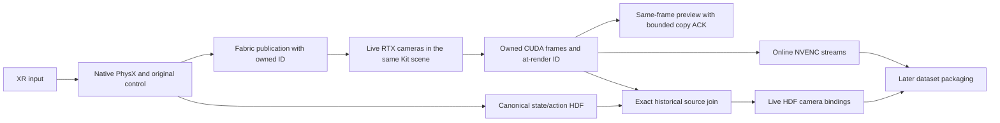
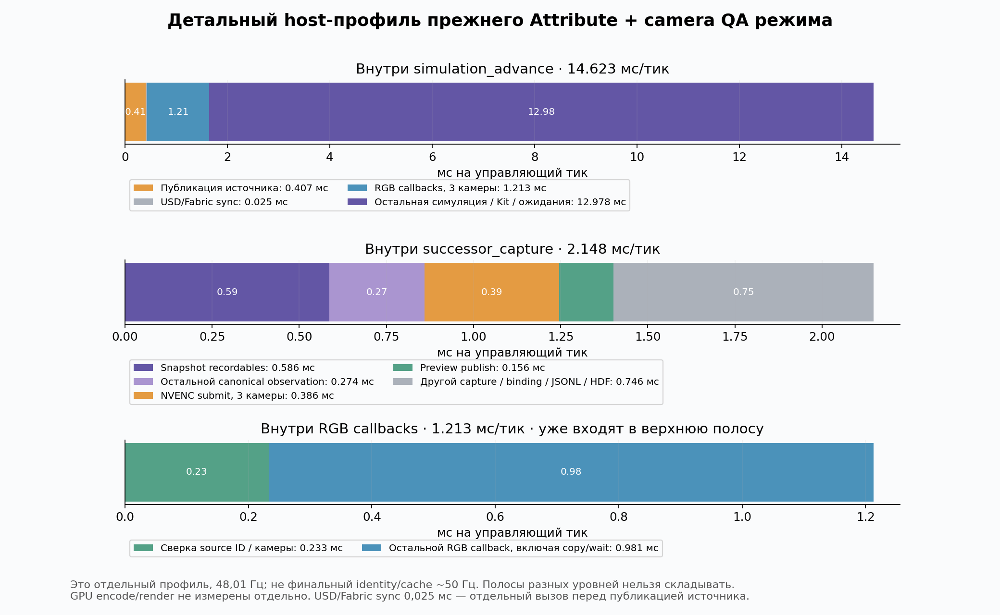
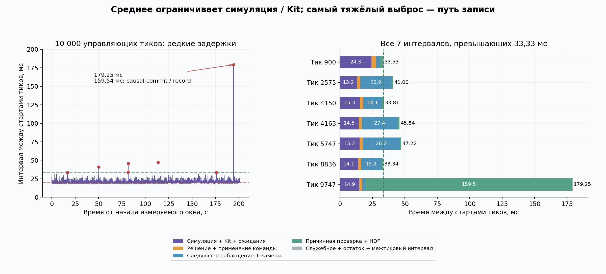

# Углубление native live: критический путь, источник изображения, физика

Kind: experiment; status: current; owner: `vr.performance`; mutable: true.
Trusted preservation base: `835d0b3ad1b8d211fb50f9d79b6d16c020454c93`.
Gate bindings=[]; dataset admission, physical S2 и реальный Quest не заявлены.
Исходный стейт сохранён verified Git bundle и checkpoint ref, см. [план](PLAN.md).

Полезный итог углубления — **полностью live путь одной Kit-сцены с точной
привязкой источника**, без replay world: HDF5 state/actions, online NVENC трёх
камер960×600 и превью из тех же owned frames. Stock at-render Fabric `Attribute`
заменяет дорогое чтение renderer geometry в рабочем цикле; геометрия проверяется
отдельными QA прогонами. Короткий600+60 benchmark дал50.64Hz, длинный1800+60 —
**50.14Hz** (49.90Hz с encode tail). Soak10000+60 дал **49.76Hz**
(49.67Hz с tail); повтор с explicit CPU receipt —50.55/49.77Hz. Это около50Hz,
sustained≥50Hz headroom пока не доказан: soak среднее49.76Hz.
Реальный Quest не подключён и >30Hz с ним не доказаны. ID/history проверяются
на каждом кадре; camera/body matrix comparison в быстром режиме не выполняется
и это явно записано в HDF/JSON. Temporal image history и tail policy остаются
отдельными ограничениями качества/допуска. Selected RUN/DIAG/RECORD не переключены.
**Device scope:** эти50Hz используют CPU native PhysX(MBP,TGS) и CPU DLS/tensors;
RTX/NVENC/preview работают на4090. `--device cpu` меняет physics execution path,
не только размещение control tensors. CUDA PhysX/GPU broadphase и CPU physics
не считаются побайтно эквивалентными без отдельного сравнения. Physics07 ниже
проверяет CUDA baseline versus CUDA media, не переносится на CPU throughput profile.
Explicit CUDA throughput13 дал **25.39/24.65Hz**: даже30Hz без Quest не достигнуты.
Поэтому быстрый CPU профиль — существенный выбор архитектуры, требующий отдельной
проверки физики и controller behaviour перед сменой selected execution profile.

Предыдущий полезный результат этого же этапа — ограниченная очередь GPU-превью,
без ожидания всего CUDA-device. На одной4090 получено **52.53Hz в рабочем цикле**
и **51.98Hz с хвостом кодирования**: три камеры960×600 основной Kit-сцены,
native PhysX, HDF5 state/actions и online NVENC. В `cuda-event-long-01` записаны
1800 измеряемых +60 прогревочных переходов,1861 триплет. Все5583 provider uploads
получили конкретный copy-event;5580 owners освобождены после ACK, последние3
удержаны до закрытия Kit. Максимум pending3 при лимите12; ошибок/карантина нет.
VRAM в измеряемом окне4000–4128MiB, без прежнего роста на размер каждого кадра.
В10,000-transition soak видеопамять осталась bounded, но RSS вырос на151.1MiB
за191s (~52.5MiB/min). Полная стабильность RAM не доказана. В pinned runner есть
O(frames) NativeKitMedia.rows,perf._all_steps и benchmark motion_rows. Их JSON
object-graph оценки суммарно~88MiB объясняют часть возможного роста, не являются
heap attribution. Текущий adapter стримит полный metadata JSONL, в RAM оставляет
только последние3 строки и отдельный capture counter; perf/motion diagnostics
в benchmark всё ещё накапливаются. Финальный source-bound soak12:402 steady samples
за200.95s, RSS first/last-decile medians7429.77→7560.79MiB (+131.02MiB),
OLS+43.11MiB/min, last-half+45.20MiB/min. VRAM4246–4406MiB,
first/last-decile median4278→4278MiB; GPU mean52.70%, NVENC4.08%.
Свободная GPU capacity есть, но serial control/render/copy dependencies не дают
линейно превратить её в FPS. Удержание media owners bounded; полной host-memory
stability нет, дальнейший heap audit должен отделить benchmark diagnostics
от SDK allocators. NVENC pending bounded8,actualpeak4/final0.

Это реальные камеры живой основной сцены; HDF/replay-world для рендера не нужен.
Реальный Quest отсутствует: включённый no-client XR профиль не заменяет испытание
подключённого шлема. Указанные52Hz измерены без полного source proof. Отдельный
путь с проверкой всех render-visible bodies, камеры и live HDF source bindings
даёт43.56Hz; compact logging44.42Hz. Эти значения не обеспечивают требуемого
запаса без Quest. Оптический тест показывает обычный лаг два control ticks;
ledger сам по себе не подтверждает принадлежность пикселей текущему state.
Не заявлены >30Hz на Quest,
качество RTX с исходными renderer/denoiser settings или готовность training dataset.

Предыдущий `gpu-retained-01` дал53.05/51.63Hz, но удержал все661 триплет до Kit
close (4,568,832,000 bytes). Он остаётся полезным верхним ориентиром и сохранённым
прототипом. Новый event transport решает именно эту проблему lifetime/памяти.
Экспериментальная архитектура развита; selected RUN/DIAG/RECORD не переключены.

## Что измерено и почему это быстрее

[Предыдущий этап](../native_live/REPORT.md) дал живые камеры основной сцены.
Этот этап измеряет его внутренний путь. История альтернатив и upstream поиска
сохранена в [основном research](../deep_research/REPORT.md),
[первом single-GPU этапе](../single_gpu/REPORT.md),
[dataset30](../dataset30/REPORT.md) и [resource30](../resource30/REPORT.md).
Selected physics/control profile не переключён; experimental CPU/CUDA различаются.
Nested host profile: canonical observation/hash около1.33ms, sampler0.86ms,
все3 NVENC submit0.45ms, вызов preview setter0.087ms, после него глобальное
`cudaDeviceSynchronize` **7.20ms**. Timings включены друг в друга; складывать все
строки нельзя. cProfile влияет на скорость: его результаты не являются обычным
performance benchmark. Первый profile сохранён как FAIL из-за восстановления
отсутствующих Carb settings: теперь отсутствие возвращается через `destroy_item`,
а не `set(None)`; ошибка не переписана в PASS.

Два Nsight Systems захвата подтвердили источник ожидания. Обычный preview:
91 `cudaDeviceSynchronize`,648.55ms суммарно,7.127ms в среднем,96% времени
CUDA API на CPU. Retained-preview: глобального device wait в измеряемом цикле нет;
270 producer `cuStreamSynchronize` суммарно лишь около5.7ms.273 preview uploads
идут через `cudaMemcpy2DToArray` в context1, его legacy/null stream7. GPU-copy
занимает около5.37µs, но завершается в среднем примерно7.37ms **после** возврата
setter. Удалить wait и оставить только два Python references недостаточно для
доказательства lifetime. Это соответствует опубликованной
[CUDA synchronization semantics](https://docs.nvidia.com/cuda/archive/12.2.1/cuda-driver-api/api-sync-behavior.html).

| Вариант | Controls Hz | С NVENC tail Hz | Вывод |
|---|---:|---:|---|
| Native state-only baseline,600+60 | 56.34 | — | исходная physics/control без дополнительных RGB products |
| Native live без preview, repeat600+60 | 54.10 | 53.42 | верхняя проверенная граница текущего пути |
| CUDA-event live preview,1800+60 | 52.53 | 51.98 | bounded pending3, VRAM4000–4128MiB; no optical witness |
| CUDA-event soak,10000+60 | 52.33 | 52.25 | no source proof;30183 uploads,peak3/12 |
| Full source proof +live bindings,600+60 | 43.56 | 42.55 | exact past source; target headroom FAIL |
| Same full proof,compact logs,600+60 | 44.42 | 43.92 | body/camera checks unchanged; target headroom FAIL |
| Full proof without added per-tick FSD sync,600+60 | 44.00 | 43.20 | initial sync kept; no useful speed gain |
| Publication-clock/native-camera proof,600+60 | 46.23 | 45.45 | exact live HDF source; body comparison is separate QA; target headroom FAIL |
| Native Attribute +camera comparison,600+60 | 47.64 | 47.05 | same-result scalar replaces semantic mapping; target headroom FAIL |
| Attribute identity only,600+60 | 49.60 | 48.80 | geometry QA separate; analysis overlap reconstructed for startup only, timing caveat retained |
| Attribute identity +accessor cache,600+60 | 50.64 | 49.71 | actual-source joins retained; near50Hz, real Quest NOT CHECKED |
| Same identity/cache,1800+60 | 50.14 | 49.90 |1861 live bindings,0missing/evicted-unbound; real Quest NOT CHECKED |
| Same identity/cache,10000+60,CPU | 49.76 | 49.67 |10061bindings,30210exact joins; real Quest NOT CHECKED |
| Final recipe explicit CPU repeat14,600+60 | 50.55 | 49.77 | resolved CPU/MBP/TGS; GPU RTX/NVENC/preview |
| Same final recipe CUDA13,600+60 | 25.39 | 24.65 | resolved CUDA/GPU broadphase/TGS; target FAIL |
| GPU retained live preview,600+60 | 53.05 | 51.63 | полезный performance prototype; VRAM растёт с эпизодом |
| Sync throughput / lowLatency off,240+30 | 37.99 | 37.10 | переключение scheduling само по себе не решает задачу |
| Desktop viewport off,240+30 | 42.97 | 41.33 | ablation; нельзя считать работающим Quest preview |
| Immutable CPU preview,240+30 | 29.23 | 28.43 | хуже; target FAIL |
| Async / async-latency | — | — | FAIL: native callback не успел продвинуться |

Controls Hz — steady interval из performance.effective_wall_hz, без warmup;
encode-tail rate включает весь записанный budget(warmup+основной) и encoder drain.
Во всех перечисленных throughput benchmarks, кроме explicit CUDA13, выбран
CPU PhysX +CPU control, GPU media. CUDA13/CPU14 читают resolved USD PhysX settings
и device actual native q/link arrays до warmup; receipts не полагаются лишь на argv.
Все числа — без Quest. Async тесты завершены ошибкой stale-result, старый кадр
не переименовывался в новое наблюдение. CPU путь использует pinned D2H staging,
собственный copy stream/event, неизменяемую обычную NumPy копию и stock provider;
несмотря на узкое ожидание preview publish в profile стоит13.18ms. Перенос в CPU
не является выигрышем. `no-preview-01` заменён повтором: между source snapshot
harness и Python import поменялся callback helper; первоначальные bytes и вывод
сохранены, но этот запуск не используется как точное сравнение исходников.
Nsight complete-rate включает выгрузку трассы в конце (~7–10s), поэтому низкие
completeHz профилировочных запусков не являются обычной скоростью записи.

В `gpu-retained-01` p95 управляющего шага20.98ms, GPU mean53.36%, max57%;
encoder4–5%, CPU агрегированно15.87%. VRAM в steady samples4640–8192MiB
по `nvidia-smi`; доступно минимум15,889MiB. Это запас мощности,
но он не устранит сериализованное ожидание в критическом пути автоматически.
В данном случае его удалось использовать через перекрытие работы, а не через
параллельное повторное рисование сцены или дополнительную GPU.

## Почему идентификаторы не доказывают актуальность

[Offline verifier](../native_live/verify_native_join.py) независимо проверяет
canonical D0 digests, state generation, каждый successor и terminal snapshot,
нативные clock deltas, полное покрытие callback identifiers и все byte extents/
source tags каждого NVENC packet. Все завершённые технически успешные media
запуски первого набора проходят эту проверку. Это **целостность ledger**;
вывод о соответствии пикселей state/action не следует из имени frameNumber.

Новый диагностический observer читает native q/dq и все27 физические body poses
в месте настоящего `PhysxManager.forward`, после kinematics/Fabric publication и
до обычного Kit update. Ни лишних physics steps, ни replay state writes нет.
`SimulationContext.physics_manager` в установленном IsaacLab — `ResolvableString`;
хук должен ставиться на разрешённый настоящий класс, с восстановлением исходного
descriptor. Предыдущие попытки с proxy/неверным ownership сохранены как FAIL.

Семантические матрицы и camera view/projection подключены к тому же renderResults,
что и RGB. Обнаружен реальный опасный эффект: применение semantic API к живым
physics prims вызывает USD composition resync, удаление descendant collision
shape и инвалидирует tensor simulationView. Исправление: owned anonymous layer
и semantic APIs создаются **до первого штатного reset**. View identity/is_valid
контролируется; слой снимается лишь после shutdown физики. SDK files не меняются.

54 видимых диагностических mesh независимо кодируют публикацию и роль камеры;
их world poses формируются из прямых native camera mounts перед app.update.
`source-proof-optical-06`: из153 confident role/frame samples147 показывают
публикацию на8 physics steps (два control ticks) раньше текущего token; первые
три соответствуют начальному состоянию и ещё три отстают на4 steps. Это измеренное
содержимое owned RGB, а не сдвиг, подобранный по timestamps. **Фиксированная
перенумерация кадров не применяется**. Требуется одновременно сверить все native
body matrices и camera pose для каждой независимо найденной публикации.

Native `SdInstanceMapping` отдавал28 world matrices, но28 пустых path tokens.
`DefaultSemanticFilter`/`DefaultSemanticFilterPost` edges в07/08 не исправили это.
Пустые строки подтверждены на upstream output через Controller и AttributeValueHelper.
`default_filter=null` в08 — неверный RP path диагностики, не отсутствие filter.
Run09 FAIL до цикла из-за несуществующего имени template `InstanceMappingController`;
реальное установленное имя `InstanceMappingPre`.22 CPU proof tests этот SDK API
не проверяли. Ошибка сохранена, исправление использует literal installed template
и отдельный static SDK port/name audit плюс runtime registered checks.

**Run10 исправил получение путей** штатным
`SdInstanceMappingPtr → omni.replicator.core.OgnPrimPaths`, как в stock Replicator
`primPaths` annotator. Оба узла получают тот же per-RP renderResults; counts,
minindex и update rational сверяются с matrix table. Нет opaque pointer casts или
private ABI. Все180 results правильно идентифицированы; geometry180/180 совпала
с указанной native публикацией:25 render-relevant bodies +camera.2из27 native
bodies не имеют видимой geometry и явно исключены из renderer comparison.
Max matrix component errors7.326e-7(body),2.682e-7(camera),tol5e-5. Пиксели во
всех180 results уверенно декодируют **тот же publication ID и роль**, что geometry.
Все51 записанных триплет имеют один и тот же publication ID между тремя камерами.

Полный optical quality check всё ещё FAIL33/180: right_wrist pubs17..49 имеют
остаточный сигнал в предыдущем marker ROI, один также centroid>2px.147/180
проходят strict check; в записанном subset120/153. Первые27 unrecorded warmup
results проходят, следовательно33fail нельзя списать на прогрев. Независимые
PNG/crop анализа сохранены: pub17 показывает старый outline; pub49 содержит
неравномерную освещённость background, и remote black anchor даёт часть false
positive. Исходные failures не переписаны; local-background measurement отдельный.
ID/geometry coherence не доказывает отсутствие temporal history в каждом пикселе.

При завершении publications50/51 (physics316/320) не имели ни одного render result:
два последних состояния ещё находятся в renderer pipeline. Для датасета нужны
bounded source-aware join и explicit tail policy — drain обычных render updates
без дополнительных physical substeps или честное исключение непокрытого конца.
Сдвиг на постоянные2 кадра запрещён: первое состояние повторяется, lag меняется
при startup и может меняться под XR load. Dataset action/causal labels не меняются;
camera result должен ссылаться на действительно найденный прошлый observation.
Дополнительный10,000+60 soak повторил52.33Hz (52.25Hz сNVENC tail),30,183uploads,
30,180ACK releases и3pending, максимум3/12; ошибки/карантин отсутствуют.

Sourceproof/optical probes стоят около16Hz, содержат диагностические meshes/CPU
readback и не включаются в performance benchmark.

## Live HDF и точная привязка прошлого кадра

### Штатный Fabric reader вместо выгрузки геометрии

Глубокий аудит установленного Replicator нашёл public `Attribute` annotator:
[`Attribute` API](https://docs.omniverse.nvidia.com/kit/docs/omni_replicator/1.13.30/source/extensions/omni.replicator.core/docs/API.html)
описывает значения атрибута во время рендера. В installed1.13.36 это два native
`OgnFabricReader` узла: PR подключён к `GpuInteropEntry`, PP читает тот же
`renderResults`, что RGB. Owned prim получает export tag `fc_exportToRingbuffer`
и Int32 publication ID через Fabric. Метаданные `primAttributeDS` не являются
настраиваемым портом. Никаких casts opaque handles или SDK patches нет.

Документация не является доказательством источника: changelog1.11.32 сообщает
переход StageAtTimeInterval →StageReaderWriter для FSD, а native C++ compute body
в поставке отсутствует. Не найден public мост из opaque RP к конкретному ring
sample. Поэтому сначала reader проверен против независимого semantic stamp,
camera matrices и декодированного ID внутри изображения, а не использован сразу
как основание для labels. Отдельный ring-reader audit сохраняет19 SDK source SHA
и16/16 CPU source-contract checks; он не заявляет GPU qualification.

`source-proof-optical-16` FAIL: первый RGB пришёл с пустым default Attribute
`uint8/0 bytes/0×0`. Пустые данные не были приняты за publication0; запись остановлена.
В экспериментальном графе обнаружены две независимые exec ветви. В17 исправлен
порядок `camera →identifier →AttributePP →consumer`; PR/PP dependency и per-RP
renderResults сохранены. В17 **180/180 native Int32 IDs совпали** с независимо
найденными semantic publication IDs и pre-encode optical IDs; camera comparison
тоже180/180. В147 callbacks ID отстоит на две публикации от последнего publisher,
в3 — на одну, в30 начальных — совпадает: результат не является простым чтением
текущего publisher в callback. Strict optical quality всё ещё147/180,33 failures.
Первые16 raw PR/PP port dumps относятся к начальной публикации; изменение ID
подтверждают все последующие source-proof events, не только эти dumps.

Phase2 — отдельный opt-in `--native-attribute-only`, scope
`publication_attribute_camera`: убрать InstanceMapping/PrimPaths/filter graph,
не авторить semantic APIs и не менять stamp transform; оставить exact native
publication history, scalar at-render ID и camera matrix comparison. Body checks
в этом режиме **не выполняются**; `compared_bodies=0`, `body_geometry_checked=false`
сохраняются в HDF/JSON. Binder отвергает отсутствующий/несовпавший scalar, смешанные
scopes и ложные body claims. GPU correctness и performance этого пути проверяются
отдельно; CPU tests сами по себе не устанавливают совпадение с rendered pixels.

`source-proof-optical-18` проверил phase2 на GPU:180/180 exact attribute-history
joins,180/180 confident optical IDs совпали с publication и ролью, camera max
error2.682e-7 при tol5e-5. Strict optical147 PASS/33 FAIL сохранился. Same-result
semantic arrays в этом режиме отсутствуют; это clock/camera proof, не повторная
проверка всех body matrices. В saved HDF51 bindings и50 canonical transitions;
последние observations49/50 явно unbound. Облегчение источника не устраняет
renderer temporal history и не обосновывает D1 admission.

Run07: Attribute +camera comparison47.64/47.05Hz,661bindings/2010matches.
Host-only profile08: native publication0.406ms/control, callback0.404ms/role
inclusive comparison0.077ms/role, added USD/Fabric sync0.025ms/control. Значит,
синхронизация не основной remaining bottleneck. QA native pose reads и camera
matrix construction не обновляют реальные камеры: они только строят ожидаемые
значения для сравнения. Их удаление сохраняет исходный native forward/force_update.

`--native-identity-only` задаёт scope `publication_attribute`: сохранить exact
native scalar →bounded publication history →canonical observation token join,
не читать native poses и не подключать camera exporter в рабочем пути.
`history_join_matched=true`, `geometry_matched=false`, body/camera checks=false;
HDF и binder отвергают попытку повысить scope, пропущенный/изменённый ID или
неизвестную публикацию. Optical19 проверил180/180 IDs в actual RGBA;147 strict
PASS/33 FAIL остаются. Native poses в optical режиме читаются исключительно
для размещения диагностических meshes и не превращаются в runtime geometry proof.

Run09 дал49.60/48.80Hz. По реконструкции timestamps независимый анализ
закончился примерно11.4s до steady и6.7s до performance log, пересекал Kit startup.
Тогда exact command start/end не регистрировались: mtime reconstruction сохраняет
неопределённость, этот run не является единственным основанием speed comparison. Для улучшения callback добавлен opt-in
`--native-cache-helpers`: кэшируются public `AttributeValueHelper` объекты,
**не значения или массивы**; каждый callback вызывает свежий `.get()` с upstream
validity check. Положительные CPU tests заменяют scalar/array между вызовами;
teardown detach предшествует очистке cache. Optical20 подтвердил180/180 IDs,
independent decode подтвердил все153 encoded IDs и role ordinals в обоих19/20.
Strict temporal-image quality33FAIL остаётся в каждом; это не ошибка source-ID.
Native graph types фиксированы
до teardown; динамическая замена портов вне tested scope.

Изолированный run10:50.64/49.71Hz,661 live bindings,2010 source joins,
0mismatch/unresolved. Long11:1800+60 transitions,1861bindings,50.14/49.90Hz,
retained history256,1605 evictions без evicted-unbound; tail1859/1860 явно unbound.
Soak12:10000+60 transitions,10061bindings,49.76/49.67Hz,30210 exact Attribute/history
joins,0mismatch/unresolved/evicted-unbound. Independent decode и exact HDF audit
прошли для каждого из19/20/09/10/11/12, включая10060 canonical snapshot digests
в soak12. Все16 runtime/source identities10/11/12 совпали.
CPU14 подтвердил50.55/49.77Hz на финальном runner с explicit device receipt.
CUDA13 при той же recording recipe дал25.39/24.65Hz: mean simulation_advance32.32ms,
apply3.04ms и successor_capture2.47ms. Это measured scope, не утверждение, что весь
разрыв имеет один root cause; CUDA performance не переносится с CPU.
Эти числа уже включают online source bindings. Они не переносят full-body QA
на каждое production изображение и не доказывают throughput подключённого Quest.

Предлагаемый рабочий pipeline:



Последняя стадия упаковки/выбора30Hz может выполняться позже; повторного рендера
нет. Небольшой renderer lag допускается только с фактическим source join.
Отдельные QA runs включают native body/camera comparisons и optical meshes;
они не составляют обязательную нагрузку production recorder.

`--native-source-proof --native-bind-sources` пишет отдельный SWMR HDF
`native-camera/camera_bindings.hdf5` прямо в capture loop, вместе с live H264.
Каждая строка сопоставляет encoded packet ordinal с actual rendered publication,
physics step,reset epoch,canonical observation sequence и snapshot ID/SHA256.
Canonical D0 state/action HDF сохраняется без изменения training labels.
Это готовый вход для последующего объединения/LeRobot conversion без повторного
рендера. Сам RGB хранится в online encoded streams, HDF содержит связи/метаданные;
формат пока экспериментальный и не является D1 admission.

Pure bounded binder хранит256 immutable tokens, принимает три одинаковые actual
source identities после проверок объявленного scope, отвергает epoch changes,
gaps,backwards identities,missing/evicted sources и snapshot ambiguity. Повтор
начального source явно считается duplicate. Никакого фиксированного смещения
на2 кадра нет. В optical12 все51 HDF bindings независимо совпали с JSON rows,
canonical HDF и snapshot digests; последовательность sources0,0,0,1..48,
последние49/50 явно unbound. Binding к terminal state допустим как observation,
но не создаёт action/transition, которого не было.

`source-bound-live-01`:600+60 transitions,661 live bindings,geometry2010/2010
совпала,0mismatch/unresolved,405 bounded-history evictions без evicted-unbound.
Последние659/660 observations остались unbound.43.56/42.55Hz включает записи
HDF и полноценную source comparison без optical meshes/readback. Compact02
сохраняет все native reads/history и comparisons, пишет state hashes вместо
больших JSON arrays:44.42/43.92Hz(рабочий цикл включая warmup44.06Hz). CPU serialization0.176→0.0167ms за publication
показывает, почему одним сокращением логов достаточного выигрыша не получить.

Принятый сейчас tail policy — явный непокрытый suffix, без ложной маркировки
последних двух кадров текущими состояниями. Для admitted dataset понадобится
valid-prefix selection, корректно сохраняющий outcome/next-observation, или
bounded render-only drain с отдельно доказанным источником каждого результата.
Полный production exporter с таким admission в этом этапе не заявлен.

Public DLPack batching девяти native Warp arrays проверен отдельно: Torch cat,
один blocking host transfer, независимые исходные shapes/order и byte-preserving
copies. CPU/installed Warp CPU proof прошёл, а GPU run03 сохранил661 корректную
привязку, но замедлился до43.10/41.85Hz(включая warmup42.56Hz). Default batch=False; один D2H не означает
отсутствия внутренних native getter waits. Host profile04 безcProfile измеряет
_publish0.795ms/tick,observe0.233ms/role,_receive0.636ms/role(inclusiveobserve).
Удаление Python proof целиком не объясняет весь разрыв с52Hz; надо измерять
FSD synchronization и native SD exporter graph, не приписывать всё JSON.

Native source observer добавлял `SynchronizeToFabric` до каждого штатного
PhysxManager.forward. Installed forward сам делает kinematics+force_update,
а не population; ordinary Kit render затем синхронизирует USD→Fabric. Opt-in05
удаляет только добавленный observer per-tick вызов, оставляя initial population,
native forward,все reads/comparisons и fail-closed view/boundary checks.05
прошёл661 joins,но44.00/43.20Hz не даёт выигрыша. Flagdefault=False.

Для production-like source binding добавлен отдельный scope
`publication_clock_camera`. До reset семантически помечен только owned stamp;
каждая native publication читает два native robot link-pose массива для mounted
camera poses,не читает props/q/dq и не сравнивает robot body matrices. Same-result
stamp ID и rendered camera view всё ещё должны совпасть с exact history source.
Это **точная привязка публикации и камеры**, не runtime proof всех тел.
Binder/HDF записывают scope и body_geometry_checked=False; default full binder
отвергает clock-only rows,clock binder отвергает full/mixed/fake-body rows.
Полная body QA остаётся default диагностикой с25 visible bodies; исходное
побайтное physics comparison не переносится автоматически на все новые режимы.

Run06:661 live HDF bindings,0missing/unbound evictions,46.23/45.45Hz,обычный
двух-tick лаг и явный tail659/660. Independent CPU join проверил все SHA иscope.
Оптический15 сравнил180 clock/camera samples и153 encoded IDs+roles+ordinals:
идентификаторы совпали, но strict147/180 сохраняет33right-wrist failures. Нельзя
называть этот run проверкой всех физических body matrices.155 CPU tests прошли
после внедрения distinct proof scopes. В этом clock/camera scope50Hz без Quest не достигнуты;
52Hz без observer не заменяют его измерения. Identity-only варианты10–14
измерены отдельно и подходят к50Hz при другой proof coverage.

## Per-camera legacy RTX: проверено, но quality issue остаётся

Installed public schemas допускают `OmniRtxSettingsCommonAPI_1` mode
`RaytracedLighting`, Debug `rtpt:rtCompatibility=True`/`newDenoiser:enabled=False`,
PostDebug `post:aa:limitedOps=False`/`post:aa:op=none`. В отдельном процессе
включены и legacyRT,иRT2; новые native products получают эти пять opinions в
сильном session layer. Global XR context сохраняетRealTimePathTracing/RT2.
Это предпочтительнее неучтённых глобальных edits renderer; ничего в SDK не патчится.

Run13 потребовал около399s со startup, завершился технически успешно, но sourceproof
file изменился до доказанного import во время долгой инициализации. Его input
snapshot/вывод сохранены как provisional; точное сравнение использует повтор14
со stable source.14: все15/15 per-RP opinions сохранились в first-capture и
after-loop, strongest layer=Session; geometry180/180 и IDs180/180 совпали.
Все153 encodedIDs+roles+ordinals прошли, mincontrast206. Strict optical154/180:
26fails(24right-wrist+2scene), в153 записанных role-rows25fails. Это не устранило
ghost/lighting concern.13 provisional дал155/180, не заменяет stable14.
Composed USD opinions сами по себе не доказывают active RTX pass selection или
отключённый RR. Legacy candidate не promoted; первоначальные10/12 failures сохранены.

## Превью и ограничение памяти

Перспективная upstream альтернатива — managed GPU resources:
[`ImageProvider.set_image_data(RpResource)`](https://docs.omniverse.nvidia.com/kit/docs/omni.ui/2.26.5/omni.ui/omni.ui.ImageProvider.html).
Installed public C++ interface сохраняет resource reference. NEW_FRAME и
DRAWABLE_CHANGED действительно наблюдаются; `source-proof-optical-05` сохранил
241 NEW_FRAME,177 drawable и180 SD events,59 held providers на каждую роль,
без ошибок. Для177 из180 SD events есть один кандидат по scalar frame identifiers;
начальные3 не имеют такого кандидата. Числовые pointer types различаются:
SD/NEW_FRAME `HydraRenderProduct*` и drawable `ViewportHydraRenderResults*`
не взаимозаменяемы и нигде не cast/dereference. Pointer reuse и ambiguity
сохраняются в отчёте. Reference ownership пока не доказывает неизменяемость pixels,
совпадение с записанным буфером или actual presentation на Quest.
Первый observer attempt сохраняет ошибку pybind Event.get: API допускает один
аргумент, не dict.get(key,default). После исправления native event capture работает.

Первый scoped `LD_PRELOAD` shim строгим образом компилируется и проходит CPU
CUDA/RTLD_NEXT stubs, но **реальный Kit copy не перехватывает**: matched_calls=0.
Очередь остановлена, source allocation удержана; это FAIL, а не ring success.
Рабочий путь использует public CUPTI callback для конкретного legacy copy:
callback читает только scalars/context/return code; после setter, вне callback,
записывается CUDA-event в том же captured context и legacy stream. Последующие
ticks только query; owner освобождается после SUCCESS query и destroy. Pending
ограничен12. Недостающий callback, неверный source/layout/context, error или
overflow останавливает опыт и удерживает незавершённые owners до Kit shutdown.
Никакие callback pointers не переживают callback; driver API из него не вызываются.
[Public CUPTI callback documentation](https://docs.nvidia.com/cupti/main/main.html#cupti-callback-api).

Первый CUPTI attempt FAIL39: при старте `carb.cudainterop` уже занимает единственную
подписку для memory tracking. Документированная NVIDIA настройка
[`--/plugins/carb.memorytracking.plugin/enabled=false`](https://github.com/NVIDIA/omniperf/blob/main/dev/docs/profiling-guide.md)
в отдельном новом процессе не освободила subscriber (probe02 FAIL39 сохранён).
Применён ранний **собственный** public subscribe до Kit startup, без снятия чужой
подписки. Успешные Nsight traces ранее показали, что Kit допускает занятую подписку
и отключает этот tracker после warning. Probe03 подтвердил subscribe0 и153 uploads,
а `cuda-event-long-01` —5583. Это проверено на установленном CUDA/CUPTI12.8.90 и
Kit110.3; переносимость на другие версии не предполагается.

Drawbacks: CUPTI12.8 допускает один subscriber, поэтому одновременный Nsight CUDA
tracing/другой subscriber несовместимы; отключается встроенный CUPTI allocation
tracker Kit, часть profiling observability теряется. Общие `nvidia-smi` telemetry
сохраняются. SDK upload API не предоставляет completion token, поэтому нужен
маленький opt-in compiled adapter с точно проверенным source/layout/API/контекстом.
Он не меняет copy return value, PhysX или renderer implementation. На shutdown
последний триплет не освобождается по времени: owners/event handles удержаны до
Kit close; process lifetime, не бесконечный повторный start/stop в одном Kit,
является проверенной границей. Managed RpResource остаётся альтернативой для
будущего отказа от зависимости от CUPTI после доказательства immutable pixel join.

## Отличия от master и проверка физики

Пять core/config files побайтно совпадают с master
`beaedfd1116577fd4d8026232cfb96cba0b030fa`: `run_isaac_s1.py`,
`isaac_s1_runtime.py`, `isaac_vr_runtime.py` и оба runtime YAML.
`isaac_s2_runtime.py` **не** побайтно идентичен master: до этого этапа добавлен
`standalone_state` provider и native fallback refactor. Быстрый профиль выбирает
`--physics-source native`; S2 controller comparison требует отдельного scope audit.
Native S2 fallback expression/index audit:7 expressions совпадают с master,
`__init__`,reset,apply AST совпадают, delta→DLS→clipping arithmetic tail совпадает
после explicit substitution limits. Но `_state` раньше читает root/limits и
меняет порядок lazy getters: AST audit не доказывает universal semantic/bit
equivalence. Receipt `final-source-review/master-scope/audit.json` сохраняет
whole-file SHA, точный diff и reproducible script. D0 processors/decision/upstream
files совпадают с master. Совпадение файлов не заменяет динамическую проверку поведения.
[Comparator](compare_native_recordings.py) проверяет finalized HDF/terminal,
все14 state channels,28 recorded pose tracks (2×13 robot root+links +2 objects),
3 cameras/intrinsics и всё source sequence, включая terminal. Physics probe,
velocities/Jacobians/contacts в этом HDF отсутствуют: он не подтверждает все27
native physical bodies. Терминальные scalar shapes нормализуются только после
проверки hash исходного terminal artifact.

Исходники core/config совпадают, но execution device — отдельный существенный
параметр. Installed PhysxManager при CPU задаёт cudaDevice=-1, readback enabled,
MBP broadphase, GPUdynamics=false; CUDA задаёт cudaDevice=0, suppressReadback=true,
GPU broadphase, GPUdynamics=true. DLS, Jacobians и control tensors тоже следуют
env.sim.device. Семейство solver остаётся TGS из cfg, timestep/actuator gains
не меняются. Профиль~50Hz — CPU physics +GPU cameras. Все optical17–20 QA также
CPU-profile. Detailed device audit сохраняет installed source lines/SHA и точные
argv; нельзя назвать это только оптимизацией CUDA↔CPU copies или без изменений
physics execution. CUDA throughput13 измерен отдельно и не даёт требуемого headroom.
CPU fixed-command assay проверяется отдельно; это не оправдывает незаметную
замену GPU physics или утверждение о равенстве DLS controller outputs.

Оба660-transition feedback-generated сравнения FAIL same-input eligibility:
labels **и** native commands расходятся на658 строках с row2. Для no-preview vs
GPU-retained max label delta0.001942deg, native command delta3.392e-5rad;
состояние различается примерно0.001080deg/0.000160mm, body positions12µm и
orientations32.3µrad. Это descriptive differences; нельзя приписать их рендеру
при разных командах. Self-comparison state-only baseline bit-exact PASS.
Отдельно baseline без cameras и GPU-retained имеют совпадающее начальное состояние
роботов, но первая wrist-camera snapshot pose различается0.280108m/0.777326rad.
Это проблема initial camera publication/freshness, не доказательство отличающейся
robot physics. Новый fixed-native diagnostic повторяет идентичные сохранённые
`native_clipped` commands и сравнивает q/dq/all27 body pose/velocity/Jacobian/
contacts/properties; он не создаёт training labels или новый canonical HDF.
Все его неудачные startup попытки также сохранены, включая отсутствующую XR
extension, обязательные no-client flags и UNIX IPC path length>108.

`fixed-native-physics-05`: одинаковые660 commands,661 samples и2640 physics
substeps в двух reset cases с RGB products (preview off/on). Начальные q/dq/all27
poses и физические свойства совпадают. Все сохранённые массивы кроме wall time
**побайтно совпали**: q/dq,27 body poses/velocities,Jacobians,native targets,
recorded contact forces и relative sim clocks. Reported orientation5.96e-8rad —
округление acos на одинаковых quaternion arrays, а не различие поз; стабильная
chord formulation даёт0. Contacts observer охватывает24 bodies на последнем
substep, не все возможные внутренние контакты. Эти тяжёлые physics assays измеряют
поведение, их wall rates не сравниваются с performance benchmark.

`fixed-native-physics-06` усиливает сравнение: первый case не создаёт никаких
дополнительных native RGB products/encoder/preview, второй включает весь live
camera pipeline. То же660-command расписание и exact initial-state guards;
численные differences q/dq/velocities/Jacobians/contacts/body translations снова0.
Это native baseline на master-identical core/config, не запуск всей master ветки
и не физическое принятие gate; validation observer сам не устанавливает допуска.

`fixed-native-physics-07` проверяет **финальный** identity/cache/CUDA-event media
против no-media CUDA baseline.660identical commands,661samples и2640substeps;
independent replay comparator и raw array audit подтвердили byte equality всех
сохранённых массивов, кроме wall time.25 visible geometry QA не подменяют эти27
native-body arrays. Это один CUDA fixed-input case, не CPU или full-master gate.

`fixed-native-physics-08` FAIL при создании diagnostic Torch facade: неявный
stage_id=-1 не работает с CPU native manager, хотя его собственные CPU tensors
валидны. Исправленный09 передаёт публичный get_current_stage_id, как upstream;
не attach/reset/physics mutation. ОбаCPU cases имеют MBP/TGS, GPUdynamics=false,
точные initial q/dq/all27poses и properties; команды/targets/action_seq/relative
physics steps/sim clocks идентичны. **Траектории не побайтно идентичны:** q arm
max5.126e-6rad, prismatic0.510µm, body position component8.956µm,
orientation25.24µrad; dq max0.05234, body velocity0.05223, Jacobian2.369e-5,
contact force0.3464N. Первое различие q/dq/poses sample2. Saved comparator
structuralPASS; отдельный byte-equality assertionFAIL сохранён и не повышен в PASS.
Не заданы acceptance limits, physics_parity_accepted=false.

CPU09 baseline vsCUDA07 baseline:660same commands/properties, relative clocks
совпали, genuine initial states **различаются**. Whole trace max body position
norm90.25µm, orientation256.81µrad, q component1.439e-4, dq0.07824,
body velocity0.23586, contacts1.676N. Этот measured difference включает device
solver/initial settling; нельзя приписать его только DLS или только live media.
Fixed native replay вообще не проверяет равенство feedback/DLS controller outputs
для same-state/same-intent bundle: такой bundle не записан в исходном HDF.
CPU baseline-repeat10 без NativeKitMedia: два reset/replay cases с strong initial
byte guards. Все arrays кромеwall побайтно совпали, stable quaternion metric0.
Один repeat не задаёт distribution, но в этом control09 differences не повторились;
причина CPU media drift остаётся неустановленной. Его нельзя незаметно признать
случайностью CPU PhysX. Ablation11 пропускает added per-tick Fabric sync,12 отключает source observer
и его native Attribute graph целиком; обе сохранили те же measured differences09.
Independent raw-array comparison подтвердил: media traces09/11/12 совпадают
побайтно, кромеwall; их baseline traces иCPU10a/b тоже совпадают между процессами.
Это исключает добавочный sync/source observer как единственное объяснение
наблюдавшегося CPU divergence в этих cases. Snapshot capture копирует CPU arrays
сразу: host(...).copy(), stack/concatenate иfresh contact array; source-level
audit исключает сохранение borrowed .numpy() буфера как механизм этого расхождения.
Preview-off13 оставляет live RGB/NVENC/sourceIdentity/cache, отключает
SceneUI setup/partition opinions/upload вместе. Все native arrays кромеwall
снова byte-exact; stable orientation0. Это локализует effect в preview presentation/
setup части проверенногоCPU pipeline, но не доказывает конкретный USD/PhysX
mechanism. Camera partition opinions и UI roots не являются physical-body tags.
Installed IsaacLab stage.py318–352 использует playSimulations=false+app.update
для no-physics rendering; native step guards иsim clocks не нашли extra steps.
CPU snapshotownership test с изменением всех fake native backing arrays прошёл:
сохранённые samples оставались неизменны.
Candidate14 preseed авторит exact session-layer three camera partition Token specs
иtwo renderer bool settings до первогоreset в обоих случаях. Stereo opinions
только наблюдаются, отдельно не авторятся. Original settings/full USD session
preimage сохранены; installed-USD failure tests подтверждают exact restore при
ошибке подготовки, включая первоначально отсутствующую настройку. Первый test
FAIL из-за сравнения anonymous .sdf/.usda header сохранён, corrected testPASS.
GPU14 завершён: initial/properties/commands/clocks exact, numeric differences
снова те же09. Перенос этих конкретных preview opinions раньше **не устранил**
CPU divergence. После успешного Kit run cleanup scope — process-owned session/
settings destruction при canonical fastshutdown(os._exit), а не заявленный
post-close Python callback. Independent14 raw-array audit подтверждает тот же nonzero within-pair difference09;
14baseline=09baseline и14media=09media побайтно во всех samples кромеwall.
Все partition/stereo snapshots before/after media совпадают, all3 session specs
присутствуют. Partition settings былиTrue уже в originalstartup; stereoRole=mono
приходит из исходного asset. Это factual readback, не свидетельство PhysX notices.

Таким образом, CPU preview-enabled fastest profile сохраняет маленькие pose
differences, но не прошёл byte-parity acceptance. Preview-off media сsourceIdentity proof является более консервативным
diagnostic candidate; его13 physics probe использует FakeRecord/bind_sources=false,
не создаёт canonical HDF/labels и не является новым полного canonical source-bound
throughput assay. Поэтому скорость54.10Hz раннегоno-preview без полного proof
не присваивается этому более сильному scope. Этот факт нельзя
скрыть за~50Hz или игнорировать по source-pointer equality. Причина broader
presentation effect остаётся открытой; перед production нужны explicit physics
acceptance limits/task-outcome checks и actual Quest measurements.

## Воспроизведение рабочего bounded transport

Полный source-bound путь воспроизводится сохранёнными
`source-bound-identity-cpu-14/config.json` (short) и
`source-bound-identity-soak-12/config.json` (soak) через resource assay harness; config
содержит exact argv,env,affinity0–15 иsourcepaths. Основные runtime flags:

```text
--media kit --physics-source native --kit-capture callback --xr
--motion reach-demo --kit-annotator rgb --kit-fast --no-witness
--kit-preview-transport cuda-event --native-copy-early-subscribe
--runtime-device cpu --native-source-proof --native-bind-sources
--native-proof-compact --native-proof-clock-only --native-attribute-probe
--native-attribute-only --native-identity-only --native-cache-helpers
```

Нужны explicit `VLA_NATIVE_COPY_SHIM` к проверенному compiled
`provider_copy_cupti.so` и `VLA_CUPTI_LIBRARY` к установленномуCUPTI12.8.90.
В root bulk есть `cupti-shim-build02/receipt.json` с полным g++ command,
retained source иbinary SHA. Не использовать CPU stub LD_LIBRARY_PATH при GPU
запуске. `--disable-kit-memorytracking` в successful config сохранён как startup
ablation; сам по себе subscriber не освобождал. Early init проверяет subscribe
до Kit и останавливается при конфликте; ничего не снимает у другого владельца.
Compiled shim необходим только opt-in `cuda-event`; default preview не переключён.

`--kit-fast` авторит per-RP AA=none/newDenoiser=false, но global AA readback
после setup был3: нельзя заявлять эффективное отключение всей AA/DLSS истории.
Найдены отдельные lighting temporal denoisers иmandatory RT2 Ray Reconstruction;
fast не отключает их автоматически. Воспроизведённые settings отличаются от
обычного selected run. Без отдельной quality/target comparison это не production quality
qualification. `--native-optical-proof` добавляет meshes и CPU pixel readback,
сильно искажает скорость и применяется только в отдельной проверке корректности.
Source proof без optical readback включён в приведённые source-bound benchmarks.
Benchmark unpaced измеряет wall throughput:120Hz physics×4substeps даёт30Hz
simulation control time, даже когда wall throughput~50Hz. Это запас compute,
не изменение dataset nominal physics dt. Actual interactive run должен соблюдать
согласованную real-time cadence; no-client synthetic reach-demo не заменяет
operator/Quest session и её scheduling. H264 encoder fps30 не служит независимым
доказательством30Hz wall acquisition: source timing остаётся в canonical HDF/ledger.
Запуск с Quest должен сохранить actual client/session evidence и live throughput;
no-client enabled profile и CPU samples не заменяют этого.

## Артефакты, откат и дальнейшая граница

Bulk root: `/data/ebulochkin/vla-runtime/native-deep-20261010`.
Каждый case имеет config, exact argv/environment/affinity, source copies/hashes,
stdout/stderr, ресурсные samples, result и raw recording при успешной записи.
В Git — этот отчёт, helper sources/tests, aggregate results и small receipts; большие
HDF/H264/Nsight SQLite/rep, SDK excerpts и case transcripts остаются в bulk root.
Final retention:5977 files,11,009,207,306bytes (~10.25GiB), SHA inventory
`f3372aa8f3665c28e1e8ede0b5ea6a7a1fce70f40c7f898d46788672fbcadcbc`.
69 configured GPU cases:51 technical PASS,16FAIL,2without technical result;
harness64PASS/5FAIL. Technical PASS не означает target/optical/physics qualification.
Final aggregate сформирован сохранённым script после bulk freeze, read_errors=0;
его output manifest хранится отдельно в
`/data/ebulochkin/vla-runtime/native-deep-publication-20261010/inventory`.
Analysis07/08/09/10 закрыты отдельными verified manifests, последующих writes нет.
Групповые проверки сохраняют команды и ошибки каждого attempt, а не только PASS.
Сохранена также correction closure дляanalysis06: первоначальный114-file inventory
заявили закрытым, затем добавили69 files. Первоначальные114 hashes не изменились;
claim раннего freeze отозван. `analysis07/freeze-advisory-correction.json` сохраняет
старый inventory, verification и список additions; final root retention включает
все bytes, поэтому это не незаявленная перезапись исторических результатов.
[Machine results](results.json), [retention inventory](retention.json).

Изменения экспериментальные, selected RUN/DIAG/RECORD не переключаются.
Нет edits установленных NVIDIA/Isaac files, driver settings или нового environment.
Откат — убрать experimental runner flags и вернуться к checkpoint; sourceproof
restores class descriptor, Carb settings/viewport restored/readback checked,
owned layers удаляются после shutdown, CUPTI/shared library загружены только в
процесс. Legacy interposer требует удаления LD_PRELOAD для следующего процесса.
Незавершённые CUDA owners не освобождаются по предположению о времени.

Повторный size/reuse audit: NativeKitMedia остаётся конкретным adapter (>300LOC),
совокупные diagnostic helpers превышают1000LOC. Physics/scene lifecycle и writers
не дублируются; используются upstream PhysX/Fabric, SD templates, SceneUI provider,
NVENC и существующий canonical recorder. Дополнительный код — observers/proofs/
конкретный completion gap, не registry/backend framework. Upstream async recipe,
CPU provider и managed RpResource проверены как альтернативы, а не скрыты за новым
универсальным API. CUPTI/shim остаются opt-in; public callback и bounded lifetime проверены на GPU,
но temporal pixel-history quality и actual Quest остаются отдельными условиями.

Exact same-render source-ID closure и live HDF/video проверены; admission также
требует политики temporal image history, terminal coverage и проверки выбранного
physics/controller profile. Для цели пользователя осталось доказать устойчивость
при actual XR load и >30Hz при **реально подключённом
Quest3**. Небольшой лаг можно принять с явным source-ID join; стоимость этого join
и XR GPU load должны измеряться в production-like режиме без тяжёлых optical probes.
Documentation registration:10 new INDEX entries, owner vr.performance, gates=[];
6 current maintained research/source documents и4 historical receipts/check files.
Это experiment/artifact provenance, не registered physical S2 или D1 admission evidence.
Selective MANIFEST set/order сохраняется; hashes refresh только для изменённых
защищённых файлов. [Repository checks](checks/repository01/results.json) сохраняют
trusted base835d0b3, exact commands, environment и transcripts для docs/history,
spec references, resolved contract, MANIFEST, Ruff, relevant topic tests и git scope.

LeRobot conversion можно отложить: state/actions HDF и compressed camera bytes
уже пишутся в лайве; поздняя упаковка/декодирование не должна включать повторный
рендер сцен или замену source labels actuator commands.

## Время на управляющий тик и распределение бюджета

Новый разбор читает **сохранённые raw performance/profile logs**, без нового
запуска симуляции. [Скрипт](analyze_tick_budget.py), [числа и происхождение](tick_budget/analysis.json),
[CSV](tick_budget/stage_timings.csv), [PDF с четырьмя графиками](tick_budget/tick_budget.pdf)
и [receipt](tick_budget/analysis_receipt.json) воспроизводят расчёт. Проверены
SHA/size всех14 исходных файлов относительно закрытого retention inventory.
Результаты исходных прогонов и их tested scope не изменялись.

Здесь **тик = одно решение, применение команды, четыре physics substeps120Hz,
следующее наблюдение, отправка трёх камер/превью и causal HDF commit**.
Это33.33ms simulation time, но около20ms wall time в unpaced CPU benchmark.
Измерения — host elapsed time, включая уже существующие ожидания GPU; они не
являются отдельными GPU timings физики, RTX или NVENC. Реального Quest нет.

Для точного суммирования stage/body тика k сопоставляются с `start_to_start_ms`
**следующего** тика k+1. Между body и следующим стартом остаётся логирование/
внешняя работа. Сумма этапов замыкается на wall interval; начальные60 тиков
прогрева и последняя body без следующего wall interval исключены. Поэтому
budget partition использует9999 интервалов soak и599 интервалов коротких
прогонов; body distribution отдельно содержит10000/600 samples. Это объясняет
малые отличия stage means от ранее опубликованной600-step summary.


| Этап, CPU soak | мс/тик | Доля фактического тика | Доля бюджета20ms | Доля бюджета33.33ms |
|---|---:|---:|---:|---:|
| Simulation advance: PhysX, Kit/render и ожидания | 13.875 | 69.05% | 69.37% | 41.62% |
| Decision/apply: input preparation, DLS, causal prepare, native command | 2.458 | 12.23% | 12.29% | 7.37% |
| Successor capture: native state/hash, media submit, source bindings | 2.155 | 10.72% | 10.77% | 6.46% |
| Causal commit/record: validation, sample construction, HDF recording | 1.561 | 7.77% | 7.81% | 4.68% |
| Остальные стадии, остаток, logging/межтиковая работа | 0.046 | 0.23% | 0.23% | 0.14% |
| **Всего** | **20.095** | **100%** | **100.48%** | **60.29%** |

Весь13.875ms блок нельзя подписывать «физика»: callback получение камер, Kit,
рендер и связанные ожидания входят туда же.2.458ms не являются чистым DLS,
а1.561ms не являются чистой записью диска. Первый observation_capture в steady
цикле почти бесплатен (~0.002ms), поскольку использует уже захваченный successor;
полная стоимость нового наблюдения находится в successor_capture. Input injected;
настоящая XR input/network/compositor стоимость этим этапом не измерена.

| Профиль | Средний wall тик | p95 | p99 | Максимум | >20ms | >33.33ms |
|---|---:|---:|---:|---:|---:|---:|
| Final CPU,10k soak | 20.095 | 22.922 | 26.369 | 179.254 | 35.594% | 0.070% |
| Final CPU,600 repeat14 | 19.783 | 22.271 | 26.045 | 29.677 | 28.548% | 0% |
| Final CUDA,600 run13 | 39.390 | 42.158 | 45.613 | 48.756 | 100% | 100% |

Средняя разница CUDA13–CPU14 составляет19.608ms. Из неё18.628ms (~95%)
находятся в simulation_advance; decision/apply различается примерно на0.624ms,
successor_capture на0.374ms, causal commit практически одинаков. Это локализация
host critical path; конкретное разделение CUDA solver / RTX / interop waits
этими coarse logs не установлено. CPU physics и CUDA physics различаются,
проверки физики выше остаются обязательными перед сменой execution profile.


**50Hz /20ms:** запас CPU soak по среднему уже отрицательный (-0.095ms),
поp95 -2.922ms. Короткий повтор имеет лишь+0.217ms по среднему. Поэтому
около50Hz throughput не означает, что каждый тик успевает в20ms.

**30Hz /33.333ms:** арифметический запас CPU soak составляет+13.238ms
по среднему, +10.411ms поp95, +6.965ms поp99. Для95% on-time тиков можно
добавить около10.4ms **постоянной последовательной** работы при неизменной
остальной длительности; для99% — около7ms. График справа показывает именно
этот сценарий: к каждому измеренному интервалу добавляется одинаковая стоимость.
Это не предсказание Quest: headset rendering может изменить GPU contention,
очереди и саму базовую длительность, а часть новой работы может перекрываться.
CUDA13 превышает даже33.333ms по среднему на6.057ms до подключения Quest.



Детальные observers существуют для **предыдущего Attribute +camera QA режима**
`source-bound-attribute-profile-08` (48.01Hz), не для финального identity/cache.
На600 steady тиков, по три камеры/тик:

- В simulation_advance14.623ms входят source publication0.407ms,
  отдельный USD/Fabric sync0.025ms и native RGB callbacks1.213ms;
  остальное12.978ms содержит симуляцию/Kit и ожидания без дальнейшего разделения.
- В RGB callbacks1.213ms уже входит source/camera comparison0.233ms;
  другие callback работы, включая owned copy и producer wait, занимают0.981ms.
- В successor_capture2.148ms: snapshot recordables0.586ms, остальной canonical
  observation0.274ms, три NVENC submit0.386ms, preview publish0.156ms,
  остаток capture/binding/JSONL/HDF0.746ms. GPU encode time не равен submit time.

Вложенность snapshot→canonical и comparison→callback подтверждена timestamp
containment; независимые observer интервалы не пересекаются. Sync оказался
отдельным вызовом **перед** publication, поэтому не вычитается из publication
повторно. Предварительная неверная гипотеза сохранена в
[preflight record](tick_budget_preflight.json). Полосы разных уровней графика
нельзя складывать. Эти более подробные времена нельзя подставлять как отдельные
статьи финального~50Hz бюджета: отличаются flags, QA overhead и instrumented scope.
Ранее сохранённый cProfile baseline preview device-wait~7.20ms остаётся отдельным
диагностическим измерением; в финальном event transport этого глобального wait нет.



У CPU soak семь wall intervals>33.333ms: тики900,2575,4150,4163,5747,8836,9747.
Один интервал33.529ms содержит simulation_advance24.274ms; пять других
выделяются successor_capture14.085–28.215ms. Самый тяжёлый179.254ms интервал
на9747 содержит **159.535ms в causal_commit_and_record**, при обычных14.899ms
simulation_advance и2.340ms successor_capture. Это наблюдение пути записи;
чистую HDF I/O/flush, Python GC, scheduler или другую внутреннюю причину по
этим logs установить нельзя. Выброс сохранён и не удалён из средних/процентилей.

Следующие profiling приоритеты по этим данным: разложить simulation_advance
на настоящий PhysX/render/interop путь; отдельно разделить tails successor
capture и causal commit (HDF call/flush, binding, JSONL, allocation/GC).
Оптимизация только NVENC submit0.386ms из другого профиля не объяснит основную
среднюю19.6ms CPU/CUDA разницу. По текущим данным средний budget и редкие
stall требуют разных проверок. Корректность source IDs, temporal quality,
CPU-preview physics drift и host-memory ограничения предыдущего раздела сохраняются.

Новые analysis attachments индексированы как `vr.performance`, gates=[];
они не являются новым физическим qualification run. [Проверки этого разбора](tick_budget/checks.json)
фиксируют trusted base57a69b8, source/artifact SHA verification, numeric closure,
Ruff, docs/history, spec/contract/MANIFEST и тематические governance tests.
