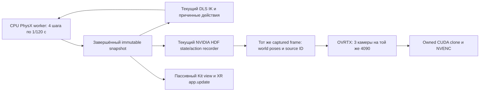

# Single-GPU live recording: реализованный диагностический прототип

Kind: experiment; status: current; owner: `vr.performance`; mutable: true.
Продолжение от trusted base `d1676c5c05f3bf6ae300f47533526085fdab4204` в ветке
`research/live-camera-recording-30hz`. Вторая GPU не использована. Исходная ветка
исследования создана от master `beaedfd1116577fd4d8026232cfb96cba0b030fa`.

## Результат

**Уточнение после [эпизода с заметными движениями](../meaningful_episode/REPORT.md):
прежняя формулировка о проверенном полном live-camera пайплайне отозвана.**
В шести новых запусках native TCP и wrist-камеры изменялись, но видимая геометрия
роботов в Scene camera оставалась у home. Предыдущие optical source-ID и
HDF→submitted matrices проверки этого не обнаруживали. Поэтому приведенные
ниже прежние Hz подтверждают state/action, transport/render submission и encode
cadence, но не частоту корректных изображений движущихся роботов. Historical
receipts и их исходные PASS/FAIL bytes сохраняются.

В новом `reach-demo08` явная публикация world transforms 696 robot meshes
устранила наблюдаемое замирание: координатор подтвердил движение в Scene camera.
Измерено **56,20 Hz с encoder tail**, 960 transitions и 961 capture каждой из
трех камер на одной GPU, XR включен, Quest отсутствует. Source join дополнен
проверкой mesh matrices из persisted HDF и static USD mapping. Optical boards
в этом демонстрационном видео отключены; независимый pixel source-ID proof
каждого кадра нового запуска не заявляется. Полные условия, шесть неудачных
попыток, повтор и артефакты находятся в новом отчете.

Дополнительный `reach-witness10` того же исправленного пути прошел строгий
optical guard всех 961×3 кадров при пороге контраста≥30 и точном source/role ID:
57,02 Hz с encoder tail. Для viewing08 доски отключены, для proof10 — включены
на половинной глубине при прежнем projected размере. Это разные записи;
их scope и отрицательная optical попытка09 явно сохранены в новом отчете.

Собран диагностический пайплайн: текущая сцена Piper,
standalone CPU PhysX, настоящий upstream DifferentialIKController, причинные
state/action переходы в текущем NVIDIA HDF recorder, пассивное отображение Kit/XR,
три камеры 960×600 в OVRTX и GPU NVENC. Render/encode выполняются во время
симуляции. Исправление публикации видимых meshes и его новые измерения описаны
в linked meaningful-episode отчете; старые числа ниже сохраняют прежний scope.

На одной RTX4090 измерены **52,06 перехода/с** с исходным Kit render mode и
**56,52/с** с MinimalRendering только для Kit view. Числа включают завершение
кодирования последнего кадра всех камер. В обоих matched прогонах — 1320 принятых
действий, по1321 реальному кадру/пакету/декодированному optical source-ID каждой
камеры, включая конечное состояние. Во всех кадрах прошёл прежний строгий
контрастный порог оптического идентификатора; persisted HDF→render matrices join
также прошёл. XR-профиль был включён при начале записи и при остановке.

**Главная цель >30 Гц с физически подключённым Quest3 пока не доказана.** Клиента
Quest не было, XR/DeviceIO движения оператора не подавались. Команды имеют
детерминированный Cartesian intent, решаемый настоящим IK; это не проверка живого
human processor/lifecycle. Около50 Гц без Quest измерены у transport/encode пути;
screening корректного camera candidate этим не завершен. Обычный `run-vr record` остаётся прежним; новый runner
является явным диагностическим opt-in. S2 и D1 не квалифицированы.

## Архитектура и изменения



Из Kit вынесен владелец физического шага. Отдельный CPU-процесс вызывает native
`step_n_sync(4,1/120)`, возвращает q/dq,27 мировых body poses, COM и Jacobian.
Kit больше не вызывает `sim.step/render/forward` во время этой записи. Он
публикует полученные позы и выполняет обычный `app.update` для представления/XR
при временно выключенном `playSimulations`. Проверяются и сохранённый native
SimContext counter, и SimulationManager counter; первые/периодические кадры
читаются обратно, чтобы обнаружить перезапись поз.

На каждый control boundary существует один источник истины. IK читает этот
snapshot, recorder использует его же для q и poses, camera worker получает копию
уже захваченного recorder frame. Существующий sampler, native Recordables,
schema HDF и causal commit остаются прежними. Dataset label продолжает
происходить из preclip intent/решения, а не из исполненного положения. Добавлены
явный backend `ovphysx_cpu` и ValidationProbe, чтобы покрыть все27 rigid bodies.
Обычный Fabric backend сохраняет прежний строгий guard.

Два частных inherited socketpair соединяют конкретные процессы; GPU изображения
между процессами не передаются. Одна GPU обслуживает Kit/XR и OVRTX/NVENC.
Renderer output остаётся на CUDA: mapping→owned clone→NVENC. Clone нужен для
асинхронного времени жизни, это не CPU readback. Примерно4 КБ world matrices на
комплект заменяют перемещение трёх RGBA изображений суммарно около6,9 МБ.

Очереди ограничены8; переполнение создаёт backpressure, а не silent drop.
Номер источника, epoch, snapshot ID/hash, physics step, matrix hash и encoder
ordinal сохраняются отдельно. Принятые NVENC пакеты проверяются по строгим
ordinal ACK; завершение всех трёх потоков доказывается drain, затем независимый
FFmpeg decode проверяет реальные optical IDs. Checked CUDA driver fences
возвращают статус ошибки; Warp1.16 void synchronization wrappers для этого
недостаточны. При неуспешном fence GPU owners удерживаются до завершения
изолированного процесса, без небезопасного освобождения renderer/stage.

## Точное окружение и upstream reuse/size re-audit

Kit/Isaac6.1/Lab и текущий shared scene builder используются из существующей
production среды. CPU worker использует ранее созданную изолированную среду
ovphysx0.6.3, ovstage0.2.0.377349, Warp1.16; media worker — существующие isolated
targets OVRTX0.5.1.385782, ovstage0.2.1.385922 и PyNvVideoCodec2.2.3. Ни SDK, ни
production site-packages в этой фазе не редактировались и не устанавливались.
Exact installed source hashes и официальные upstream URLs сохранены в
[PhysX audit](NATIVE_PHYSX_AUDIT.md), [source pins](native-physx-sources.json),
[scene audit](scene-audit.json), [media audit](media-source-audit.json) и per-run
guards/launch receipts. Исторические результаты прошлых фаз не переписаны.

В новых runtime модулях 2650 физических строк после форматирования, что превышает порог
повторного upstream audit из IMPLEMENTATION_PLAN. Причины оставшегося адаптера:

- Upstream owns PhysX tensors/integration/mimic, USD composition, текущий DLS IK,
  XR, native HDF storage, RTX и NVENC. Собственных physics/FK/IK/codec нет.
- Проверен существующий Lab ovphysx backend: его closure ожидает ovphysx0.5.11 и
  ovstage0.1.1.355824; установленный optional0.6.3 требует ovstage0.2.0.377349.
  GPU manager также вызывает отсутствующий в новой API `warmup_gpu`. Это не
  доказательство непригодности всех Lab CPU API; repinning/port остаётся вариантом.
- Нужны конкретные единый snapshot/clock, passive Kit view, инициализация реальных
  приводов, невстроенная lifetime/packet валидация и warmup/drain. Dependency
  conflict сам по себе не был основанием строить RPC/framework.
- Пять интеграционных модулей и runner превышают300 строк из-за reversible root/mimic overlay,
  exact native seed/inventory guards и camera mount mapping. Worker/owner/media модули также превышают300 строк из-за native field/order,
  lifetime/failure/receipt boundaries; runner — из-за launch/provenance composition.
  Это один конкретный Piper adapter. Нет simulator registry, backend hierarchy, нового dataset
  serializer, собственных robot processors или копии human control loop.
- Повторно использованы maintained snapshot/mirror/witness helpers предыдущей
  фазы. Изменения в двух helpers обратно совместимы по default arguments; точные
  исходники каждого теста сохранены в launch receipts, а не подменены HEAD.

Execution profile benchmark — существующий
`isaac_vr_record_injected_no_client_audit`; physics worker явно помечен
`standalone_cpu_physx_diagnostic_v1`. Это diagnostic ownership/profile, не новая
идентичность production среды. Contract, gate rules, выбранный runtime и
physical verification не менялись. Gate bindings пусты; scoped artifacts/IDs/
SHA/locators регистрируются в локальном artifact inventory и INDEX, без переноса
исследовательских результатов в accepted gate evidence.

## Что пришлось исправить и какие проверки прошли

Ранний physics-only результат917 Гц не учитывал текущие VR-приводы. Новый seed
читает фактические native q/dq, limits, targets и properties: лидер захвата
400/40/2/3, followers0/0/1/3. Проверены9DOF/12body order, units rad/metre,
fixed-root poses, полный27-body inventory и неподвижность исходного USD.

Источник в Kit может быть floating articulation, приваренной к миру. Derived
overlay переносит root API на существующий world weld, сохраняя исходные world
transforms. Был обнаружен ещё один root через builtin
`NewtonArticulationRootAPI→PhysicsArticulationRootAPI`: переносится и этот alias,
вместе с его root-owned authored properties. Mass/link/body APIs не меняются.

Поддержка NewtonMimic в parser не означает сохранение этой schema при population.
В default standalone population count был0 вместо4, а пассивные пальцы отклонились
до28,25 мм. Перевод четырёх исходных связей в equivalent PhysxMimic выполнен
только в derived overlay. Нативный тест с намеренно неправильными follower
targets подтвердил реальное coupling: максимальный residual0,123 мм при guard
0,2 мм. Этот исходный FAIL и все последующие попытки сохранены.

Raw native Jacobian привязан к COM. Он явно сдвигается к link origin текущего
`gripper_base` TCP, с проверенными body/DOF индексами и xyzw↔wxyz mapping.
Нативные central finite differences всех6DOF/обеих рук подтвердили linear и
angular части. Initial parity с **текущим** Kit в full integration: q/dq/root
точно равны; максимальная component ошибка27body pose1,19e-7, TCP Jacobian
1,49e-7. Дополнительно проверены velocities/freefall всех трёх props.

Per-pose Gf/матрицы/guards в hot path сначала стоили около6 мс на sampler и ещё
одного такого прохода на view. Static mount composition проверяется при seed,
затем используется batch rigid transform mapping без повторных USD/Gf reads.
Это coordinate composition известных body poses и fixed camera mounts, не FK.
Synthetic rotated/moved camera mount test прошёл до повторного GPU запуска.

Full media выявил несовпадение initial epoch: source clock0 против настоящего
`env.camera.reset_epoch`. Исправлено чтение текущего camera epoch. Первое
успешное видео затем выявило повторный холодный renderer reset: первый admitted
кадр987 мс, хотя warmup уже выполнен. Warmup теперь заканчивается за1/30 с до
первого source time; новый source ledger продолжает тот же renderer clock/caches
без reset. Optical board при warmup фиксирован наsource0, fresh admitted
encoder ordinal начинается с0. Первые admitted triplets после исправления —
около27–31 мс. Warmup не добавляет actions/canonical capture ordinals.

Минимальный source time должен допускать positive warmup prefix. При20warmup и
initial source time1 с это условие выполнено; runner отказывает при слишком
раннем времени, не выдумывает физические шаги.

## Измерения и сохранённые неуспехи

Первичные результаты — bounded Git receipts и полные runtime outputs,
перечисленные в [run ledger](run_ledger.json) и [artifact inventory](artifact_inventory.json).
Все GPU прогоны сериализованы; чужие процессы не завершались. Каждая попытка
сохраняет config, exact Python sources, launcher, stdout и result/process receipt.

| Run | Результат | Проверенный scope |
|---|---|---|
| source-smoke01 | FAIL topology guard | обнаружен floating Kit metadata; шага external owner не было |
| source-smoke02/03 | FAIL root inventory | найден builtin Newton root alias; snapshot bytes сохранились |
| source-smoke04 | PASS10 transitions | initial Kit/CPU state/J parity, passive physics counters, настоящий IK/HDF; камеры не включены |
| live-smoke01 | FAIL epoch | warmup прошёл, source0 отклонён из-за camera epoch; receipt сохранён |
| live-smoke02 | PASS150/151,52,49 steady action Hz | все3 optical streams/source join; cold-first987мс, длинный lag; не итоговый вариант |
| live-continuation01 | PASS720/721,52,00 complete Hz | original Kit view, no cold-first reset, камеры/joins/drain прошли |
| live-minimal01 | PASS1320/1321,56,52 complete Hz | MinimalRendering mode2 только Kit view; все3 камеры остались RTX |
| live-original-paired01 | PASS1320/1321,52,06 complete Hz | те же count/warmup/intent/scene и исходный Kit view, matched сравнение |

В matched original/minimal screening установившиеся wall action Hz52,54/57,00;
основные **complete Hz52,06/56,52** считают все1320 transitions, включая120
control warmup, и последний encoded frame всех камер. Improvement около8,6%.
Producer ACK age p95 original158,74 мс, minimal21,11 мс; pending максимум8/4.
Backpressure original2032 мс, minimal88 мс за1320 действий. Отставание ограничено
очередью, source IDs не подставляются и кадры не теряются.

CPU optical decode/source validation выполняются после закрытия admission.
Они тоже сохранены и не спрятаны: в minimal прогоне working23,18 с, последующее
finish/verification6,99 с; включая всю verification throughput43,75 transitions/s.
Сам NVENC drain169 мс; CPU optical verification5,28 с. Verification не является
частотой записи камер, но её блокирующее ожидание в текущем diagnostic runner
нельзя переносить в human XR loop без idle pump. HDF sealing/source join следуют
дальше; их время также отражено launcher wall time.

## Воспроизведение и rollback

Из репозитория, при свободной единственной GPU и существующих optional envs:

```sh
OMNI_KIT_ACCEPT_EULA=Y ISAACLAB_CXR_ACCEPT_EULA=1 \
PYTHONDONTWRITEBYTECODE=1 CUDA_DEVICE_MAX_CONNECTIONS=1 \
/data/vla-infrastructure/isaac61_production/env/bin/python \
  tools/run_single_gpu_live_recording.py \
  --output /data/ebulochkin/vla-runtime/single-gpu-new-unique-run \
  --frames 1200 --warmup 120 --media gpu --media-warmup 20 \
  --xr --view-mode minimal
```

Output должен быть новым. Для точного launch/source/process receipt используется
существующий `deep_research/run_receipted.py` с JSON config из run ledger,
заменив только output/prefix на новые пути. Ordinary branch opt-in не меняет
`run-vr`. Guard generator проверяет ранее audited installed SDK bytes, затем
хеширует текущие adapter/worker/snapshot/witness sources; после правки кода
создаётся новый guard, старые receipts не перезаписываются.

Rollback внутри owner восстанавливает только принадлежавшие ему instance methods,
source clock getter и native state step; каждому passive pump соответствует
`finally` restore исходного playSimulations. CPU/GPU worker завершаются владельцем;
teardown status/ACK/cleanup errors проверяются. Derived USD и runtime artifacts
можно исключить из следующего запуска; исходные assets/SDK не изменены. Полный
code rollback — предыдущий commit этой ветки в отдельном чистом checkout;
production selection не менялся, поэтому обычный запуск сразу использует прежний
pipeline. Не применять reset/stash/clean для удаления постороннего WIP.

## Drawbacks, неопределённости и следующий шаг

- Quest3 не подключён: eye render/encode/transport и live DeviceIO/processor
  нагрузка неизвестны. Запас57 Гц увеличивает шансы, но не доказывает >30 с Quest.
- MinimalRendering снижает качество Kit/XR представления. Камерные RTX/H264
  результаты проверены, фактический вид stereo Quest в этом режиме ещё нет.
- Physics state/J initial parity не доказывает contact/grasp/trajectory parity.
  Passive mimic coupling прошёл native assay, но при сложном контакте residual
  может превысить0,2 мм, и эксперимент завершится ошибкой.
- Камеры имеют diagnostic optical boards, меняющие изображение; они нужны для
  proof. Witness ограничен4096captures/technical episode. H26416Mbit/s/камера
  lossy; цвет/lighting fidelity относительно production RTX не квалифицирована.
- Дополнительные процессы, optional pinned environments, packet/clock/lifetime
  guards и 2650 физических строк adapters увеличивают стоимость поддержки.
- Human lifecycle пока не включён. Source reset сейчас требует recreate owner.
  Нужны reset из исходного seed с новым epoch, passive XR pumping во время
  startup/drain, rebase/discard устаревшего входного XR packet и join по
  capture_sequence для discarded observations. Повторные technical gaps не
  должны создавать многосекундные паузы. Точные минимальные seams и тесты —
  [human lifecycle audit](HUMAN_LIFECYCLE_AUDIT.md). Это сохранённый audit WIP;
  описанная там ранняя hardcoded epoch ошибка уже исправлена.
- Benchmark success не делает renderer metadata pixel proof: source proof
  получен отдельным decode для всех3 ролей и HDF/matrix join. Независимые
  silhouette/contact/photometric equivalence ещё не проверены.

Следующий этап — конкретные human lifecycle seams без копирования `run_s2`,
повторение этого optical/causal теста после integration и connected Quest
qualification с принятыми actions, всеми3 cameras, очередями, p95/p99 и стопом.
Это не выдаётся за завершённый physical target.

## Проверки и регистрации

Native CPU assays:7/7 PASS,22 worker receipts, cleanup errors0; сохранены
Newton-only FAIL и все schema/overlay/finite-difference attempts. Core topic,
negative lifetime/packet/clock tests, docs/contract/manifest и scope checks
сохраняются в [checks](checks/repository02/results.json). Optional native tests в ordinary
core discovery могут быть skipped: реальные исполнения сохранены отдельно в
[native results](native-physx-result.json). Каждый doc/attachment имеет explicit
INDEX entry owner `vr.performance`; local inventory даёт IDs/SHA/locators с
пустыми gate bindings. Selective root MANIFEST membership сохраняется.

Форматирование новых файлов после GPU проверок сохранило AST каждого файла: [format parity](checks/format-ast-parity.json). Runtime receipts идентифицируют реальные тестовые байты, core checks — текущие байты.

Первый repository check сохранён в checks/repository01: 306 PASS, один FAIL из-за read-only HF cache вне sandbox и raw-log whitespace в diff check. Cache перенесён в /tmp через окружение checker; исторические logs исключены только из whitespace checks. Байты первого FAIL не изменены.

Итог repository02: **308 PASS, 38 SKIP**; Ruff, docs preservation относительно d1676c5 (766 frozen files), spec references, contract validator и selective MANIFEST110 — PASS. Contract validator сохраняет прежнее FINAL RC NOT READY; исследование не закрывает его blockers. Native7/7 исполнения находятся в отдельном retained CPU bundle.
